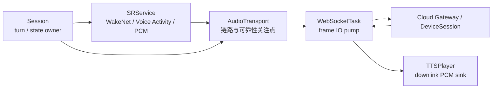

## 一句话定位

音频流链路搭建负责把上行 PCM、WebSocket 传输、云端处理、下行音频和本地播放串成一条可运行、可观察、可优化的链路。

它当前解决的不是“已经做到完整可靠传输”，而是先回答一个更基础也更真实的问题：在弱网、慢云端、打断、重连和资源争用下，这条链路还能不能持续正确工作。

它的职责是链路，不是业务：

- 不决定什么时候唤醒。
- 不决定什么时候开始一轮对话。
- 不解释 JSON 协议语义。
- 不决定 UI 怎么显示。
- 不处理音频算法本身。

它真正要保证的是：

- 文本控制帧和 PCM 数据帧分道走。
- 上行和下行都能持续运行。
- 断线、超时、拥塞、迟到消息都能收口。
- 其他模块能通过清晰接口拿到状态和统计信息。

## 如果我是部门 leader

如果我是部门 leader，我会把任务描述成这样：

> 现在产品已经能跑通语音闭环，但一到真实网络环境就容易暴露出问题。我要的不是再写一个“能发送音频”的函数，而是先把音频链路搭清楚：采集怎么产出、怎么分帧、怎么发包、网络慢时怎么处理、下行怎么播放、异常后怎么收口。后续再基于这条链路逐步做可靠性优化。

这类任务的判断标准，不是代码长不长，而是能不能把复杂问题拆成少数几个可控的模块边界。

## 音频流链路搭建的常见问题

先把问题列清楚，比一开始就说“可靠传输”更重要。

| 问题 | 现象 | 本质 |
|---|---|---|
| WebSocket/TCP 可靠但不实时 | 数据没有丢，但迟到后已经不该播放或识别 | TCP 保证有序字节，不保证实时期限 |
| 采集持续产生 PCM | 网络慢时 ringbuf 或 queue 积压 | 生产速度和发送速度不匹配 |
| 发送阻塞 | `send` 没报错，但发送任务被拖慢 | 发送成功不等于及时到达 |
| turn 边界混乱 | 旧音频污染新一轮对话 | 缺少 `turn_id`、`seq`、`timestamp` 等边界信息 |
| 下行播放不稳定 | TTS 卡顿、尾音残留、打断后仍播放 | 播放队列缺少水位、drain 和清空策略 |
| 弱网恢复困难 | close 后状态不一致，重新 listening 失败 | 传输状态和业务状态没有统一收口 |
| 缺少指标 | 只能说“能跑”，无法说明稳定性 | 没有 queue、drop、latency、timeout 的证据 |

### 弱网不是异常，是常态

音频流最怕的不是完全断网，而是更难复现的中间状态：

- Wi-Fi 抖动。
- WSS/TLS 写入变慢。
- 云端处理延迟升高。
- 收到一半 close / error。
- 一段时间没有收到下行帧。

这意味着模块必须明确处理 timeout、reconnect、close、error 和 idle，而不是只在 happy path 里发送成功。

### 实时性和吞吐会打架

音频不是普通文件数据。PCM 要持续送，不能随便攒一大块再发，也不能每次只发一小段把 TLS 开销打爆。

以 `16kHz / 16bit / mono` 为例：

| 时长 | PCM 大小 |
|---:|---:|
| 1s | 约 `32KB` |
| 20ms | 约 `640B` |
| 50ms | 约 `1600B` |
| 100ms | 约 `3200B` |
| 128ms | 约 `4096B` |

反过来说，如果发送缓冲区一次取 `4096B`，对应的就是约 `128ms` 的单声道 PCM 音频。

所以要先明确一个取舍：

> 发送缓冲大小，不等于采集粒度。

采集可以按小颗粒保证实时性，传输可以按适度批量减少开销，但两者不能绑死在一起。

### turn 边界很容易乱

语音系统不是单向流媒体，而是一轮一轮的对话。

一个 turn 结束后，旧 turn 的迟到帧可能还会继续到达。模块必须能认得：

- 这是新 turn。
- 这是旧 turn 的迟到输出。
- 这是已经失效的播放内容。

否则就会出现 UI 显示和实际播放不同步、播放被旧数据污染、一轮结束后又冒出上一轮尾音等问题。

### 资源争用会放大问题

ESP32 上最常见的坑，不是单个函数，而是系统资源互相影响：

- ringbuf 满了。
- queue 堵了。
- socket 发送阻塞。
- 任务栈不够。
- 内存长期运行后下降。
- 播放和采集同时竞争音频资源。

如果没有清晰模块边界，这些问题会散落到 `Session`、`SRService` 和 `WebSocketTask` 里，最后谁都说不清。

### 没有指标，就没有工程能力

只说“能跑通”没有价值。真正要回答的是：

- 多快开始发第一段 PCM？
- 积压多久算危险？
- 断线多久能恢复？
- 播放结束后多久回 listening？
- 连续多少轮不泄漏、不死锁？

这些问题能量化，模块才有工程意义。

## 链路搭建的关键任务

1. 建立上行和下行两条稳定通道。
2. 把控制帧和音频帧分开处理。
3. 明确 turn 边界，旧数据必须能被丢弃。
4. 定义 backpressure 和 drop 策略。
5. 提供 snapshot 和 stats，方便其他模块和测试读取。
6. 支持 `ws` / `wss`，并能在 close / timeout / error 后收口。
7. 把“能不能发”变成“什么时候发、发多少、发失败后怎么恢复”。

## 可靠性指标应该怎么定

这些不是行业唯一标准，而是适合当前 ESP32-S3 实时语音设备的建议验收线。

| 指标 | 建议目标 | 说明 |
|---|---:|---|
| 上行首帧延迟 | `<= 100-150ms` | 从 voice activity 开始到第一段 PCM 发出。 |
| 上行吞吐 | `>= 32KB/s` | 16k/16bit/mono 的基础吞吐。 |
| ringbuf 积压 | P95 `<= 300ms` | 长时间积压会拖垮实时性。 |
| 最大积压 | `<= 800ms` | 超过后要触发降级或丢弃策略。 |
| good network 丢帧 | `0` | 正常网络下不应丢整帧。 |
| reconnect 恢复 | `<= 5s` | 断线后要能尽快回到可用状态。 |
| turn_done 到 listening | `<= 200ms` | 前提是本地播放已 drain。 |
| 100 轮连续对话 | `0 crash / 0 deadlock / 0 leak` | 长稳比单次跑通更重要。 |
| 迟到旧 turn | `0` 可见污染 | 旧 turn 的 output 必须被忽略。 |

## 方案对比

| 方案 | 优点 | 问题 | 结论 |
|---|---|---|---|
| `Session` 直接管 socket 和 PCM | 上手快，代码少 | 业务状态和 IO 状态混在一起，失败路径难维护 | 不推荐 |
| 通用 helper 混合处理 | 看起来有抽象 | 只是把复杂度藏起来，接口会越来越胖 | 不够深 |
| `Protocol + WebSocketTask + Session + SR/TTS` 分层 | 责任清楚，测试清楚，故障清楚 | 需要认真维护模块边界 | 推荐 |
| WebRTC / 更重媒体栈 | 媒体语义更完整 | 对当前 ESP32 目标太重，接入成本高 | 暂不作为主线 |

推荐方案的核心是：

- `Protocol` 只管消息格式。
- `WebSocketTask` 只管 frame IO。
- `Session` 只管 turn 和上下文。
- `SRService` 和 `TTSPlayer` 只管音频生产/消费。

## 推荐模块边界



这里最重要的一点是：

- `Session` 决定什么时候开门、什么时候关门。
- `SRService` 决定有没有可发的 PCM。
- `WebSocketTask` 负责把数据送出去、再收回来。

传输层不能理解 UI，也不能理解“这个 turn 为什么要终止”。

## 后续要提供的接口和证据

如果把它当成一个可复用服务，对外能力应该尽量少：

```text
start(config)
stop(reason)
set_uplink_enabled(bool)
push_uplink_pcm(pcm, len)
set_downlink_enabled(bool)
get_snapshot()
get_stats()
```

对应的 snapshot / stats 至少要能回答：

- 当前链接状态是什么？
- 最近一帧下行是什么时候？
- 上行是否已授权？
- ringbuf 是否积压？
- 最近一次错误是什么？
- 本轮发送和接收了多少 PCM？
- 是否出现 drop、timeout 或 reconnect？

## 验收场景

| 场景 | 重点看什么 |
|---|---|
| 正常对话 | 首帧、吞吐、播放是否连贯。 |
| 弱网 | 是否能收口，是否反复卡死。 |
| 慢云端 | ringbuf 是否持续积压。 |
| 断线重连 | 是否能恢复，不残留假状态。 |
| 连续多轮 | turn 边界是否干净。 |
| 播放打断 | 本地先停，再通知云端。 |
| 旧 turn 迟到 | 是否被正确忽略。 |
| 长时间 soak | 内存、栈、任务状态是否稳定。 |

## 为什么这不是低端重复劳动

因为真正难的不是写 `send` / `recv`，而是：

- 先定义问题。
- 再定义边界。
- 再定义指标。
- 再设计失败路径。
- 再把问题变成能测的东西。

如果只是把 PCM 往 socket 里推，那是实现细节。

如果能把弱网、拥塞、迟到、打断、重连都纳入一个清晰模块，那就是工程设计。

## 当前阶段的实事求是结论

当前这篇只是第一章，定位是问题背景和常见问题梳理。它还不能证明模块已经完成优化，也不能证明链路已经达到长稳要求。

后续必须用代码改动、日志指标、自动化测试和实机联调结果来补齐证据。
