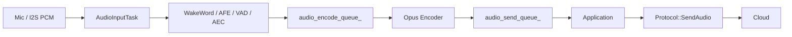

## 一句话结论

`xiaozhi-esp32-main` 的音频流传输不是“采集 PCM 后直接发给服务器”，而是先把设备侧音频整理成固定时长的 Opus 包，再通过 `Protocol` 这个 seam 交给不同的传输 Adapter。

它有两种主要传输模式：

- `WebsocketProtocol`：一条 WebSocket 同时承载 JSON 控制帧和二进制 Opus 音频帧。
- `MqttProtocol`：MQTT 承载 JSON 控制消息，UDP 承载加密后的 Opus 音频包。

这套设计最值得学习的不是某个 `send` 函数，而是三个点：

- 用 `Protocol` 把业务状态机和传输实现隔开。
- 用 Opus 包作为传输层的数据单元，降低带宽和队列压力。
- 用队列和任务把采集、处理、编码、发送、接收、解码、播放拆成可观察的流水线。

## 源码阅读入口

建议按下面顺序对照源码阅读：

| 顺序 | 文件 | 重点 |
|---:|---|---|
| 1 | `main/protocols/protocol.h` | 看 `AudioStreamPacket` 和 `Protocol` interface。 |
| 2 | `main/protocols/websocket_protocol.cc` | 看 WebSocket hello、JSON/binary 分流、Opus 发送。 |
| 3 | `main/protocols/mqtt_protocol.cc` | 看 MQTT 控制通道、UDP 音频通道、AES-CTR 和 sequence。 |
| 4 | `main/audio/audio_service.h` | 看音频队列、Opus 帧长、任务模型。 |
| 5 | `main/audio/audio_service.cc` | 看 PCM 到 Opus、Opus 到 PCM 的实际流水线。 |
| 6 | `main/application.cc` | 看应用层如何只依赖 `Protocol` interface。 |
| 7 | `main/audio/processors/afe_audio_processor.cc` | 看 AFE/VAD/AEC 如何输出固定帧。 |
| 8 | `main/audio/processors/audio_debugger.cc` | 看音频调试数据如何旁路输出。 |

## 整体数据流

它的核心链路可以抽象成两条流。

上行链路：



下行链路：


这个结构背后的思想是：

- 麦克风和扬声器处理 PCM。
- 网络传输处理 Opus 包。
- 应用层只处理“什么时候发、什么时候收、状态如何切换”。

## Protocol seam 为什么重要

`Protocol` 是这个仓库里最值得先看的地方。它定义了一个很小的 interface：

```text
Start()
OpenAudioChannel()
CloseAudioChannel()
IsAudioChannelOpened()
SendAudio(packet)
SendStartListening(mode)
SendStopListening()
SendAbortSpeaking(reason)
OnIncomingAudio(callback)
OnIncomingJson(callback)
OnAudioChannelOpened(callback)
OnAudioChannelClosed(callback)
```

`AudioStreamPacket` 则是传输层统一的数据结构：

```text
sample_rate
frame_duration
timestamp
payload
```

这说明它不是让上层到处处理 socket、UDP、JSON、Opus 细节，而是先定义一个稳定的数据单元和操作集合。`WebsocketProtocol` 和 `MqttProtocol` 都是这个 seam 后面的 Adapter。

这个设计对 Pixel Soul 的启发很直接：如果后续要做“音频流可靠传输模块”，就不应该让 `Session`、`SRService`、`TTSPlayer` 都直接理解 WebSocket 细节。应该先抽出一个小 interface，让业务只关心：

- 音频通道是否打开。
- 现在能不能发送上行音频。
- 下行音频是否到达。
- 传输层当前是否 timeout、close、error、backpressure。

## WebSocket 模式

WebSocket 模式是一条连接同时做两件事：

- 文本帧：传 JSON 控制消息，例如 `hello`、`listen`、`abort`、`mcp`。
- 二进制帧：传 Opus 音频数据。

建立连接后，设备会先发送 `hello`，说明自己支持的传输和音频参数：

```json
{
  "type": "hello",
  "transport": "websocket",
  "audio_params": {
    "format": "opus",
    "sample_rate": 16000,
    "channels": 1,
    "frame_duration": 60
  }
}
```

服务端返回 `hello` 后，设备记录 `session_id`、服务端采样率和帧时长，然后认为音频通道打开。

WebSocket 的二进制音频有几个版本：

| 版本 | 形式 | 作用 |
|---:|---|---|
| v1 | 裸 Opus payload | 最简单，只有音频数据。 |
| v2 | 包头 + timestamp + payload size + payload | 可把 timestamp 传给服务端，服务端 AEC 时有用。 |
| v3 | 更小的包头 + payload size + payload | 减少包头字段。 |

对当前 Pixel Soul 来说，WebSocket 模式最值得先研究，因为它和当前“控制 JSON + 二进制音频”思路最接近。区别在于 Xiaozhi 传的是 Opus，不是裸 PCM。

## MQTT + UDP 模式

MQTT + UDP 模式更像产品化实时语音系统：

- MQTT 保持控制通道，负责 JSON 消息和重连。
- UDP 单独承担实时音频流。
- UDP 音频 payload 是 Opus。
- 音频包用 AES-CTR 加密。
- 包头包含 timestamp 和 sequence。

大致流程是：

1. 设备先连接 MQTT。
2. 设备通过 MQTT 发送 `hello`，声明 `transport: "udp"`。
3. 服务端通过 MQTT 返回 UDP server、port、key、nonce。
4. 设备创建 UDP socket。
5. 上行 Opus 包通过 UDP 发出。
6. 下行 Opus 包通过 UDP 收到后解密，再进入解码队列。

UDP 音频包大致包含：

```text
type
flags
payload_len
ssrc
timestamp
sequence
encrypted_payload
```

这里有两个细节值得注意：

- 发送端 `local_sequence_` 单调递增。
- 接收端用 `remote_sequence_` 检查旧包和乱序包。

但要实事求是：这还不是完整意义上的可靠传输。它能发现旧包、记录乱序、丢弃过旧包，但没有看到 ACK/NACK、重传、jitter buffer、Opus FEC、丢包恢复或自适应码率。它更准确的定位是“低延迟、弱可靠、可观测的实时音频传输”。

因此它适合作为第二阶段参考，不适合现在直接照搬到 Pixel Soul。

## AudioService 的工程价值

`AudioService` 比协议层更接近真实嵌入式音频问题。

它在文件注释里已经把两条数据流讲得很清楚：

- `MIC -> Processors -> Encode Queue -> Opus Encoder -> Send Queue -> Server`
- `Server -> Decode Queue -> Opus Decoder -> Playback Queue -> Speaker`

这背后的工程价值是：

- PCM 大，Opus 小，主队列尽量放 Opus 包。
- 采集、播放、编解码分任务执行，避免一个阻塞拖死全链路。
- 发送队列和解码队列有上限，能形成 backpressure。
- 输入和输出采样率不一致时，会做 resampling。
- 播放前会等待 playback queue，避免网络抖动导致尾音被截断。

它的默认 Opus 配置也值得注意：

```text
sample_rate      = 16000
channels         = mono
frame_duration   = 60ms
bitrate          = auto
complexity       = 0
enable_fec       = false
enable_dtx       = true
enable_vbr       = true
```

这说明它优先考虑的是嵌入式设备上的 CPU、带宽和实时性平衡，而不是把所有抗丢包能力都打开。后续如果研究“可靠传输”，这里就可以继续问：

- 是否应该打开 Opus FEC？
- 60ms 是否会导致交互延迟偏大？
- 20ms、40ms、60ms 在 CPU、带宽、延迟之间怎么取舍？
- 队列上限是保护实时性，还是掩盖了下游慢的问题？

## Application 如何连接音频和协议

`Application` 负责把 `AudioService` 和 `Protocol` 拼起来，但它没有直接理解 WebSocket 或 UDP。

几个关键动作是：

- 初始化时根据配置选择 `MqttProtocol` 或 `WebsocketProtocol`。
- `OnIncomingAudio` 收到下行音频后，推入 `AudioService` 的解码队列。
- `MAIN_EVENT_SEND_AUDIO` 触发时，从 `audio_send_queue_` 取 Opus 包，再调用 `protocol_->SendAudio()`。
- 进入 listening 状态时，调用 `SendStartListening()` 并启用 voice processing。
- 进入 speaking 状态时，关闭或调整本地采集，重置 decoder。
- 唤醒词触发时，可以先发送唤醒词 Opus 包，再发送 `listen detect`。

这说明它的主干是：

```text
state change -> enable audio path -> queue produces packets -> protocol sends packets
incoming packet -> protocol callback -> decode queue -> speaker
```

这条主线比较清楚，也是值得学习的地方。

## 值得研究的模块排序

### 1. `Protocol`

优先级最高。它告诉我们：传输模块的 interface 应该小而稳定，复杂度藏在 Adapter 里。两个 Adapter 同时存在，说明这个 seam 是真实有用的。

### 2. `WebsocketProtocol`

最贴近 Pixel Soul 当前阶段。建议重点研究：

- hello 协商。
- JSON 和 binary frame 的分流。
- binary v2 timestamp。
- server hello timeout。
- close/error 后如何通知上层。

### 3. `AudioService`

这是音频链路稳定性的核心。建议重点研究：

- 队列的最大长度。
- 编解码任务和输入输出任务如何解耦。
- PCM frame 如何聚合成 Opus frame。
- decode queue 满时怎么处理。
- playback queue 如何避免播放打断。

### 4. `MqttProtocol`

适合研究控制面和数据面分离。建议重点研究：

- 为什么控制消息走 MQTT。
- 为什么实时音频走 UDP。
- sequence 和 timestamp 放在哪里。
- 加密如何和包头配合。
- 乱序、旧包、解密失败如何收口。

### 5. `AfeAudioProcessor`

它体现的是音频算法和传输之间的衔接。传输层不应该吃任意长度的 PCM，而应该吃稳定帧。

### 6. `AudioDebugger`

这个模块很小，但很有启发。后续 Pixel Soul 也应该有类似旁路观测能力，用来确认：

- 麦克风实际采到了什么。
- 上行是否连续。
- 是否有断流。
- 是否是算法问题还是传输问题。

## 和 Pixel Soul 当前思路的对比

| 维度 | Pixel Soul 当前主线 | Xiaozhi 参考点 |
|---|---|---|
| 上行音频 | PCM over WebSocket | Opus over Protocol |
| 控制消息 | JSON over WebSocket | JSON over WebSocket 或 MQTT |
| 传输抽象 | 更靠近 `Session/WebSocketTask` | `Protocol` interface + Adapter |
| 音频队列 | 更需要补 metrics 和 backpressure | 多级队列，主队列放 Opus 包 |
| 弱网处理 | 需要继续完善 timeout/drop/recover | 有 timeout、sequence、reconnect，但不完整 |
| 可观测性 | 需要补 evidence | 有 AudioDebugger 思路可借鉴 |
| 适合直接照搬 | 不建议 | 借鉴 seam 和队列模型 |

当前阶段更合理的路线不是马上把 Pixel Soul 改成 MQTT+UDP，也不是马上引入 Opus，而是先把 WebSocket 音频流的可靠性做深：

- 明确上行帧的 sequence 和 timestamp。
- 统计 ringbuf / queue 水位。
- 明确积压后的 drop 策略。
- 明确旧 turn 下行帧的丢弃策略。
- 明确 close / timeout / error 后状态如何收口。
- 用日志和自动化测试证明链路稳定。

## 它还没有解决什么

为了避免把参考项目神化，这里单独列出它没有完整覆盖的内容：

- 没有看到完整 ACK/NACK 重传机制。
- 没有看到 jitter buffer。
- 没有看到自适应码率或动态帧长。
- Opus FEC 默认没有打开。
- UDP 乱序主要是记录和丢弃，不是恢复。
- 队列水位和时延统计还不够系统化。
- 业务状态、音频状态和传输状态仍然需要结合 `Application` 一起理解。

所以它是一个很好的参考对象，但不是“音频流可靠传输”的最终答案。

## 对后续专栏的启发

下一步真正要做的，不是写更多模块名，而是把 Pixel Soul 的音频传输问题变成可验证的工程目标。

我认为可以拆成三层：

### 第一层：当前 WebSocket 链路可靠化

先不换协议。补齐：

- `frame_seq`
- `timestamp_ms`
- `turn_id`
- `uplink_bytes`
- `downlink_bytes`
- `queue_depth`
- `drop_count`
- `last_rx_ms`
- `last_tx_ms`
- `close_reason`

这一步最贴合当前项目，也最容易形成测试证据。

### 第二层：音频包模型升级

评估是否从 PCM 迁移到 Opus，至少做实验对比：

- 带宽下降多少。
- CPU 占用增加多少。
- 首帧延迟变化多少。
- 云端解码复杂度增加多少。
- ASR 接口是否支持 Opus 或必须转 PCM。

### 第三层：控制面和数据面分离

如果 WebSocket 单连接在弱网、长会话、双向音频时确实成为瓶颈，再评估 MQTT+UDP 或其他双通道方案。

但这一步应该有前提：

- 已经有 baseline。
- 已经知道瓶颈在哪里。
- 已经证明 WebSocket 单通道不是靠简单优化能解决。

## 本章结论

`xiaozhi-esp32-main` 给我的最大启发是：音频传输模块不能只被理解为 socket 读写，它应该有自己的数据单元、状态、队列、指标和 Adapter seam。

短期最值得借鉴：

- `Protocol` interface。
- Opus 包作为传输单元的思路。
- `AudioService` 多队列流水线。
- WebSocket JSON/binary 分流。
- sequence、timestamp、timeout 这些观测字段。

暂时不建议直接照搬：

- MQTT+UDP 整套架构。
- 完整 Opus 化。
- 复杂媒体栈。

当前更稳的目标是：先把 Pixel Soul 的 WebSocket 音频流做成一个可观察、可测试、可解释的可靠传输模块。这样后续无论是否迁移到 Opus 或 UDP，都会有清晰依据，而不是凭感觉重构。
