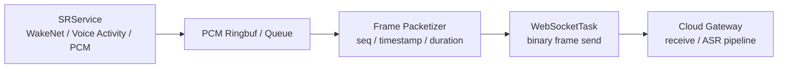

## 一句话结论

音频流链路搭建的第一个突破口，应该放在上行 PCM 发包链路。

原因很简单：`SRService` 会持续产出 PCM，而 WebSocket 发送速度会受到 Wi-Fi、TCP 重传、TLS 写入、云端消费速度和任务调度影响。一旦生产速度大于发送速度，设备侧就会出现 ringbuf 或 queue 积压。

这个问题不解决，后面的协议设计、ASR 效果、打断逻辑和多轮对话都会被拖累。

本章不宣称已经完成优化，只先把问题、瓶颈、指标和测试基线定义清楚。

## 先研究哪一段

本章聚焦这一段：



先不处理下行 TTS 播放，也不急着引入 UDP、Opus 或 WebRTC。原因是上行链路更容易形成可控实验：

- 输入速率固定：`16kHz / 16bit / mono` 大约 `32KB/s`。
- 发送目标明确：WebSocket binary frame。
- 结果容易观测：产生多少、发送多少、积压多少、丢弃多少。
- 弱网下问题最先暴露：发送变慢，队列变深，语音迟到。

## TCP 可靠不等于实时可靠

WebSocket 底层有 TCP，TCP 会保证字节有序、可靠、不乱序。但音频系统关心的不只是“有没有送到”，还关心“是不是按时送到”。

| TCP 能保证 | TCP 不能保证 |
|---|---|
| 字节不乱序 | 这段音频是否还来得及用于当前 turn |
| 丢包后重传 | 重传造成的额外延迟是否可接受 |
| 连接内有序 | 新音频是否会被旧音频堵住 |
| 写入最终成功或失败 | 设备侧 queue 是否已经积压过深 |

所以本章要解决的问题不是“TCP 会不会丢包”，而是：

> 当网络或云端变慢时，上行 PCM 会不会在设备侧越积越多，最终变成迟到音频。

## 真实瓶颈在哪里

这条链路的瓶颈通常不在某一行代码，而在生产速度、发送速度和业务时限之间。

| 位置 | 可能瓶颈 | 典型现象 |
|---|---|---|
| PCM 采集 | 固定速率持续产出 | 网络变慢后仍然不断写入 ringbuf |
| ringbuf / queue | 没有水位指标 | 不知道积压了多少毫秒音频 |
| 分帧 | 采集粒度和发送粒度绑死 | 小包开销大，大包延迟高 |
| WebSocket 发送 | 写入阻塞或变慢 | `send` 调用耗时上升 |
| 云端 gateway | 读取或处理变慢 | 设备侧发送正常，但云端消费滞后 |
| turn 管理 | 旧 turn 队列未清空 | 新一轮混入上一轮尾部音频 |

如果没有指标，只看日志里的“send ok”，很容易误判。`send ok` 只能说明这次调用没有立即失败，不能说明链路实时健康。

## 基础吞吐预算

当前上行 PCM 如果按 `16kHz / 16bit / mono` 计算：

```text
16000 samples/s * 2 bytes = 32000 B/s
```

也就是每秒约 `32KB`。换算成常见帧长：

| 音频时长 | PCM 大小 |
|---:|---:|
| 20ms | 约 `640B` |
| 50ms | 约 `1600B` |
| 100ms | 约 `3200B` |
| 128ms | 约 `4096B` |

这张表的意义不是说必须按 `4096B` 发包，而是提醒一个关键取舍：

> 采集粒度、缓存粒度和发送粒度可以不同，不应该因为某个 buffer 大小就默认接受对应的链路延迟。

如果一次发送 `4096B`，单次 frame 就已经包含约 `128ms` 音频。再叠加网络抖动、云端处理和下行 TTS，交互延迟很容易被放大。

## 本章建议先补的观测指标

第一步不要急着优化，先让链路说真话。

建议每个 turn 维护一组上行统计：

| 指标 | 含义 | 用途 |
|---|---|---|
| `turn_id` | 当前语音轮次 | 防止旧帧污染新轮次 |
| `uplink_seq` | 上行音频帧序号 | 发现跳帧、乱序、重复 |
| `frame_timestamp_ms` | 采集侧时间戳 | 计算音频是否迟到 |
| `frame_duration_ms` | 这一帧代表的音频时长 | 把 byte backlog 换算成 time backlog |
| `produced_bytes` | SR 侧产出的 PCM 字节数 | 判断生产速度 |
| `sent_bytes` | WebSocket 已发送字节数 | 判断发送速度 |
| `ringbuf_depth_bytes` | 当前积压字节数 | 判断是否接近危险区 |
| `ringbuf_depth_ms` | 当前积压音频时长 | 比 byte 更直观 |
| `send_latency_ms` | 单次 WebSocket 发送耗时 | 判断发送是否阻塞 |
| `drop_count` | 主动丢弃帧数量 | 判断是否触发保护 |
| `last_send_ok_ms` | 最近一次发送成功时间 | 判断发送是否停滞 |
| `ws_state` | WebSocket 当前状态 | 关联 close / error / reconnect |

其中最重要的是：

```text
ringbuf_depth_ms = ringbuf_depth_bytes / 32000 * 1000
```

用毫秒看积压，才符合音频系统的直觉。

## 如何判断瓶颈

建议先用下面这张判断表。

| 观测结果 | 可能原因 | 下一步 |
|---|---|---|
| `produced_bytes/s` 约等于 `32KB/s`，`sent_bytes/s` 也约等于 `32KB/s` | 正常 | 继续看 `send_latency_ms` 和下行 |
| `produced_bytes/s` 正常，`sent_bytes/s` 降低 | WebSocket 发送或网络变慢 | 看 `send_latency_ms`、socket error、云端接收 |
| `ringbuf_depth_ms` 持续上升 | 生产速度大于发送速度 | 需要回压、drop 或 abort 策略 |
| `send_latency_ms` 突然升高 | TCP/TLS 写入被拖慢 | 增加发送超时和链路健康判定 |
| `drop_count` 增加但 ASR 正常 | 保护策略可能有效 | 检查丢弃位置是否合理 |
| `drop_count` 为 0，但 ASR 变慢或污染 | 旧音频可能迟到 | 增加 frame deadline 和 turn 清理 |
| WebSocket 正常但云端 ASR 慢 | 云端消费或 ASR pipeline 是瓶颈 | 加 gateway receive timestamp 和 ASR final timestamp |

真正要避免的是这种假象：

> 设备侧没有报错，所以链路没问题。

实时音频里，迟到本身就是一种失败。

## 基线测试场景

本章建议先做 5 组基线，不求一次解决所有问题。

| 场景 | 操作 | 重点看 |
|---|---|---|
| 正常网络 | 普通语音输入，完整一轮 ASR | `sent_bytes/s` 是否稳定在 `32KB/s` 左右 |
| 慢云端 | 人为让 gateway 或 ASR 前处理变慢 | `ringbuf_depth_ms` 是否持续上涨 |
| 网络抖动 | 增加延迟和 jitter | `send_latency_ms` 是否尖峰明显 |
| 连续多轮 | 连续触发 10-20 轮对话 | turn 切换后队列是否清空 |
| 打断场景 | speaking/listening 中途打断 | 旧 turn 上行音频是否继续发送 |

如果环境暂时不方便做真实弱网，也可以先做“慢消费者”测试：在云端 gateway 里人为延迟读取或处理，观察设备侧队列是否积压。这不等价于真实网络弱网，但足够暴露生产和消费速度不匹配的问题。

## 初始阈值建议

这些阈值不是最终标准，只是方便第一轮基线判断。

| 指标 | 建议阈值 | 处理建议 |
|---|---:|---|
| `ringbuf_depth_ms` | `< 300ms` | 健康 |
| `ringbuf_depth_ms` | `300-800ms` | warning，记录链路不健康 |
| `ringbuf_depth_ms` | `> 800ms` | 触发 drop、abort 或重建链路 |
| `send_latency_ms` | P95 `< 50ms` | 可接受 |
| `send_latency_ms` | P95 `> 150ms` | 发送链路可能阻塞 |
| `last_send_ok_ms` | `> 2000ms` 无更新 | 认为发送停滞 |
| `turn_done` 后残留队列 | `0` | 必须清空或丢弃 |

这里最关键的是 `ringbuf_depth_ms`。只看 bytes 不够直观，看毫秒才能知道这段音频是否已经过期。

## 优化方向

等基线数据出来后，再决定具体优化动作。当前可以先规划几个方向。

### 1. 分离采集粒度和发送粒度

采集可以保持小粒度，例如 `20ms` 或算法输出的固定块；发送可以按更合适的 frame 组包，例如 `40-80ms`。

不要让 `4096B` 这类 buffer 大小直接决定业务时延。

### 2. 给每帧音频加边界信息

建议上行 binary frame 至少能关联：

```text
turn_id
seq
timestamp_ms
duration_ms
payload_len
```

这样云端和日志才能判断：

- 这一帧属于哪一轮。
- 是否有跳帧。
- 是否迟到。
- 是否跨 turn 污染。

### 3. 建立有上限的队列

队列不能无限增长。超过阈值后必须有策略：

- 丢弃最旧帧。
- 丢弃静音段。
- 终止当前 turn。
- close WebSocket 后重新进入 listening。

具体选择要看 ASR 模式。如果 ASR 更依赖完整语音，直接丢中间语音可能影响识别；但无限积压会让整轮对话变得更差。

### 4. 发送停滞要有收口

如果长时间没有发送进展，不应该让状态机继续假装 listening 正常。

可以先定义：

```text
last_send_ok_ms 超过 2s 未更新
或 ringbuf_depth_ms 超过 800ms
或连续 N 次 send 失败
```

触发链路异常收口：停止上行授权、清空当前 turn 队列、关闭 WebSocket、通知 Session 进入可恢复状态。

### 5. turn 切换时清理旧数据

任何 `stop listening`、`turn_done`、`abort`、`session reset` 都应该明确处理上行队列。

否则旧音频可能在网络恢复后继续发出，造成最难排查的污染问题。

## 这一章的验收标准

第 3 章真正完成时，至少应该能回答这些问题：

- 正常网络下，上行是否稳定达到 `32KB/s`？
- 弱网或慢云端时，`ringbuf_depth_ms` 如何变化？
- WebSocket 发送变慢时，`send_latency_ms` 是否能观测到？
- backlog 超过阈值后，系统是 warning、drop、abort 还是重连？
- turn 结束后，上行队列是否清零？
- 自动化日志能否复盘一轮上行链路？

如果这些问题回答不了，就还不能说链路可靠。

## 当前阶段的实事求是结论

本章只是确定第一个深入方向：上行 PCM 发包链路的积压与回压。

它暂时不解决所有音频可靠性问题，也不急着替换 WebSocket。当前更重要的是先把链路量出来，找到瓶颈，再用数据决定优化方向。

后续真正有价值的工作，是把这些指标接入设备侧和云端日志，用正常网络、慢云端、弱网和连续多轮场景跑出基线数据。
