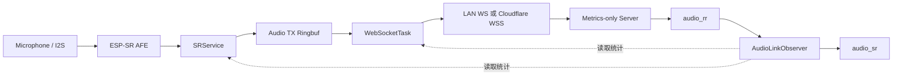

## 一句话结论

本轮测试已经证明：

> 当前设备可以通过 Cloudflare 公网 WSS 完成 WebSocket 连接、PCM 上传和 `audio_sr/audio_rr` 交换，但公网链路的实时性能不合格。

同一台 ESP32-S3、同一份固件、同一套 SR/Session/WebSocket 代码和同一个最小测试服务，仅把连接地址从 LAN WebSocket 改为 Cloudflare 公网 WSS 后，链路从“无积压、无丢帧”变成了“发送调用长期阻塞、TX ringbuf 满载、持续丢弃 PCM”。

当前能够定位的瓶颈边界是：

```text
设备侧 WebSocket/TLS 公网发送路径
```

但现有证据还不能把根因进一步收敛为某一个具体机制，例如：

- TLS record 写入；
- WebSocket header/payload 分次写；
- TCP 小包与 delayed ACK；
- `TCP_NODELAY` 配置；
- Cloudflare Tunnel 转发；
- 公网路径本身的拥塞或抖动。

因此，本章只报告已经被数据证明的边界，不提前宣称已经找到最终根因。

## 为什么先做这轮基线

第 3 章完成了指标定义和 `AudioLinkObserver` 的拆分，但当时仍然缺少一个最关键的事实：

> 当前链路在真实公网环境下，到底能不能持续承载设备产生的上行 PCM？

如果只在 LAN 内测试，很容易得到“WebSocket 可以稳定发送”的结论。但产品实际使用的是公网 WSS，链路中还增加了：

```text
ESP32-S3
-> Wi-Fi AP
-> 公网
-> Cloudflare Edge
-> Cloudflare Tunnel
-> gateway
```

这条路径与 LAN 直连不是同一个性能条件。

本轮测试的目标不是测试 ASR 效果，也不是跑完整 AI 对话，而是先回答四个更基础的问题：

1. SR 侧是否能稳定生产 PCM？
2. WebSocketTask 是否能及时消费这些 PCM？
3. 网络变慢时，积压发生在哪一层？
4. `audio_sr/audio_rr` 是否真的能够把积压过程量出来？

## 测试范围

为了避免 UI、ASR、Agent 和 TTS 的日志、CPU 占用及外部服务状态干扰，本轮只启动最小链路：



未启用的模块：

- LVGL 业务交互；
- ASR；
- Agent；
- TTS；
- 下行 PCM 播放；
- 完整 `VoicePipeline`。

这样做的目的，是让结果尽可能只反映：

```text
音频生产 -> ringbuf -> WebSocket 发送 -> 网络 -> server 接收
```

## 测试实现

### 设备侧测试 runner

测试固件启动后执行以下流程：

```text
初始化 I2C/I2S
-> 启动 AudioService
-> 连接 Wi-Fi 并等待 IP
-> 启动 SRService
-> 注入一次测试 wake latch
-> 启动 Session/WebSocketTask
-> 等待 voice_input_open
-> 开启真实麦克风 PCM 发布
-> 持续观测约 10 秒
-> 发送 final audio_sr
-> 关闭 Session
```

PCM 不是由 PC 文件模拟，而是来自设备真实麦克风和 ESP-SR AFE 输出。

音频格式保持：

```text
PCM S16LE
16000 Hz
mono
约 32000 B/s
```

binary PCM 协议没有增加帧头，也没有为了测试修改业务 payload。

### 最小 WebSocket server

测试 server 只负责：

- 接收 `session_start`；
- 返回 `session_start_ack`；
- 用最短消息让 Session 进入可上传状态；
- 累计 binary PCM 的字节数和 frame 数；
- 收到 `audio_sr` 后立即返回 `audio_rr`；
- 记录 JSONL 事件。

`server_report_delay_ms` 为 `0`，没有执行 ASR、Agent 或 TTS。

这意味着本轮看到的长时间延迟，不能归因于 ASR 推理或 TTS 合成。

### 观测指标来源

| 模块 | 指标 |
|---|---|
| `SRService` | `produced_bytes`、累计入队字节、`dropped_bytes`、`drop_count` |
| `WebSocketTask` | `sent_bytes`、`sent_frames`、`tx_ringbuf_depth_bytes/ms`、`ws_send_call_ms` |
| `AudioLinkObserver` | `uplink_id`、`sr_id`、periodic/final `audio_sr`、`audio_report_rtt_ms` |
| server | `binary_bytes_received`、`binary_frames_received`、`audio_rr` |

其中：

```text
ws_send_call_ms
= 设备调用 esp_transport_write() 的本地耗时
```

它不是 TCP RTT。

```text
audio_report_rtt_ms
= audio_sr 发出到对应 audio_rr 返回的应用层往返时间
```

它也不是纯网络传播时延，因为报告会和 binary PCM 共用同一条 WebSocket 发送路径，并受到发送积压影响。

## 对照条件

两组有效测试只改变 WebSocket URI：

| 条件 | LAN 对照 | 公网测试 |
|---|---|---|
| 设备 | 同一台 ESP32-S3 | 同一台 ESP32-S3 |
| 固件 | 同一份测试代码 | 同一份测试代码 |
| Wi-Fi | 同一个 AP | 同一个 AP |
| SR / AFE | 相同 | 相同 |
| ringbuf | 相同 | 相同 |
| Session | 相同 | 相同 |
| server 逻辑 | 相同 | 相同 |
| URI | `ws://LAN-IP:8769` | `wss://pixel-soul.gpt0417.space` |
| TLS / Tunnel | 无 | 有 |

这不是严格实验室网络测试，但已经构成了一组有价值的单变量对照。

## 测试过程中的环境问题

测试不是第一次就成功，中间暴露了几个需要记录的问题。

### 1. Cloudflare 一度返回 HTTP 530

最初公网域名无法正常到达 origin。恢复 tunnel connector 后，普通 HTTP 请求返回：

```text
426 Upgrade Required
```

说明请求已经到达 WebSocket gateway，只是普通 HTTP 请求没有进行 WebSocket Upgrade。

### 2. 运行中的 gateway 没有加载最新协议代码

第一次公网 smoke 收到：

```text
unsupported_message_type: audio_sr
```

原因不是协议代码没有实现，而是运行中的 gateway 进程仍然加载旧版本代码。重启已确认的 gateway 后，PC 端公网 smoke 可以正常收到 `audio_rr`。

这也说明：

> 测试代码已经更新，不等于运行环境已经加载更新。

后续自动化测试必须记录 gateway PID、启动时间和代码版本。

### 3. 第一次最小 server 消息不完整

最初测试 server 返回的 `turn_new` 缺少协议要求的：

```json
{
  "data": {
    "text": ""
  }
}
```

导致 Session 无法进入预期输入状态。修正 server 后重新执行，本次失败不纳入链路性能判定。

### 4. 切换测试条件时存在一个中断连接

从公网固件切换到 LAN 对照固件时，有一个连接被刷机过程打断。该 session 没有完成完整测试流程，因此没有纳入最终数据。

这条记录被保留在原始 server events 中，而不是删除或伪装成有效样本。

## 核心结果

### 总体数据

| 指标 | LAN | Cloudflare WSS |
|---|---:|---:|
| `produced_bytes` | 413696 B | 414720 B |
| final SR 中的 `sent_bytes` | 413696 B | 208896 B |
| server 最终接收 | 413696 B | 212992 B |
| server binary frames | 397 | 53 |
| `dropped_bytes` | 0 B | 140288 B |
| `drop_count` | 0 | 137 |
| `tx_ringbuf_depth_ms` | 0 ms | 1920 ms |
| `ws_send_call_ms` 采样均值 | 2.4 ms | 290.0 ms |
| `ws_send_call_ms_max` | 25 ms | 334 ms |
| `audio_report_rtt_ms` 范围 | 36-109 ms | 2076-3735 ms |
| `audio_report_rtt_ms` 均值 | 74.1 ms | 2932.0 ms |

两组测试的 PCM 生产量只相差约 `0.25%`，但发送和丢弃结果完全不同。

公网测试中：

```text
sent_bytes / produced_bytes ≈ 50.4%
dropped_bytes / produced_bytes ≈ 33.8%
```

其余数据主要仍处于 TX ringbuf 或发送中的 chunk。

### LAN 链路

LAN 下的表现：

```text
produced_bytes = sent_bytes = server_received_bytes
dropped_bytes = 0
tx_ringbuf_depth_ms = 0
```

`ws_send_call_ms` 通常为：

```text
1-4 ms
```

观测到的最大值为 `25ms`，但没有形成持续积压。

`audio_report_rtt_ms` 为：

```text
36-109 ms
```

这说明在 LAN 条件下：

- SR 生产正常；
- ringbuf 容量足够；
- WebSocketTask 可以及时消费；
- `audio_sr/audio_rr` 可以正常匹配；
- Session 和 observer 没有形成明显性能瓶颈。

### Cloudflare 公网链路

公网连接、协议握手和报告交换都能完成，因此它不是“完全不可用”。

但进入持续 PCM 上传后，`esp_transport_write()` 的单次调用耗时长期处于：

```text
274-334 ms
```

而设备仍在持续产生 PCM。

TX ringbuf 水位按报告序列增长：

| `sr_id` | `tx_ringbuf_depth_ms` | 已丢弃 |
|---:|---:|---:|
| 1 | 160 ms | 0 B |
| 2 | 544 ms | 0 B |
| 3 | 1056 ms | 0 B |
| 4 | 1408 ms | 0 B |
| 5 | 1920 ms | 5120 B |
| 后续 | 长期约 1920 ms | 持续增加 |

也就是说，这不是偶发尖峰，而是一个完整的退化过程：

```text
发送调用变慢
-> 消费速度低于生产速度
-> ringbuf 水位持续上升
-> ringbuf 接近满载
-> SR 新产出的 PCM 开始被整帧丢弃
```

### 应用层报告 RTT 的变化

公网 `audio_report_rtt_ms` 按报告依次增长：

```text
2076
2202
2416
2666
2811
2992
3128
3241
3436
3549
3735 ms
```

这组数据不能被解释成“公网网络 RTT 为 2-3 秒”。

更合理的解释是：

- `audio_sr` 与 PCM 共用发送路径；
- WebSocketTask 正在被慢速 binary write 占用；
- 报告自身也需要等待发送机会；
- 报告返回时间包含了发送队列等待和应用层处理路径。

因此它反映的是：

> gateway 应用层看见设备报告并返回的整体及时性正在持续恶化。

这个指标对实时音频仍然有价值，但不能代替 ICMP RTT、TCP RTT 或底层 ACK RTT。

## 一处重要的帧大小现象

server 最终记录：

```text
LAN:              413696 B / 397 frames
Cloudflare WSS:   212992 B / 53 frames
```

换算平均 binary frame 大小：

```text
LAN:              约 1042 B/frame
Cloudflare WSS:   约 4019 B/frame
```

这说明当前 WebSocketTask 的实际发送粒度不是一个严格固定值。

LAN 下 ringbuf 被及时消费，发送任务经常拿到约 `1KB` 数据；公网发送变慢后，ringbuf 有更多数据积压，后续读取更接近 `4KB`。

这个现象带来两个结论：

1. 公网退化并不是简单的“每 32ms 强制发送一个 1KB 小帧”，因为进入积压后实际已经大量发送约 4KB frame。
2. 下一轮不能只说“把 frame 改成 4KB 再测”，因为当前公网条件下实际 frame 已接近 4KB。必须显式固定发送聚合策略，才能形成真正的 `1KB / 4KB / 8KB` 单变量实验。

这不会推翻“公网发送路径是瓶颈”的结论，但会影响下一步实验设计。

## 为什么 server 接收量略大于 final SR 的 sent_bytes

公网 final SR 中：

```text
sent_bytes = 208896 B
```

server 断开前累计收到：

```text
212992 B
```

差值正好为：

```text
4096 B
```

这更符合“final SR 快照之后，还有一个已取出或正在发送的 4KB chunk 完成发送”，而不是 server 凭空多收到数据。

因此后续如果需要做严格的字节级一致性判定，还需要明确：

- `sent_bytes` 在 write 前还是 write 成功后更新；
- observer 获取快照时是否存在 in-flight chunk；
- final SR 是否应该等待发送任务进入稳定点；
- server 断开统计和设备 final report 的截止时刻是否一致。

本轮可以判断吞吐退化，但 final SR 还不是严格意义上的传输结算报表。

## 为什么不能用“测试 PASS”判断性能健康

测试 runner 最终打印：

```text
TEST_AUDIO_LINK_BASELINE PASS
```

它当前只表示：

```text
测试流程完成
并且 produced_bytes > 0
```

它没有检查：

- 是否丢帧；
- ringbuf 是否超过阈值；
- `ws_send_call_ms` 是否异常；
- `audio_report_rtt_ms` 是否持续增长；
- `sent_bytes` 是否接近 `produced_bytes`。

所以本轮人工判定为：

```text
LAN:               PASS
Cloudflare WSS:    FUNCTIONAL-PASS / PERFORMANCE-FAIL
Overall:           DEGRADED
```

后续测试 runner 应该区分：

```text
execution_completed
functional_pass
performance_pass
```

否则一个已经丢弃三分之一 PCM 的链路仍会打印 PASS，容易产生错误结论。

## 测量限制

### 1. `run_ms=10000` 不是精确墙上时间

runner 当前通过循环累计 `vTaskDelay(100ms)` 来推进 `elapsed_ms`。

任务被其他工作抢占或阻塞时：

```text
累计 delay 时间 != 实际经过的墙上时间
```

因此不能简单使用：

```text
produced_bytes / 10s
```

计算精确的 PCM 生产吞吐。

本轮结论主要依据：

- 同构 LAN/公网对照；
- ringbuf 水位；
- 丢弃量；
- send 调用耗时；
- SR/RR 变化趋势。

下一版 runner 应使用单调时钟记录真实：

```text
start_monotonic_ms
end_monotonic_ms
actual_duration_ms
```

### 2. 当前没有底层 TCP 指标

本轮没有采集：

- TCP smoothed RTT；
- retransmission count；
- congestion window；
- send buffer occupancy；
- TLS record 数量；
- WebSocket header/payload 底层 write 次数。

所以目前只能定位到“公网 WSS 发送路径”，不能证明是 Nagle、重传或某个 Cloudflare 机制。

### 3. 当前没有固定 binary frame size

实际 frame 大小会随 ringbuf 可读数据量变化。因此下一轮测试必须先让发送粒度成为一个可控变量。

### 4. 只有一次完整 LAN 和一次完整公网样本

本轮对照差异很大，足以证明链路存在明显问题，但还不足以形成稳定的 P50/P95/P99 统计。

后续每种条件至少重复多轮，并输出分位数，而不是只记录均值和最大值。

## 当前可以确认什么

### 可以确认

1. SR 生产侧不是当前主要瓶颈。
2. LAN 下 ringbuf、Session、WebSocketTask 和 observer 能够正常协作。
3. Cloudflare 公网路径下 `esp_transport_write()` 调用发生持续性慢写。
4. 慢写导致发送消费速度低于 PCM 生产速度。
5. TX ringbuf 最终达到约 `1920ms` 音频积压。
6. ringbuf 饱和后开始真实丢弃上行 PCM。
7. `audio_sr/audio_rr` 能够观察到积压、丢弃和应用层报告延迟。
8. WebSocket/TCP 的可靠交付不能自动保证实时音频可用性。

### 还不能确认

1. 最终根因是否是 TLS。
2. 最终根因是否是 Nagle 或 delayed ACK。
3. Cloudflare Tunnel 是否是唯一问题。
4. 直接公网 WSS origin 是否也会出现相同表现。
5. `TCP_NODELAY` 能否解决问题。
6. 固定 4KB 或 8KB frame 是否一定改善。
7. 当前网络下是否存在明显 TCP 重传。
8. 问题是否与 ESP-IDF WebSocket transport 的多次底层 write 有关。

## 对架构设计的验证

本轮也验证了把观测逻辑从 Session 拆成 `AudioLinkObserver` 的合理性。

如果所有统计都写在 Session 内，本轮需要让 Session 同时理解：

- SR 生产量；
- ringbuf 水位；
- WebSocket write 耗时；
- server 接收量；
- SR/RR 匹配；
- 瓶颈判断。

这会让业务状态机承担过多传输细节。

现在的边界更清晰：

```text
SRService
只提供生产侧事实

WebSocketTask
只提供发送侧事实

AudioLinkObserver
聚合事实并形成链路快照

Session
决定何时开始、结束和发送报告
```

当前 observer 仍然只做被动观测，没有自动控制发包、drop、abort 或 reconnect。

从本轮结果看，这个顺序是合理的：如果没有先量出真实链路，过早加入自适应控制，很可能只是掩盖问题。

## 下一步应该如何讨论

本章暂不直接修改发送策略。下一步应先讨论并确定一个严格的单变量实验矩阵。

建议优先回答：

### 1. 如何固定发送数据单元

明确区分：

```text
AFE 输出粒度
ringbuf 写入粒度
WebSocket 聚合粒度
WebSocket binary frame 粒度
```

然后固定测试：

```text
1KB
4KB
8KB
```

不能继续让 frame 大小由“当时 ringbuf 里有多少数据”隐式决定。

### 2. `esp_transport_write()` 内部到底阻塞在哪里

需要检查：

- WebSocket header 是否单独 write；
- payload 是否单独 write；
- TLS 层一次实际写了多少字节；
- write 返回前等待了什么；
- 是否能够采集更细的分段耗时。

### 3. 如何拆分公网路径因素

建议增加：

| 场景 | 目的 |
|---|---|
| LAN WS | 当前健康基准 |
| LAN WSS | 区分 TLS 开销 |
| 直连公网 WSS origin | 区分公网与 Cloudflare Tunnel |
| Cloudflare WSS | 当前真实部署路径 |

### 4. 何时测试 `TCP_NODELAY`

应该在 frame 大小固定后再测试 `TCP_NODELAY`。

否则同时改变 frame 聚合和 TCP 行为，即使结果改善，也无法判断是哪一个变量生效。

### 5. 性能判定应该自动化到什么程度

至少应把以下条件写入 verdict：

```text
dropped_bytes == 0
tx_ringbuf_depth_ms 不持续超过阈值
ws_send_call_ms P95 在目标范围内
sent_bytes 与 produced_bytes 差值可解释
audio_report_rtt_ms 不持续单调恶化
```

## 本章结论

这轮测试的价值不在于“Cloudflare 很慢”这一句，而在于完成了一个可复现的定位过程：

```text
先拆掉无关模块
-> 建立生产侧、发送侧和接收侧指标
-> 用 LAN 建立健康对照
-> 只切换公网 URI
-> 观察 write 耗时、积压、丢弃和 RR RTT
-> 把瓶颈收敛到公网 WSS 发送路径
```

它证明了第 3 章设计的指标不是为了“多打日志”，而是真的能够回答：

- 音频在哪里堆积；
- 从什么时候开始失去实时性；
- 丢弃发生前有哪些先兆；
- 哪个模块可以暂时排除；
- 下一轮实验应该改变哪个变量。

当前项目还不能宣称已经完成“可靠音频传输”，但已经从“WebSocket 能发 PCM”推进到“能够用数据定位公网链路退化”。

下一步应该继续保持实事求是：先把 frame 聚合、TLS、Tunnel 和 TCP 行为逐项拆开，再决定优化方案。
