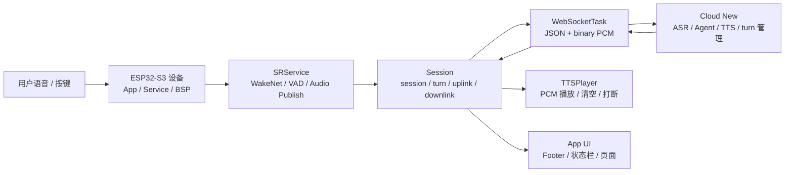

这篇文章的目标不是背公司介绍，而是把自己的项目经历转换成面试时能讲清楚、能经得住追问的表达。

核心判断是：如果岗位和 `AI 对话玩偶 / 智能硬件 / 仿生互动 / 嵌入式语音设备` 有关，Pixel Soul 是一段匹配度很高的经历。面试时不要只说“我会 ESP-IDF”，而要说清楚：我做过一个接近真实 AI 陪伴硬件产品形态的端云闭环。

## 信息校准

面试前先把公开信息和 HR 信息对齐。公开官网信息可能会变化，正式面试称呼以 HR、招聘 JD 和营业主体为准。

可以先按这些关键词理解公司方向：

- AI 对话玩偶。
- 仿生玩偶。
- 智能硬件。
- 硬件设计定制。
- 软件定制开发。
- AI 陪伴和情感交互。

需要注意的是，公司主体、品牌名、官网页脚和招聘平台名称可能不完全一致。面试时可以自然地说：

```text
我看了贵司公开资料，方向主要是 AI 对话玩偶、仿生互动和智能硬件。我自己的项目正好做过 ESP32-S3 端侧语音交互、云端 ASR/Agent/TTS 和本地 UI 状态联动，所以想重点了解这个岗位更偏固件、音频链路，还是端云协同。
```

这句话的好处是：不死背公司信息，同时把话题拉回自己的项目强项。

## 匹配主线

Pixel Soul 可以包装成一个小型 AI 陪伴硬件终端：

```text
ESP32-S3 设备
  -> 显示 / 按键 / 电池 / RTC / 传感器
  -> 麦克风采集 / WakeNet / VAD
  -> WebSocket 音频上行
  -> 云端 ASR / Agent / TTS
  -> 下行 PCM 播放
  -> KEY 打断 / BOOT 退出 / UI 状态同步
```

如果面试官问“这个项目一句话是什么”，可以这样说：

```text
Pixel Soul 是一个基于 ESP32-S3 的桌面 AIoT 语音交互设备。我负责把设备侧的按键、屏幕、网络、音频、唤醒、Session 状态机和云端 ASR/Agent/TTS 串成一个完整可用的 AI 对话体验。
```

如果面试官问“和我们业务有什么关系”，可以这样接：

```text
AI 对话玩偶或陪伴硬件，本质上也要解决唤醒、收音、播放、打断、网络异常、低功耗、电池状态和端云协议这些问题。我的项目虽然形态是桌面设备，但核心链路和工程问题是相通的。
```

## 端云链路图

面试时最好能画出下面这条链路。不要一上来陷入某个函数名，要先讲业务主干。



讲这张图时，顺序可以固定成四句话：

1. 设备侧负责交互和音频管道稳定，不在 ESP32 上跑重型 ASR/TTS/Agent。
2. SR 只负责听人声、辨别人声、在 Session 授权下发布音频。
3. Session 是 AI 会话 owner，负责 `session / turn / 上行授权 / 下行播放 / 打断`。
4. 云端负责 ASR、Agent、TTS 和协议级 turn 生命周期。

## 30 秒自我介绍版本

面试一开始可以用这个版本，短而聚焦：

```text
我最近主要做的是 Pixel Soul，一个 ESP32-S3 AIoT 语音交互设备。设备侧包含按键、屏幕、网络、RTC、电池、SD、音频 codec、WakeNet、VAD、WebSocket 和 TTS 播放；云端包含 ASR、Agent、TTS 和 turn 管理。我重点参与了设备侧架构、AI Session 状态机、播放期打断、音频 ringbuf、网络/gateway 探测、UI 状态同步和问题定位。这个项目让我比较熟悉智能硬件从端侧输入、云端推理到本地播放反馈的完整链路。
```

## 2 分钟项目展开版本

如果面试官让详细介绍项目，可以按“业务目标 -> 系统链路 -> 难点 -> 结果”展开：

```text
这个项目的目标是做一个小型 AI 陪伴设备，让用户可以通过唤醒词和语音进行对话，同时设备有屏幕、按键、电池、网络和状态显示。

架构上我把它分成 App、Service、BSP 和云端几层。App 层负责页面、按键策略和 ViewModel；Service 层负责网络、时间、电池、音频、语音识别、Session 和 WebSocket；BSP 层只暴露板级资源，比如 I2C、GPIO 和引脚配置；云端负责 ASR、Agent、TTS 和 turn 管理。

最难的部分是实时语音交互不是单向播放，而是有唤醒、上行音频、下行 TTS、播放期打断、网络断开和状态同步。比如播放期用户想打断时，最开始我尝试 VAD/RMS 自动打断，但扬声器回声会影响麦克风输入，最后改成 KEY 单击协议级 turn_terminate：设备本地立即清空 TTS 播放队列，云端取消当前 turn，下一轮输入重新开始。

项目最后形成了比较清晰的模块边界和复盘文档，也有多轮实机测试和回归脚本。对我来说，它最有价值的地方是把嵌入式外设、FreeRTOS 任务、音频缓冲、网络协议和 AI 云端链路真正串起来了。
```

## 项目亮点一：播放期打断

这是最适合和 AI 玩偶业务对齐的亮点。

**背景：**

AI 对话设备播放 TTS 时，用户可能想插话或停止。语音打断听起来简单，但设备扬声器会回灌到麦克风，VAD、AEC 和 ASR 都可能被干扰。

**行动：**

- 先尝试 `VAD + RMS EMA + ducking`，降低 TTS 音量。
- 实测发现播放同时说话时，回声和音频质量会让 ASR 不稳定。
- 后续将主路径调整为 `KEY single click -> turn_terminate`。
- 设备本地立即停止旧 TTS，清空下行 ringbuf。
- Session 使用 `active_turn_id` 丢弃旧 turn 的迟到输出。
- 云端收到 `turn_terminate` 后取消当前 voice job，并返回 `turn_terminate_ack`。

**结果：**

```text
用户按 KEY
  -> 设备 200ms 内本地停播
  -> 旧 turn 下行被屏蔽
  -> 云端取消当前 turn
  -> 设备回 LISTENING，准备下一轮输入
```

**面试表达：**

```text
我最终没有把打断完全押在 VAD 上，因为播放期自动语音打断会受扬声器回声、麦克风距离和 ASR 模型影响。产品上如果允许按键，我会把 KEY 作为确定性控制面事件，保证本地立即停播；语音打断可以作为增强路径，而不是唯一可靠路径。
```

这段很重要，因为它体现了工程取舍：不是“我做了一个酷功能”，而是“我知道什么路径在产品上更可靠”。

## 项目亮点二：Session 状态治理

AI 设备最容易出问题的是状态残留。比如云端主动 `session_close(input_audio_idle_timeout)` 后，UI 看起来已经退出，但 App 内部还认为 AI active，下一次按键行为就会错。

**行动：**

- 保留 `SESSION_STATE_IDLE` 语义：表示当前没有 active session。
- App 收到 `snap.state == SESSION_STATE_IDLE && !snap.session_active` 后统一清理 AI runtime。
- 清理内容包括 ducking、SR active、audio tx/rx ringbuf、session_started、ai_active。
- BOOT 长按在 active session 时退出会话；非 active 时进入 wake prompt。

**面试表达：**

```text
我把 Session close/stop/timeout 都看成一次 AI 会话结束，由 App AI runtime 做统一清理。这样不会在各个异常路径里散落状态复位逻辑，也能避免下一次 BOOT 长按走错分支。
```

可以主动补一句：

```text
在嵌入式交互设备里，很多 bug 不是算法错，而是状态残留。我的处理方式是让 Session 成为会话事实来源，App 只根据 snapshot 投影 UI 和按键策略。
```

## 项目亮点三：SR 模块边界重构

SR 最后可以这样定义：

```text
SRService 只为 Session 服务：
  1. 听人声。
  2. 辨别人声。
  3. 在 Session 授权下发布音频。
```

也就是说，SR 不应该理解“当前是不是 AI 业务要说话”，这些业务条件属于 Session。SR 提供能力，Session 控制开关。

可以这样讲：

```text
我后来把 SR 从业务状态里解耦出来。SR 不再自己判断复杂的 LISTENING、SPEAKING、output_context_active 等条件，而是提供 voice activity 和 audio publish 开关。什么时候开启上行，由 Session 决定。这样核心流程更短，也更容易看懂。
```

主流程可以画成：

```text
feed task:
  microphone -> AFE

detect task:
  Wake Detect
  -> Voice Detect
  -> Audio Publish if enabled
```

面试官如果追问为什么这么设计，可以回答：

```text
因为 SR 是底层语音能力，Session 是业务会话 owner。底层模块如果混入太多业务条件，就会出现重复判断、状态堆叠和难以定位的问题。把开关交给 Session 后，谁负责决策、谁负责执行就很清楚。
```

## 项目亮点四：端云协议和 WebSocket

Pixel Soul 的协议不是简单 HTTP 请求，而是同一条 WebSocket 上同时跑：

- JSON 控制消息。
- binary PCM 上行音频。
- binary PCM 下行 TTS。

核心表达：

```text
WebSocketTask 只负责 transport 和 IO pump，不负责 AI 业务恢复。Session 负责 session_start、turn_new、turn_done、turn_terminate、上下行授权和状态收口。
```

如果问 WebSocket 断开怎么办：

```text
当前设计是 WebSocket closed/error/idle timeout 后 Session 直接 close local，状态回 IDLE，由用户下一次 BOOT/WakeNet 重新创建 Session。没有在 WebSocketTask 里偷偷自动重连，因为 AI session/turn 不能假设 transport 重连后还能透明恢复。
```

如果问为什么要这样：

```text
WebSocket 自动重连只解决连接问题，不解决云端 turn、下行音频、旧输出、ASR 状态和用户体验问题。对 AI 会话来说，重连策略应该由 Session 或 App 明确决策。
```

## 项目亮点五：硬件外设和状态栏能力

如果岗位偏嵌入式硬件适配，可以重点讲这些：

| 能力 | 面试表达 |
| --- | --- |
| RTC | 板载 `PCF85063` 外部 RTC，通过 I2C 读取；上电时恢复系统时间，联网后 SNTP 校准并按策略写回 RTC。 |
| 电池 | PowerService 使用 ADC 采样分压后的 BAT_ADC 节点，再按分压比换算电池实际电压，估算状态栏电量。 |
| 充电状态 | 当前 Type-C 充电指示由 ETA6098 的 STAT 脚点亮 LED，固件没有 GPIO 读取，所以 UI 不显示充电图标。 |
| SD 卡 | 当前项目使用 SDMMC 1-bit，不是 SPI；这是 SD 卡原生协议和较少引脚之间的折中。 |
| 音频 | ES7210/ES8311 负责输入输出 codec，AudioService 管理播放/录音资源租约，TTSPlayer 管理下行 PCM 播放。 |

面试时不要只背 API，要把“为什么这样设计”说出来：

```text
BSP 提供板级资源，Service 提供稳定能力，App 只消费 snapshot。这样 UI 不需要知道 ADC、I2C、RTC 寄存器、SDMMC 或 codec 细节。
```

## 高频技术追问

**Q1：App / Service / BSP 的边界是什么？**

App 负责业务和 UI 决策；Service 负责把硬件或协议能力包装成稳定 snapshot/API；BSP 负责板级资源和引脚配置。Driver 细节通常收在 Service 内部或 ESP-IDF driver 里，App 不直接碰。

**Q2：为什么不用设备端直接做 ASR/TTS/Agent？**

ESP32-S3 适合做唤醒、VAD、音频采集、播放和 UI，不适合承载重型 ASR/TTS/LLM。把重模型放云端，可以换模型、扩展 Agent 能力，也能保持设备固件简单稳定。

**Q3：为什么播放期自动打断很难？**

因为扬声器播放的 TTS 会被麦克风收到，形成回声；VAD 可能误判，ASR 可能把回声和人声混在一起。AEC、麦克风位置、音量、房间环境都会影响效果。产品上可以用 KEY 打断作为确定性路径。

**Q4：为什么 `turn_terminate` 不等待 ACK 才停播？**

用户体验上必须立即停止本地声音。ACK 是云端确认和诊断信号，不应该挡住本地 UX。设备先清下行、关 gate、回 LISTENING；云端随后取消 turn。

**Q5：为什么 WebSocketTask 不自动重连？**

因为 AI session 是有状态协议，断线后旧 turn 是否还有效、旧音频是否要丢弃、UI 是否回 IDLE，都不是 transport 层能决定的。WebSocketTask 只负责连接和收发，Session 负责业务恢复策略。

**Q6：NetworkService 和 Gateway Probe 有什么区别？**

NetworkService 判断设备是否连上 Wi-Fi、有没有 IP。Gateway Probe 只判断 AI gateway 的 TCP 端口是否可达。Wi-Fi online 不等于 AI 服务可用。

**Q7：RTC 为什么断电还能保持时间？**

项目使用外部 `PCF85063` RTC。主电源断开时，如果 RTC 独立备用电池还在，PCF85063 仍能低功耗走时；ESP32 下次上电后通过 I2C 读回来。

**Q8：电池 ADC 为什么要分压？**

锂电池电压大约 3V 到 4.2V，超过 ESP32 ADC 直接测量范围。板上用电阻分压把电池电压降到 ADC 可测范围，软件再用分压比换算回实际电池电压。

**Q9：SDMMC 和 SPI 的区别？**

SDMMC 是 SD 卡原生总线，速度和协议适配更好；SPI 更通用、更灵活，但通常性能低。当前项目用 SDMMC 1-bit，是少占引脚和保持原生 SD 协议之间的折中。

**Q10：如何定位“无法唤醒”？**

先分层：BOOT 长按是否进入 wake prompt，SR 是否 active，AFE 是否有输入，WakeNet 是否返回命中，事件是否发给 App，Session 是否还未创建。不要直接猜模型问题，要先确认链路哪一段没有事件。

**Q11：如何定位“AI ERROR”？**

先看错误来源：WebSocket closed/error、session_id mismatch、turn 迟到输出、gateway offline、ASR empty transcript、TTS 下行异常。设备侧要看 Session state、active_turn_id、rx/tx ringbuf、WebSocket event；云端看 session/turn/provider 日志。

**Q12：如果量产，会补什么？**

补 OTA、崩溃日志持久化、网络 backoff 重连、低电策略、按键产测、麦克风/喇叭出厂测试、云端健康探测、协议兼容版本和更完整的异常恢复。

## STAR 案例一：打断策略从语音转向 KEY

**Situation：**

TTS 播放期间用户想打断，但语音打断识别不稳定。

**Task：**

让用户能稳定停止当前回答，并准备下一轮输入。

**Action：**

我先尝试 VAD/RMS ducking，后来根据实机效果改成 KEY 单击协议级 `turn_terminate`。设备本地立即停止 TTS，清空 rx ringbuf，用 active turn gate 丢弃旧下行；云端取消当前 turn，并返回 ack。

**Result：**

打断从不稳定的音频识别问题，变成确定性的控制面事件。用户体验是立即停播，系统状态也更容易收口。

## STAR 案例二：Session close 后状态残留

**Situation：**

云端主动关闭 session 后，UI 看起来退出了，但 App 内部 AI active 没清干净，导致下一次 BOOT 长按行为异常。

**Task：**

让 close/stop/timeout 后系统统一回到干净状态。

**Action：**

我把 `SESSION_STATE_IDLE && !session_active` 作为 App 层统一清理信号，清理 ducking、SR、ringbuf 和 AI runtime 状态。

**Result：**

BOOT 长按激活和退出路径变稳定，也减少了多处重复清理逻辑。

## STAR 案例三：SR 职责简化

**Situation：**

SR 模块里堆了很多 Session 状态判断，导致核心流程不清楚，调试 VAD 和音频上行时很难判断谁在控制。

**Task：**

重构 SR 和 Session 边界，让语音输入链路更容易维护。

**Action：**

我把 SR 定位成能力层：听人声、辨别人声、按授权发布音频；把业务决策收回 Session，比如何时开启 voice activity、何时允许 audio publish。

**Result：**

核心流程变成 `Wake Detect -> Voice Detect -> Audio Publish`，模块边界更清楚，后续调试不会在多层状态里绕圈。

## 面试前复习清单

技术链路：

- 能否画出 `麦克风 -> SR -> Session -> WebSocket -> Cloud -> TTSPlayer -> Speaker`？
- 能否说明 `JSON 控制消息` 和 `binary PCM` 为什么走同一条 WebSocket？
- 能否说明 `turn_new / output_text / turn_done / turn_terminate` 的关系？
- 能否说明 WebSocket 断开为什么会让 Session 退出？
- 能否说明 KEY 打断为什么比播放期语音打断更可靠？

嵌入式基础：

- 能否说明 `I2C / I2S / SPI / SDMMC / UART / ADC / GPIO` 在项目里分别做什么？
- 能否说明 `PCF85063 RTC` 为什么能断电走时？
- 能否说明 ADC 分压采样怎么换算电池电压？
- 能否说明 SDMMC 1-bit 和 SPI 访问 SD 卡的区别？
- 能否说明 FreeRTOS task、queue、ringbuf 在项目里的分工？

工程能力：

- 能否讲一个实机问题如何从日志定位到模块边界？
- 能否讲一个“最开始方案不对，后来调整策略”的例子？
- 能否说明为什么要写模块文档和回归测试？
- 能否说明如果进入量产，要补哪些可靠性能力？

## 反问问题

面试结束前可以问这些问题。重点是让对方感受到你理解 AI 硬件落地，而不是只关心技术名词。

1. 当前产品的语音链路是本地唤醒加云端 ASR/TTS，还是有端侧 ASR 或端侧模型？
2. 播放期打断目前是按键、触摸、语音，还是多种方式共存？
3. 硬件平台主要是 ESP32、Linux SoC，还是 MCU 加通信模组？
4. 设备是否有远场唤醒、双麦 AEC 或低功耗待机要求？
5. 固件岗位会参与量产测试、OTA、异常日志和产线工具吗？
6. 产品更关注响应速度、成本、续航，还是情感交互效果？
7. 云端 Agent 和 TTS provider 是否会频繁切换？设备协议是否需要版本兼容？

## 最后的表达策略

面试时最忌讳把项目讲成“我调了很多 bug”。更好的表达是：

```text
我做这个项目最大的收获，是把 AI 语音交互拆成了清晰的端云边界：设备侧保证输入输出和本地交互稳定，云端负责模型和 turn 生命周期，协议把两边连接起来。遇到播放期打断、状态残留、网络异常这类问题时，我会先找 owner，再决定是设备本地收口、云端取消，还是协议补事件。
```

如果只能留下一个印象，就让面试官记住：

```text
我不是只会写 ESP32 外设 demo，而是做过一个从硬件输入、实时音频、WebSocket 协议、云端 AI 到本地 UI 反馈的完整 AIoT 闭环。
```
