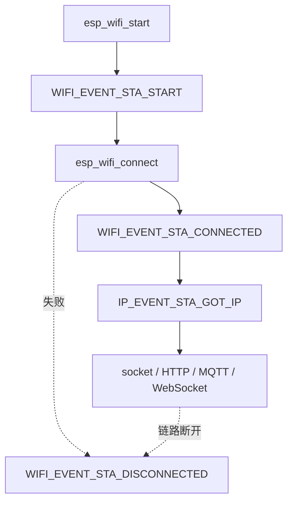

这篇文章用于准备偏 Wi-Fi / IoT / ESP32 联网方向的外包面试。

面试官通常不是想听你背 API，而是想确认你是否理解：

```text
Wi-Fi 连接到底经历哪些阶段？
ESP32 的事件对应协议栈哪一层？
什么时候才算真正联网成功？
断线重连怎么收口？
语音/音频/时钟类业务应该怎么选 Wi-Fi 功耗策略？
```

## 30 秒总回答

可以先这样回答：

```text
Wi-Fi 从发现 AP 到真正可通信，不是一步完成的。底层先 scan，之后 802.11 authentication 和 association 建立二层链路，然后 WPA2 四次握手生成会话密钥，再通过 DHCP 拿到 IP。对 ESP32 来说，WIFI_EVENT_STA_CONNECTED 只能说明已连上 AP，IP_EVENT_STA_GOT_IP 才说明网络层 ready。真正业务可用还要继续看 DNS、TCP/TLS/WebSocket 或 MQTT 是否成功。
```

如果面试官继续问项目经验，可以接：

```text
我在项目里会把 Wi-Fi/IP/gateway/session 分成不同状态，NetworkService 负责 Wi-Fi 和 IP 层状态，Session 负责业务会话，避免一个 online 字段混淆所有问题。
```

## Wi-Fi 建连流程怎么讲

最清晰的顺序：

```text
扫描
  -> 802.11 认证
  -> 关联
  -> WPA2 4-Way Handshake
  -> DHCP
  -> 应用层通信
```

表格版：

| 阶段 | 发生了什么 | 面试关键词 |
|---|---|---|
| 扫描 | STA 通过 Beacon / Probe 发现 AP | Discovery |
| 认证 | Authentication Request/Response | Open System |
| 关联 | Association Request/Response，AP 分配 AID | L2 link |
| WPA2 握手 | EAPOL 四次握手，生成 PTK/GTK | key handshake |
| DHCP | Discover/Offer/Request/ACK | got IP |
| 应用通信 | TCP/UDP/TLS/WebSocket/MQTT | business ready |

一句话：

```text
STA_CONNECTED 是二层连接，GOT_IP 是三层上线，业务 online 还要看应用协议。
```

## ESP32 事件怎么讲



回答重点：

```text
esp_wifi_start 只是启动 Wi-Fi driver。
esp_wifi_connect 才是发起连接。
WIFI_EVENT_STA_CONNECTED 表示连上 AP。
IP_EVENT_STA_GOT_IP 表示 DHCP 成功。
WIFI_EVENT_STA_DISCONNECTED 表示链路失效，需要清理上层状态并按策略重连。
```

## WPA2 四次握手怎么讲

不要讲太复杂，能说清目标即可：

```text
WPA2 四次握手不是把密码发给 AP，而是 STA 和 AP 基于 PMK、Nonce 和 MAC 地址派生本次连接的 PTK。PTK 里有 KCK、KEK、TK，分别用于握手消息完整性、密钥材料加密和后续数据帧加密。
```

更短版本：

```text
四次握手的目的就是证明双方都有正确密钥，并生成本次会话使用的加密密钥。
```

## DHCP 为什么重要

如果面试官问“为什么连上 Wi-Fi 还不能访问网络”，可以回答：

```text
因为连上 AP 只解决了二层链路问题。设备还需要通过 DHCP 获取 IP、网关和 DNS，拿到 IP 后才具备 TCP/UDP 通信条件。
```

结合 ESP32：

```text
所以我一般不会在 WIFI_EVENT_STA_CONNECTED 就启动业务连接，而是在 IP_EVENT_STA_GOT_IP 后再启动 TCP/TLS/WebSocket 或 gateway probe。
```

## 断线重连怎么讲

断线事件：

```text
WIFI_EVENT_STA_DISCONNECTED
```

面试表达：

```text
我不会只看到 disconnected 就无脑重连。首先要记录 reason code、RSSI、重试次数和当前业务状态。比如密码错误、找不到 AP 这类配置问题不适合无限快速重试；Beacon timeout、AP 临时断开、弱信号可以按退避策略重连。同时要通知上层 WebSocket、Session 和 UI 收口。
```

常见分类：

| 类型 | 例子 | 处理 |
|---|---|---|
| 配置错误 | 密码错误、认证失败 | 提示配置错误，降低重试频率 |
| AP 不可达 | 找不到 AP、信号弱 | 退避扫描/重连 |
| 连接后掉线 | Beacon timeout、AP 主动断开 | 快速重连，记录 RSSI |
| 业务断线 | TCP/TLS/WebSocket 断 | Wi-Fi 可能仍在线，但业务 session 要重建 |

## Wi-Fi 省电策略怎么讲

```text
WIFI_PS_NONE:
  延迟最低，功耗最高，适合语音交互和实时音频。

WIFI_PS_MIN_MODEM:
  保持连接，按 DTIM 周期唤醒，功耗和延迟折中。

Light Sleep:
  CPU 与 Wi-Fi 协同睡眠，适合非强实时场景。

Deep Sleep:
  Wi-Fi 彻底断开，唤醒后重新连接，适合低频上报或桌面时钟。
```

场景选择：

| 场景 | 推荐 |
|---|---|
| AI 语音交互 | `WIFI_PS_NONE` 或谨慎 `MIN_MODEM` |
| 持续音频流 | 优先 `WIFI_PS_NONE`，需要实测 jitter |
| 普通 IoT 状态同步 | `MIN_MODEM` |
| 桌面时钟/低频刷新 | Light Sleep / Deep Sleep |

## 结合我的项目怎么讲

可以这样把 Wi-Fi 和 Pixel Soul 项目连起来：

```text
我的项目里设备要先连接 Wi-Fi，拿到 IP 后再 TCP 探测 gateway，gateway online 后才允许进入 AI wake prompt。这样能避免用户已经看到“请说你好小智”，但服务端其实不可达的问题。
```

再展开：

```text
我把状态拆成 network ready、gateway online、session active。NetworkService 只负责 Wi-Fi/IP 状态，gateway probe 只判断服务端端口可达，Session 只在唤醒后创建业务会话。这样定位问题时可以快速区分是 Wi-Fi、IP、gateway、WebSocket 还是 AI Session 出错。
```

## 高频追问

### Q1：为什么 `STA_CONNECTED` 后不立刻创建 WebSocket？

因为这时还没有 IP。应该等 `IP_EVENT_STA_GOT_IP` 后再创建 TCP/TLS/WebSocket。

### Q2：为什么业务 online 不能等同于 Wi-Fi online？

Wi-Fi online 只说明网络基础可用；业务 online 还要 DNS、TCP、TLS、WebSocket、协议握手全部成功。

### Q3：断线后哪些状态要清？

至少要清：

```text
ip_ready
gateway_reachable
WebSocket connected
Session active
audio publish enabled
pending tx/rx queue
UI online status
```

具体是否清音频队列，要看业务设计；但不能让旧会话继续以为自己在线。

### Q4：语音设备能不能 Deep Sleep？

如果要求随时唤醒和低延迟语音交互，不适合 Deep Sleep。Deep Sleep 适合低频上报，因为每次都要重新连接 Wi-Fi，延迟是秒级。

### Q5：为什么 Wi-Fi 省电会影响音频？

省电模式会引入 DTIM 唤醒周期、TCP ACK 延迟、收发 burst 和调度抖动。音频流对 jitter 和持续吞吐敏感，所以必须实测，不应该只看平均网速。

## 易错回答

错误：

```text
Wi-Fi connected 就代表可以上网。
```

正确：

```text
Wi-Fi connected 代表二层连接；got IP 才代表网络层上线；业务协议成功才代表业务可用。
```

错误：

```text
断线就 while 循环 esp_wifi_connect。
```

正确：

```text
断线要看 reason code，更新状态，通知上层收口，再按退避策略重连。
```

错误：

```text
为了省电，语音设备直接 Deep Sleep。
```

正确：

```text
语音交互需要低延迟在线，通常要常驻 Wi-Fi；Deep Sleep 更适合低频上报。
```

