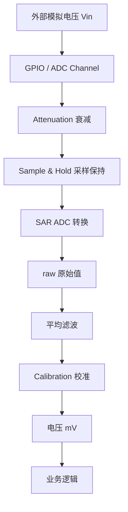
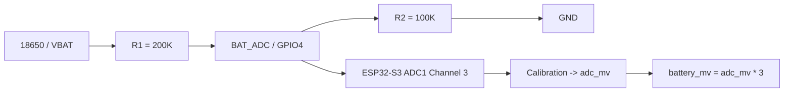

## TL;DR

ESP32-S3 的 ADC 不是直接读出“真实电压”，而是把输入电压转换成一个原始数字值 `raw`。工程里不要只用 `raw * 3.3 / 4095` 这种理想公式，应该使用 ESP-IDF 的 ADC calibration，把 `raw` 转成更接近真实值的 mV。

在当前 ESP32-S3-RLCD-4.2 板子上，电池电压采集链路是：

```text
VBAT
  -> 200K/100K 电阻分压
  -> BAT_ADC
  -> GPIO4 / ADC1 Channel 3
  -> adc_cali_raw_to_voltage()
  -> adc_mv * 3
  -> battery_mv
```

## 1. 为什么要学 ADC

很多外部传感器输出的是模拟电压，而不是数字值。例如：

- 电位器输出 `0-3.3V`。
- 光敏电阻分压后输出随光照变化的电压。
- NTC 热敏电阻输出与温度相关的电压。
- 电池通过分压后输出较低电压。
- 压力、电流、麦克风等传感器也可能输出模拟信号。

MCU 不能直接理解“1.37V”这种连续模拟量，它需要 ADC，也就是 Analog-to-Digital Converter。

```text
模拟电压 Vin
  -> ADC
  -> 数字值 raw
  -> 软件换算电压
```

ESP32-S3 常用 12 bit ADC，原始读数范围大致是：

```text
0 ~ 4095
```

## 2. 总体流程



这个流程可以记成：

```text
Vin -> Channel -> Attenuation -> SAR ADC -> raw -> filter -> calibration -> mV
```

## 3. ADC1 和 ADC2

ESP32-S3 内部有两个 ADC 单元：

```text
ADC1
ADC2
```

一般项目优先使用 `ADC1`，因为 `ADC2` 会和 Wi-Fi 等模块共享资源，某些模式下更容易遇到冲突。

常见映射大致是：

| ADC 单元 | GPIO 范围 | 通道 |
| --- | --- | --- |
| ADC1 | GPIO1 ~ GPIO10 | ADC_CHANNEL_0 ~ ADC_CHANNEL_9 |
| ADC2 | GPIO11 ~ GPIO20 | ADC_CHANNEL_0 ~ ADC_CHANNEL_9 |

当前板子的 `BAT_ADC` 使用官方 demo 中的：

```text
ADC_UNIT_1
ADC_CHANNEL_3
```

也就是 `GPIO4 / ADC1_CHANNEL_3`。

## 4. raw 和 Vref

理想情况下：

```text
raw ≈ Vin / Vref * (2^bitwidth - 1)
```

12 bit 时：

```text
raw ≈ Vin / Vref * 4095
```

反过来：

```text
Vin ≈ raw / 4095 * Vref
```

但 ESP32-S3 的内部参考电压 `Vref` 虽然设计值约为 `1100mV`，不同芯片之间会有偏差。也就是说，同样输入 `1.000V`，不同芯片读出来的 raw 可能不同。

所以工程里不要只相信：

```c
voltage = raw * 3.3 / 4095;
```

这只是理想估算。

## 5. 衰减 Attenuation

ADC 核心本身适合测较低电压。为了测接近 `3.3V` 的输入，ESP32-S3 在 ADC 前端提供了衰减器。

可以把它理解为内部模拟分压：

```text
外部 Vin
  -> 内部衰减器缩小
  -> ADC 核心采样
```

常见衰减配置：

| 配置 | 近似理解 | 适合输入 |
| --- | ---: | --- |
| `ADC_ATTEN_DB_0` | 基本不衰减 | 约 1V 以下 |
| `ADC_ATTEN_DB_2_5` | 轻微衰减 | 约 1V-1.5V |
| `ADC_ATTEN_DB_6` | 大约减半 | 约 1.5V-2.2V |
| `ADC_ATTEN_DB_12` | 较大衰减 | 接近 3.3V |

当前板子的电池分压点最高约：

```text
4.2V / 3 = 1.4V
```

官方 ADC demo 使用 `ADC_ATTEN_DB_12`，PowerService 可以优先沿用这个配置。

## 6. 校准 Calibration

ESP32-S3 的 ADC 误差主要来自：

- Vref 实际值偏差。
- 衰减器比例误差。
- ADC 非线性。
- 芯片制造差异。

ESP-IDF 提供 calibration driver，常用的是 Curve Fitting 方案。

推荐方式：

```c
adc_cali_raw_to_voltage(cali_handle, raw, &voltage_mv);
```

它会结合芯片 eFuse 校准数据、ADC unit、attenuation 和 bitwidth，把 raw 转成更接近真实值的 mV。

## 7. 输入阻抗和滤波

SAR ADC 在转换前会使用内部采样电容抓取输入电压。

如果输入源阻抗太大，采样电容充电速度不够，读数就可能偏低。

工程经验：

- 分压电阻不要无限增大。
- ADC 输入点可以并联 `0.01uF ~ 0.1uF` 电容到地。
- 多次采样取平均。
- 第一次采样不稳定时可以丢弃。

当前板子用较高阻值分压以降低电池耗电，因此多次采样平均和校准更有必要。

## 8. Oneshot 和 Continuous

ESP-IDF ADC 常见两种使用方式：

| 模式 | 特点 | 适合 |
| --- | --- | --- |
| Oneshot | 软件需要时采一次 | 电池、电位器、慢速传感器 |
| Continuous | 硬件连续采样，DMA 搬运 | 波形、音频、较高采样率 |

电池电压变化很慢，所以当前项目只需要 `oneshot`。

## 9. 当前板子的电池采集链路

ESP32-S3-RLCD-4.2 的电池管理不是 I2C 电量计方案，而是：

| 功能 | 芯片/器件 | 作用 |
| --- | --- | --- |
| 充电管理 | `ETA6098` | 锂电池充电管理 |
| 电池保护 | `S8261 + 8205` | 过充、过放、过流保护 |
| 电压采样 | ESP32-S3 ADC | 基于分压后的电压估算电量 |

也就是说，我们能做的是“基于电池电压的粗略电量估算”，不是精确 SOC 计量。



分压公式：

```text
Vadc = Vbat * R2 / (R1 + R2)
```

如果 `R1 = 200K`，`R2 = 100K`：

```text
Vadc = Vbat / 3
Vbat = Vadc * 3
```

## 10. 当前板子的代码示例

下面示例只聚焦电池电压采集，适合作为 PowerService 的底层采样逻辑参考。

### CMakeLists.txt

```cmake
idf_component_register(
    SRCS "main.c"
    INCLUDE_DIRS "."
    REQUIRES esp_adc
)
```

### main.c

```c
#include <stdbool.h>
#include <stdint.h>
#include <stdio.h>

#include "freertos/FreeRTOS.h"
#include "freertos/task.h"

#include "esp_adc/adc_cali.h"
#include "esp_adc/adc_cali_scheme.h"
#include "esp_adc/adc_oneshot.h"
#include "esp_err.h"
#include "esp_log.h"

static const char *TAG = "BAT_ADC";

#define BAT_ADC_UNIT       ADC_UNIT_1
#define BAT_ADC_CHANNEL    ADC_CHANNEL_3
#define BAT_ADC_ATTEN      ADC_ATTEN_DB_12
#define BAT_ADC_BITWIDTH   ADC_BITWIDTH_12

#define BAT_DIVIDER_RATIO  3
#define BAT_EMPTY_MV       3000
#define BAT_FULL_MV        4120
#define SAMPLE_COUNT       16

static bool init_adc_calibration(adc_cali_handle_t *out_handle)
{
    adc_cali_curve_fitting_config_t config = {
        .unit_id = BAT_ADC_UNIT,
        .chan = BAT_ADC_CHANNEL,
        .atten = BAT_ADC_ATTEN,
        .bitwidth = BAT_ADC_BITWIDTH,
    };

    esp_err_t ret = adc_cali_create_scheme_curve_fitting(&config, out_handle);
    if (ret != ESP_OK) {
        *out_handle = NULL;
        ESP_LOGW(TAG, "ADC calibration unavailable: %s", esp_err_to_name(ret));
        return false;
    }

    return true;
}

static uint8_t battery_percent_from_mv(int battery_mv)
{
    if (battery_mv <= BAT_EMPTY_MV) {
        return 0;
    }
    if (battery_mv >= BAT_FULL_MV) {
        return 100;
    }

    return (uint8_t)((battery_mv - BAT_EMPTY_MV) * 100 /
                     (BAT_FULL_MV - BAT_EMPTY_MV));
}

void app_main(void)
{
    adc_oneshot_unit_handle_t adc_handle = NULL;

    adc_oneshot_unit_init_cfg_t unit_config = {
        .unit_id = BAT_ADC_UNIT,
        .ulp_mode = ADC_ULP_MODE_DISABLE,
    };
    ESP_ERROR_CHECK(adc_oneshot_new_unit(&unit_config, &adc_handle));

    adc_oneshot_chan_cfg_t channel_config = {
        .atten = BAT_ADC_ATTEN,
        .bitwidth = BAT_ADC_BITWIDTH,
    };
    ESP_ERROR_CHECK(adc_oneshot_config_channel(
        adc_handle,
        BAT_ADC_CHANNEL,
        &channel_config
    ));

    adc_cali_handle_t cali_handle = NULL;
    bool calibrated = init_adc_calibration(&cali_handle);

    while (true) {
        int raw = 0;
        int raw_sum = 0;

        for (int i = 0; i < SAMPLE_COUNT; ++i) {
            ESP_ERROR_CHECK(adc_oneshot_read(adc_handle, BAT_ADC_CHANNEL, &raw));
            raw_sum += raw;
            vTaskDelay(pdMS_TO_TICKS(2));
        }

        int raw_avg = raw_sum / SAMPLE_COUNT;

        if (calibrated) {
            int adc_mv = 0;
            ESP_ERROR_CHECK(adc_cali_raw_to_voltage(cali_handle, raw_avg, &adc_mv));

            int battery_mv = adc_mv * BAT_DIVIDER_RATIO;
            uint8_t percent = battery_percent_from_mv(battery_mv);

            ESP_LOGI(TAG,
                     "raw=%d adc=%dmV battery=%dmV percent=%u%%",
                     raw_avg,
                     adc_mv,
                     battery_mv,
                     (unsigned)percent);
        } else {
            ESP_LOGI(TAG, "raw=%d calibration unavailable", raw_avg);
        }

        vTaskDelay(pdMS_TO_TICKS(30000));
    }
}
```

## 11. 从示例到 PowerService

上面的示例可以进一步收敛成项目里的 `PowerService`：

```text
Init ADC/GPIO
  -> Sample Battery
  -> Read Charge GPIO
  -> Update Snapshot
  -> Notify App if changed
```

对上层只暴露 snapshot：

```c
typedef struct {
    bool valid;
    uint16_t voltage_mv;
    uint8_t percent;
    bool charge_valid;
    bool charging;
} power_snapshot_t;
```

这样 UI 不需要理解 ADC，也不需要知道分压电阻。它只关心：

```text
battery_valid
battery_percent
charging
```

## 12. 工程经验总结

- 优先使用 `ADC1`，避免和 Wi-Fi 相关资源冲突。
- 根据输入范围选择 attenuation，不要自己死算衰减比例。
- 使用 `adc_cali_raw_to_voltage()`，不要只靠理想公式。
- 电池电压采集适合 `oneshot`，不需要 continuous。
- 多次采样取平均，降低随机噪声。
- 电池百分比只是粗略估算，不等同于电量计 SOC。
- 如果需要精确电量，应该使用专门的电量计芯片。

## 参考资料

- [Espressif ESP32-S3 ADC 文档](https://docs.espressif.com/projects/esp-idf/en/stable/esp32s3/api-reference/peripherals/adc/index.html)
- [ESP-IDF ADC Oneshot Driver](https://docs.espressif.com/projects/esp-idf/en/stable/esp32s3/api-reference/peripherals/adc/adc_oneshot.html)
- [ESP-IDF ADC Calibration Driver](https://docs.espressif.com/projects/esp-idf/en/stable/esp32s3/api-reference/peripherals/adc/adc_calibration.html)
- ESP32-S3-RLCD-4.2 官方 ADC demo：`02_ESP-IDF/03_ADC_Test`

