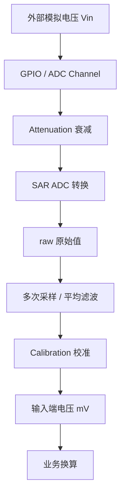

这篇文章是 [PowerService：电源与电池状态](../projects/pixel-soul-services/power-service/) 的底层背景资料。它说明模拟电压如何进入 GPIO，如何变成 `raw`，为什么要做校准，以及怎样把这个采样链路用于电池电压观测。

前半部分先讲 ESP32-S3 ADC 的通用原理；后半部分用 `ESP32-S3-RLCD-4.2` 示例板的电池采样链路说明 PowerService 为什么可以只暴露 `voltage_mv / percent` 这类电量 snapshot 字段。当前板卡充电状态由 Type-C 口附近的 `CHG` LED 人眼判断，固件默认不读取 charging。

## 1. 为什么要学 ADC

很多外部传感器输出的是模拟电压，而不是数字值。例如：

- 电位器输出随旋钮位置变化的电压。
- 光敏电阻分压后输出随光照变化的电压。
- NTC 热敏电阻输出与温度相关的电压。
- 锂电池通过分压后输出较低电压。
- 压力、电流、麦克风等传感器也可能输出模拟信号。

MCU 不能直接理解“1.37V”这种连续模拟量，它需要 ADC，也就是 Analog-to-Digital Converter。

```text
模拟电压 Vin
  -> ADC
  -> 数字值 raw
  -> 软件换算电压
```

ESP32-S3 的 ADC 默认输出 12 bit 数字值。12 bit 可以理解为把输入范围切成约 4096 个等级，常见 `raw` 范围是：

```text
0 ~ 4095
```

## 2. 总体流程



这个流程可以记成：

```text
Vin -> Channel -> Attenuation -> raw -> filter -> calibration -> mV -> business value
```

其中“业务换算”取决于外部电路。例如电池分压采集里，ADC 只能看到分压后的 `Vadc`，软件还要根据电阻比例还原 `Vbat`。

## 3. ADC1 和 ADC2

ESP32-S3 内部有两个 ADC 单元：

```text
ADC1
ADC2
```

一般项目优先使用 `ADC1`。ESP-IDF 文档说明 `ADC2` 也会被 Wi-Fi 使用，oneshot driver 会做资源仲裁，但实际项目中如果没有特殊原因，用 `ADC1` 更简单。

常见映射是：

| ADC 单元 | GPIO 范围 | 通道 |
| --- | --- | --- |
| `ADC1` | `GPIO1` ~ `GPIO10` | `ADC_CHANNEL_0` ~ `ADC_CHANNEL_9` |
| `ADC2` | `GPIO11` ~ `GPIO20` | `ADC_CHANNEL_0` ~ `ADC_CHANNEL_9` |

在 `ESP32-S3-RLCD-4.2` ADC demo 里，电池采样使用：

```text
ADC_UNIT_1
ADC_CHANNEL_3
```

也就是：

```text
GPIO4 / ADC1 Channel 3
```

## 4. raw、Vref 和理想公式

理想情况下：

```text
raw ≈ Vin / Vref * (2^bitwidth - 1)
```

12 bit 时：

```text
raw ≈ Vin / Vref * 4095
```

反过来：

```text
Vin ≈ raw / 4095 * Vref
```

但这只是理想模型。ESP32-S3 的 ADC 参考电压设计值约为 `1100mV`，不同芯片之间可能存在偏差。官方文档给出的背景是，实际 Vref 可能落在约 `1000mV ~ 1200mV` 的范围内。

所以工程里不要只依赖：

```c
voltage = raw * 3.3 / 4095;
```

这类公式适合帮助理解 ADC，但不适合作为最终电压测量结果。

## 5. 衰减 Attenuation

ADC 前端有 attenuation 衰减配置。它的作用是让 ADC 可以覆盖不同输入电压范围。

可以把它理解为：

```text
外部 Vin
  -> ADC 前端衰减
  -> SAR ADC 核心采样
```

常见配置：

| 配置 | 学习时可以这样理解 |
| --- | --- |
| `ADC_ATTEN_DB_0` | 输入范围较小，适合低电压信号 |
| `ADC_ATTEN_DB_2_5` | 比 0 dB 覆盖更高一点的输入 |
| `ADC_ATTEN_DB_6` | 继续扩大可测输入范围 |
| `ADC_ATTEN_DB_12` | 覆盖更高输入范围，常用于接近电源电压或分压后的电池采样 |

注意：具体可测电压范围不要只凭名字估算，要以对应芯片 datasheet 和 ESP-IDF 文档为准。不同 SoC、不同 attenuation 的有效范围和线性误差并不完全相同。

`ESP32-S3-RLCD-4.2` 官方 ADC demo 使用：

```text
ADC_ATTEN_DB_12
```

本文示例沿用这个配置。

## 6. 校准 Calibration

ADC 误差主要来自：

- Vref 实际值偏差。
- 衰减器比例误差。
- ADC 非线性。
- 芯片制造差异。
- 外部电路阻抗、噪声和采样时序。

ESP-IDF 提供 ADC calibration driver。常见做法是先读 `raw`，再调用：

```c
adc_cali_raw_to_voltage(cali_handle, raw, &voltage_mv);
```

`voltage_mv` 的单位是 `mV`。这里得到的是 ADC 输入端看到的电压，不一定就是业务对象的真实电压。电池分压采样里，它对应的是分压节点 `BAT_ADC` 的电压。

## 7. 输入阻抗、滤波和采样

SAR ADC 在转换前会用内部采样电容抓取输入电压。如果输入源阻抗太大，采样电容充电不充分，读数可能偏低或抖动。

工程里常见处理：

- 分压电阻不要无限增大。
- ADC 输入点可以并联小电容到地；乐鑫硬件设计指南建议 ADC 引脚到地增加 `0.1uF` 滤波电容来改善精度。
- 多次采样取平均，降低随机噪声。
- 如果第一次采样明显不稳定，可以丢弃第一次结果。

电池电压变化很慢，适合用低频 `oneshot` 采样，不需要 continuous 模式。

| 模式 | 特点 | 适合 |
| --- | --- | --- |
| Oneshot | 软件需要时采一次 | 电池、电位器、慢速传感器 |
| Continuous | 硬件连续采样，DMA 搬运 | 波形、音频、较高采样率 |

## 8. 示例背景：ESP32-S3-RLCD-4.2 电池电压采集

### 快速结论

ESP32-S3 的 ADC 不是直接读出“真实电压”，而是把输入电压转换成一个原始数字值 `raw`。工程里不要只用 `raw * 3.3 / 4095` 这种理想公式，应该使用 ESP-IDF 的 ADC calibration，把 `raw` 转成更接近真实值的 `mV`。

在 `ESP32-S3-RLCD-4.2` 示例板上，电池电压采集链路可以理解为：

```text
VBAT
  -> 200K / 100K 电阻分压
  -> BAT_ADC
  -> GPIO4 / ADC1 Channel 3
  -> adc_cali_raw_to_voltage()
  -> adc_mv * 3
  -> battery_mv
```

这不是 I2C 电量计方案，而是“根据电池电压粗略估算电量”。它适合显示大致电量，不等同于精确 SOC 计量。

### 局部等效电路

下面是根据 ADC demo 代码和分压关系重画的局部等效图，用于学习电池采样链路。实际板卡以原理图/BOM 为准。


分压公式：

```text
Vadc = Vbat * R2 / (R1 + R2)
```

如果 `R1 = 200K`，`R2 = 100K`：

```text
Vadc = Vbat / 3
Vbat = Vadc * 3
```

所以软件里会看到：

```text
battery_mv = adc_mv * 3
```

## 9. ESP-IDF 代码示例

下面示例只聚焦电池电压采集，适合作为学习 demo 或后续 PowerService 底层采样逻辑参考。

### CMakeLists.txt

```cmake
idf_component_register(
    SRCS "main.c"
    INCLUDE_DIRS "."
    REQUIRES esp_adc
)
```

### main.c

```c
#include <stdbool.h>
#include <stdint.h>

#include "freertos/FreeRTOS.h"
#include "freertos/task.h"

#include "esp_adc/adc_cali.h"
#include "esp_adc/adc_cali_scheme.h"
#include "esp_adc/adc_oneshot.h"
#include "esp_err.h"
#include "esp_log.h"

static const char *TAG = "BAT_ADC";

#define BAT_ADC_UNIT       ADC_UNIT_1
#define BAT_ADC_CHANNEL    ADC_CHANNEL_3
#define BAT_ADC_ATTEN      ADC_ATTEN_DB_12
#define BAT_ADC_BITWIDTH   ADC_BITWIDTH_12

#define BAT_DIVIDER_RATIO  3
#define BAT_EMPTY_MV       3000
#define BAT_FULL_MV        4120
#define SAMPLE_COUNT       16

static bool init_adc_calibration(adc_cali_handle_t *out_handle)
{
#if ADC_CALI_SCHEME_CURVE_FITTING_SUPPORTED
    adc_cali_curve_fitting_config_t config = {
        .unit_id = BAT_ADC_UNIT,
        .chan = BAT_ADC_CHANNEL,
        .atten = BAT_ADC_ATTEN,
        .bitwidth = BAT_ADC_BITWIDTH,
    };

    esp_err_t ret = adc_cali_create_scheme_curve_fitting(&config, out_handle);
    if (ret != ESP_OK) {
        *out_handle = NULL;
        ESP_LOGW(TAG, "ADC calibration unavailable: %s", esp_err_to_name(ret));
        return false;
    }

    return true;
#else
    *out_handle = NULL;
    ESP_LOGW(TAG, "ADC curve fitting calibration is not supported");
    return false;
#endif
}

static uint8_t battery_percent_from_mv(int battery_mv)
{
    if (battery_mv <= BAT_EMPTY_MV) {
        return 0;
    }
    if (battery_mv >= BAT_FULL_MV) {
        return 100;
    }

    return (uint8_t)((battery_mv - BAT_EMPTY_MV) * 100 /
                     (BAT_FULL_MV - BAT_EMPTY_MV));
}

void app_main(void)
{
    adc_oneshot_unit_handle_t adc_handle = NULL;

    adc_oneshot_unit_init_cfg_t unit_config = {
        .unit_id = BAT_ADC_UNIT,
        .ulp_mode = ADC_ULP_MODE_DISABLE,
    };
    ESP_ERROR_CHECK(adc_oneshot_new_unit(&unit_config, &adc_handle));

    adc_oneshot_chan_cfg_t channel_config = {
        .atten = BAT_ADC_ATTEN,
        .bitwidth = BAT_ADC_BITWIDTH,
    };
    ESP_ERROR_CHECK(adc_oneshot_config_channel(
        adc_handle,
        BAT_ADC_CHANNEL,
        &channel_config
    ));

    adc_cali_handle_t cali_handle = NULL;
    bool calibrated = init_adc_calibration(&cali_handle);

    while (true) {
        int raw = 0;
        int raw_sum = 0;

        for (int i = 0; i < SAMPLE_COUNT; ++i) {
            ESP_ERROR_CHECK(adc_oneshot_read(adc_handle, BAT_ADC_CHANNEL, &raw));
            raw_sum += raw;
            vTaskDelay(pdMS_TO_TICKS(2));
        }

        int raw_avg = raw_sum / SAMPLE_COUNT;

        if (calibrated) {
            int adc_mv = 0;
            ESP_ERROR_CHECK(adc_cali_raw_to_voltage(cali_handle, raw_avg, &adc_mv));

            int battery_mv = adc_mv * BAT_DIVIDER_RATIO;
            uint8_t percent = battery_percent_from_mv(battery_mv);

            ESP_LOGI(TAG,
                     "raw=%d adc=%dmV battery=%dmV percent=%u%%",
                     raw_avg,
                     adc_mv,
                     battery_mv,
                     (unsigned)percent);
        } else {
            ESP_LOGI(TAG, "raw=%d calibration unavailable", raw_avg);
        }

        vTaskDelay(pdMS_TO_TICKS(30000));
    }
}
```

这段代码的关键点：

- `ADC_UNIT_1 + ADC_CHANNEL_3` 对应示例板的 `GPIO4`。
- `ADC_ATTEN_DB_12` 沿用示例板官方 demo。
- `adc_cali_raw_to_voltage()` 得到的是 `BAT_ADC` 节点电压。
- 因为外部分压是 `200K / 100K`，所以 `battery_mv = adc_mv * 3`。
- `3000mV ~ 4120mV` 的百分比只是线性粗估，不能代表精确 SOC。

## 10. 从示例到 PowerService

如果把上面的 demo 收敛成项目里的 `PowerService`，模块职责可以保持很简单：

```text
Init ADC/GPIO
  -> Sample Battery
  -> Convert to Voltage
  -> Estimate Percent
  -> Update Snapshot
  -> Notify App if changed
```

对上层只暴露 snapshot：

```c
typedef struct {
    bool valid;
    uint16_t voltage_mv;
    uint8_t percent;
    bool charge_valid;
    bool charging;
} power_snapshot_t;
```

这样 UI 不需要理解 ADC，也不需要知道分压电阻。它只关心：

```text
battery_valid
battery_percent
```

当前板卡没有确认 `CHG/STAT` 接到 ESP32 GPIO，所以右上角 UI 不显示充电图标。充电状态由用户观察 Type-C 口附近的 `CHG` LED 亮灭判断。

## 11. 校对记录

这篇笔记按以下依据校正过：

- ESP-IDF stable ESP32-S3 ADC 文档：ADC 原始输出、attenuation、calibration、oneshot driver。
- ESP-IDF stable ESP32-S3 ADC calibration 文档：`adc_cali_raw_to_voltage()` 输出电压单位为 `mV`，推荐基于校准方案把 `raw` 转换为电压。
- 本地 `ESP32-S3-RLCD-4.2-Demo/02_ESP-IDF/03_ADC_Test` 示例：确认 `ADC_UNIT_1`、`ADC_CHANNEL_3`、`ADC_ATTEN_DB_12`、`ADC_BITWIDTH_12`，以及 `adc_cali_raw_to_voltage()` 后乘 `3` 的板级分压关系。

仍然要注意：

- 本文示例图是局部等效图，不代替完整原理图。
- 不同 ESP32 板卡的 ADC 引脚、电阻分压比、充电管理芯片可能不同。
- 电池百分比线性估算只适合粗略显示，精确电量需要专用电量计。

## 参考资料

- [Espressif ESP32-S3 ADC 文档](https://docs.espressif.com/projects/esp-idf/en/stable/esp32s3/api-reference/peripherals/adc/index.html)
- [ESP-IDF ADC Oneshot Driver](https://docs.espressif.com/projects/esp-idf/en/stable/esp32s3/api-reference/peripherals/adc/adc_oneshot.html)
- [ESP-IDF ADC Calibration Driver](https://docs.espressif.com/projects/esp-idf/en/stable/esp32s3/api-reference/peripherals/adc/adc_calibration.html)
- [ESP32-S3 Hardware Design Guidelines](https://docs.espressif.com/projects/esp-hardware-design-guidelines/en/latest/esp32s3/esp-hardware-design-guidelines-en-master-esp32s3.pdf)
- 本地 ESP32-S3-RLCD-4.2 ADC demo：`02_ESP-IDF/03_ADC_Test`
