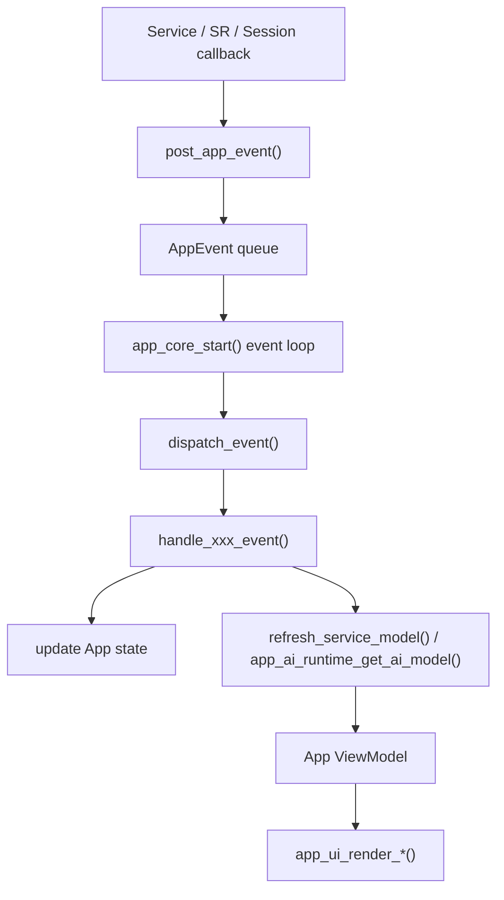
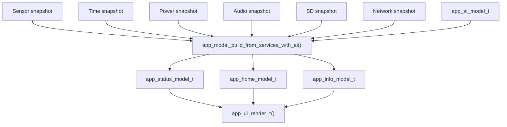

## 一句话定位

`AppApplication` 是设备侧的产品编排层：它把按键、页面、Footer、AI 入口、Session 状态和各个 Service snapshot 组织成用户可见行为。

更直白地说：

```text
Service 提供事实:
  按键事件 / 网络状态 / 传感器 / 时间 / 电量 / 音频 / Session

AppApplication 解释事实:
  当前页面是什么
  这个按键在当前状态下代表什么
  AI Footer 应该显示什么
  哪些 Service 更新会刷新 UI

AppUI 只渲染结果:
  status / home / game / info / footer model
```

所以 App 层不是底层驱动，也不是 AI Session 本体。它的核心价值是：**把异步硬件事实收束成一个串行业务决策入口**。

## 文件边界

当前 App 层主要由这些文件组成：

| 文件 | 职责 |
| --- | --- |
| `include/app_application.h` | 对外启动入口，最终进入 `app_core_start()`。 |
| `include/app_events.h` | 定义 App 层事件类型，例如按键、网络、SR wake、Session 更新。 |
| `include/app_event_bus.h` / `src/app_event_bus.c` | AppEvent 队列，把外部回调串行化。 |
| `src/app_core.c` | 唯一业务编排中心，消费 AppEvent，决定页面、按键、Footer 和 AI 动作。 |
| `src/app_ai_runtime.c` | App 到 SR/Session/ringbuf/gateway 的窄适配层。 |
| `src/app_model.c` | 纯投影层，把 Service snapshot + AI model 变成 UI ViewModel。 |
| `include/app_view_models.h` | Status/Home/Game/Info/Footer/AI 的 ViewModel 类型。 |
| `src/app_ui/` | LVGL 渲染层，只消费 ViewModel，不读取 Service。 |

边界可以这样背：

```text
AppCore:
  管产品语义。

AppAIRuntime:
  管 App 到 AI Session/SR 的适配。

AppModel:
  管数据投影，不做副作用。

AppUI:
  管渲染，不做业务判断。
```

## 主心智模型

App 层最重要的主线不是“哪个页面怎么画”，而是这条事件和数据流：



这条链路的好处是：按键、网络、传感器、SR、Session 都可能从不同任务或回调线程回来，但它们不会直接改 UI，也不会互相抢业务状态。所有产品决策都回到 `dispatch_event()` 后串行执行。

当前 `app_event_type_t` 包含：

| 事件 | 来源 | AppCore 做什么 |
| --- | --- | --- |
| `APP_EVENT_BUTTON` | ButtonService callback | 根据 `BOOT / KEY` 和当前页面/AI 状态解释按键语义。 |
| `APP_EVENT_SENSOR_UPDATED` | SensorService callback | 刷新 Service model；Home/Info 页面需要时重渲染。 |
| `APP_EVENT_TIME_UPDATED` | TimeService callback | 刷新 Service model；Home/Info 页面需要时重渲染。 |
| `APP_EVENT_POWER_UPDATED` | PowerService callback | 刷新状态栏电池模型。 |
| `APP_EVENT_NETWORK_UPDATED` | NetworkService callback | 更新网络状态、通知 TimeService、触发 gateway probe。 |
| `APP_EVENT_SR_WAKE_WORD` | AppAIRuntime 从 SR wake 转换而来 | 检查网络/gateway/session，再决定是否 `session_start`。 |
| `APP_EVENT_SESSION_UPDATED` | Session update 经 AppAIRuntime 转换而来 | 获取 AI model，更新 Footer 和 Info AI 状态。 |
| `APP_EVENT_SESSION_ERROR` | SR/Session 错误 | App AI 状态进入 error，Footer 显示错误。 |
| `APP_EVENT_GATEWAY_UPDATED` | TCP gateway probe 结果 | 更新 Info AI 状态；如果有 pending wake prompt，继续或失败收口。 |

## 启动流程

启动主线可以这样看：

```text
app_application_start()
  -> app_core_start()
  -> app_event_bus_init()
  -> display_service_init()
  -> app_ui_init()
  -> init_app_state()
  -> init Sensor / Time / Power / SD / Audio / Network / Button
  -> app_ai_runtime_init()
       -> create audio_tx/audio_rx ringbuf
       -> sr_service_start(start_active=false)
  -> refresh_service_model()
  -> render_current_page()
  -> start Sensor / Time / Power / Network background work
  -> while true:
       app_event_bus_receive()
       dispatch_event()
       poll_ai_runtime()
       request_gateway_probe(false)
```

这里有两个细节很关键：

- `app_ai_runtime_init()` 会启动 SRService，但 `start_active=false`，所以 BOOT 长按前不会直接进入唤醒监听。
- 外设服务初始化失败通常只降级显示，不应该阻塞主 App，例如 Sensor/Time/Power/SD 的失败不会拖垮 Home/Game/Info。

## AppEvent 为什么重要

如果没有 AppEvent 队列，很多地方会直接改 UI：

```text
Button callback 直接切页
Network callback 直接改 Info
Session callback 直接改 Footer
Sensor callback 直接刷新 Home
```

这样很快会出现竞态：一个回调刚改完 Footer，另一个回调又切页；Session 更新和按键退出同时到达，UI 显示可能和真实状态不一致。

现在的做法是：

```text
callback:
  只投递 AppEvent

event loop:
  串行取事件
  统一 dispatch
  统一更新 App 状态和 UI
```

因此 `AppEvent` 不是业务日志，也不是事件溯源；它只是 App 层的并发收口和业务决策队列。

## 按键业务逻辑

按键服务只输出事实：

```text
BUTTON_ID_BOOT + BUTTON_ACTION_SINGLE_CLICK
BUTTON_ID_KEY + BUTTON_ACTION_VERY_LONG_PRESS
```

真正的含义由 AppCore 根据当前状态决定。

### BOOT

| 动作 | AppCore 解释 |
| --- | --- |
| 单击 | `Home -> Game -> Info -> Home` 循环切页。 |
| 双击 | 回到 Home。 |
| 长按且 AI inactive | 不创建 Session，只显示唤醒提示并激活 SR。 |
| 长按且 AI active/session active | 停止当前 AI Session，发送 `session_close(reason="user_exit")`。 |

BOOT 长按有一个很容易说错的点：**它不是 session_start**。它只是进入“请说：你好，小智”的产品入口；真正创建 Session 的触发点是 SR wake 命中。

### KEY

| 场景 | AppCore 解释 |
| --- | --- |
| AI active/session active | KEY 优先进入 AI 逻辑，不触发页面业务。 |
| AI `SPEAKING` + KEY press/single/long/hold | 调用 `app_ai_runtime_interrupt_output()`，进一步触发 `session_terminate_turn("key_click")`。 |
| Game 页面 + KEY single/long/hold | `merit_count + 1`，最大 999，并显示 hit feedback。 |
| Info 页面 + KEY very long | 清除 Wi-Fi 凭据并进入配网。 |
| 其他页面普通 KEY | 当前保留并忽略。 |

这个设计解决了一个实际问题：AI 播放期如果还允许 Game/Info 的 KEY 业务并行生效，就会出现“我想打断 TTS，结果给游戏加分或触发配网”的错乱体验。

## AI Runtime 数据流

`app_ai_runtime` 是 App 和 Session/SR 之间的窄适配层。AppCore 不直接创建 ringbuf，不直接调用 `session_start()`，也不直接消费 SR 事件。

```text
AppCore
  -> app_ai_runtime_activate()
       -> sr_service_set_active(true)

AppCore
  -> app_ai_runtime_start()
       -> session_start()
       -> pass audio_tx/audio_rx ringbuf

SRService callback
  -> AppAIRuntime on_sr_event()
  -> notify AppCore as APP_AI_RUNTIME_EVENT_WAKE
  -> AppCore posts APP_EVENT_SR_WAKE_WORD

Session update callback
  -> AppAIRuntime on_session_update()
  -> output text queue sync
  -> notify AppCore as APP_AI_RUNTIME_EVENT_UPDATED
  -> AppCore posts APP_EVENT_SESSION_UPDATED
```

`AppAIRuntime` 还做三件 AppCore 不应该直接碰的事：

- 管理 `audio_tx_ringbuf / audio_rx_ringbuf`。
- 做 gateway TCP probe，并把结果投影成 `APP_AI_GATEWAY_*`。
- 根据下行 PCM backlog 延迟发布 `output_text`，让 Footer 文本更接近本地播放进度。

这样 AppCore 保持“产品编排”身份，不会被 SR、Session、ringbuf、gateway socket 细节拖进去。

## AI Session 主链路

App 层视角下，AI 主链路是：

```text
BOOT long press
  -> show_ai_wake_prompt()
  -> check network
  -> check/probe gateway
  -> app_ai_runtime_activate()
  -> Footer: 请说：你好，小智
  -> no session_start yet

SR wake word
  -> APP_EVENT_SR_WAKE_WORD
  -> handle_sr_wake_word_event()
  -> check network and gateway again
  -> show WAIT SESSION
  -> app_ai_runtime_start()
  -> session_start

Session update
  -> APP_EVENT_SESSION_UPDATED
  -> app_ai_runtime_get_ai_model()
  -> update_footer_from_ai()
  -> render_ai_state()
```

关键状态显示：

| 状态 | Footer |
| --- | --- |
| `WAKE_PROMPT` | `请说：你好，小智` |
| `LISTENING` 且 `voice_input_open=false` | `WAIT SESSION` |
| `LISTENING` 且 `voice_input_open=true` | `LISTENING...` |
| `THINKING` | `THINKING: <ASR文本>` 或 `THINKING...` |
| `SPEAKING` | 延迟队列到点后的云端 `output_text`，否则 `SPEAKING...` |
| `ERROR` | `AI ERROR` 或具体错误 |

这解释了为什么冷启动时不是一按 BOOT 就进 `LISTENING...`：设备还没有真正进入正式输入窗口，Footer 应该先表达 `WAIT SESSION`。

## Gateway 检查逻辑

BOOT 长按不是无条件激活 SR。AppCore 会先看网络和 gateway：

```text
network not ready
  -> 显示等待网络

gateway unknown/offline/checking
  -> 显示检查 AI 服务
  -> app_ai_runtime_probe_gateway_async()

gateway online
  -> app_ai_runtime_activate()
  -> 显示唤醒提示
```

这也是为什么 Info 页 AI 状态需要英文 ASCII：Info 是设备诊断页，重点是稳定展示 `Net Offline / Checking / Gateway Online / Gateway Offline / Ready / Listening / Speaking`，避免中文字体缺字或乱码影响排障。

## ViewModel 数据流

`app_model.c` 是纯投影层，不做副作用。它把各种 Service snapshot 和 App AI model 合并成 UI 能直接渲染的数据：



几个例子：

| 输入 | 输出 |
| --- | --- |
| `time_snapshot_t` | 状态栏时间、Home 日期/小时/分钟、宠物时段。 |
| `sensor_snapshot_t` | Home 温湿度文本。 |
| `power_snapshot_t` | 状态栏电池图标百分比。 |
| `network_snapshot_t` | Wi-Fi 图标、Info Wi-Fi/IP、AI gateway 展示前提。 |
| `audio_snapshot_t` | Info 麦克风 RMS/Off。 |
| `app_ai_model_t` | Info AI 英文状态和 Footer 文案。 |

这样 UI 文件不需要知道 `sensor_service_get_snapshot()`、`network_service_get_snapshot()`、`session_get_snapshot()`，只管渲染传入 model。

## Footer 数据流

Footer 是 App 层最容易和 Session 混淆的地方。可以这样分工：

```text
Session:
  维护 session state / input_text / output_text / voice_input_open

AppAIRuntime:
  把 session_snapshot_t 投影为 app_ai_model_t
  管 output_text 延迟队列

AppCore:
  根据 app_ai_model_t 选择 footer mode 和 text

AppUI:
  只渲染 footer
```

Footer mode 的核心规则：

| AI state | Footer mode |
| --- | --- |
| `IDLE` | `APP_FOOTER_MODE_PAGE_HINTS` |
| `WAKE_PROMPT / LISTENING / THINKING` | `APP_FOOTER_MODE_AI_STATUS` |
| `SPEAKING` | `APP_FOOTER_MODE_AI_REPLY` |
| `ERROR` | `APP_FOOTER_MODE_AI_ERROR` |

因此，云端 Session 不直接“画 Footer”；它只改变 Session snapshot。AppAIRuntime/AppCore 负责把这个状态翻译成用户可见文本。

## 为什么这样设计

第一，AppCore 是唯一产品语义 owner。ButtonService 不知道“KEY 是打断还是加分”，Session 不知道“BOOT 长按是退出还是唤醒提示”，UI 不知道“Info 页超长按 KEY 是配网”。这些都集中在 AppCore。

第二，所有外部回调先变成 AppEvent。这样可以减少多任务回调同时改 UI 的竞态，也让调试时只要看 `dispatch_event()` 就能顺着业务主线走。

第三，AppAIRuntime 把 AI 细节关在窄接口后面。AppCore 只调用 activate/start/stop/interrupt/probe/get_model，不直接碰 ringbuf、SR profile、Session config。

第四，AppModel 保持纯投影。它没有 UI 副作用，也不启动网络或刷新时间；这样状态栏/Home/Info 的数据怎么来一眼能看清。

第五，AppUI 只渲染 ViewModel。这样页面布局、字体、图标、Footer 样式变化，不会反向污染 Service 或 Session。

## 高频面试问答

**问：AppApplication 到底负责什么？**
答：它负责产品编排，把按键、页面、Footer、AI 状态和 Service snapshot 组织成用户可见行为。它不实现 WebSocket、协议解析、SR 算法或底层硬件驱动。

**问：为什么需要 AppEvent 队列？**
答：因为按键、网络、传感器、SR、Session 都是异步回调。统一投递到 AppEvent 队列后，AppCore 串行消费，避免多个回调直接改 UI 或业务状态造成竞态。

**问：为什么 BOOT 长按不直接 `session_start`？**
答：BOOT 长按只是进入 AI 的产品意图，真正开始会话要等 WakeNet 命中。这样避免误触按键就占用云端资源，也更符合“先唤醒，再对话”的用户体验。

**问：为什么 KEY 在 AI active 时要屏蔽页面业务？**
答：AI 模式下 KEY 的最高优先级是控制 AI，尤其是播放期打断。如果不屏蔽页面业务，用户想打断 TTS 时可能触发 Game 加分或 Info 配网，体验会乱。

**问：AppAIRuntime 和 Session 的区别是什么？**
答：Session 是 AI 会话 owner，维护 session/turn/output/上行授权。AppAIRuntime 是 App 到 Session/SR 的适配器，负责 ringbuf、gateway probe、AI model 投影和 output text 延迟同步。

**问：AppModel 为什么不直接更新 UI？**
答：它是纯投影层，只把 Service snapshot 和 AI model 转成 ViewModel。UI 更新由 AppCore 决定时机，再调用 AppUI。这样数据转换和渲染副作用分开。

**问：Footer 文本为什么不直接用 Session output_text？**
答：云端文本可能比本地 TTS 播放快很多。AppAIRuntime 会根据下行 PCM backlog 估算文本显示时间，再把到点文本投影给 Footer，减少“文字跑在声音前面”的问题。

**问：Info 页为什么 AI 状态用英文？**
答：Info 页偏诊断，英文 ASCII 更稳定，避免中文字体缺字或编码问题影响排障；Footer 仍可以显示中文唤醒提示和对话文本。

## 复习检查表

- [ ] 能一句话说明 AppApplication 是产品编排层。
- [ ] 能画出 `callback -> AppEvent -> dispatch_event -> handler -> ViewModel -> UI`。
- [ ] 能列出 `APP_EVENT_BUTTON / NETWORK_UPDATED / SR_WAKE_WORD / SESSION_UPDATED` 分别由谁触发、谁处理。
- [ ] 能解释为什么 BOOT 长按只显示唤醒提示，不创建 Session。
- [ ] 能解释 KEY 在 AI active 时为什么不进入 Game/Info 页面业务。
- [ ] 能说明 AppAIRuntime 为什么存在，以及它和 Session 的区别。
- [ ] 能说明 AppModel 是纯投影层，不做 UI 和副作用。
- [ ] 能说明 Footer 文案从 Session snapshot 到 AppAIModel 再到 AppCore 的链路。
- [ ] 能解释 Network 更新为什么会触发 TimeService 和 gateway probe。
- [ ] 能说明 AppUI 为什么不直接读取 Service snapshot。
