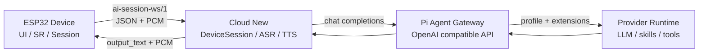

这组笔记用于从项目全链路角度复盘 Pixel Soul。它和 [Service 模块笔记](../pixel-soul-services/) 的关系是：

- Service 模块笔记：聚焦 ESP32 设备侧模块内部怎么构建。
- 全链路复盘：聚焦设备、云端、Pi Agent Gateway 三个仓库如何协作。

## 仓库边界

| 仓库 | 主要职责 |
| --- | --- |
| 设备侧 ESP32 | UI、按键、音频采集/播放、WakeNet、SR、WebSocket、AI Session 设备状态机 |
| Cloud New | 设备 WebSocket session、ASR、Agent、TTS、turn 管理、协议收口 |
| Pi Agent Gateway | OpenAI 兼容对话接口、profile、skill/extension、本地 provider runtime 适配 |

## 端到端主链路



## 阅读顺序

1. [设备侧复盘](./device-side/)：先理解设备如何组织 UI、按键、SR、Session 和播放。
2. [App 层复习](./app-layer/)：单独理解 AppEvent 串行分发、按键业务、Footer 和 ViewModel 数据流。
3. [协议交互泳道图](./protocol-flows/)：用建连、唤醒、多轮、打断和超时场景理解设备与云端怎么通信。
4. [云端复盘](./cloud-side/)：再理解云端如何接收设备音频、调用 ASR/Agent/TTS 并管理 turn。
5. [Pi Agent Gateway 复盘](./pi-agent-gateway/)：最后理解 Agent provider 如何独立成 OpenAI 兼容服务。

## 面试表达主线

可以用一句话先开场：

```text
这个项目把实时语音交互拆成三层：设备侧保证交互和音频管道稳定，云端负责语音流水线和 turn 生命周期，Pi Agent Gateway 负责把 Agent 能力做成可替换的 provider。
```

然后按四个问题展开：

- 设备侧为什么不直接做 ASR/TTS/Agent？
- 云端为什么要管理 `session / turn / output context`？
- Pi Agent Gateway 为什么要做成独立仓库和 OpenAI 兼容接口？
- 播放期打断、延迟和识别不稳定这些问题分别由哪一层负责？

## 复习检查表

- 能否画出设备到云端再到 Agent 的调用链？
- 能否解释 `ai-session-ws/1` 为什么同时有 JSON 和 binary PCM？
- 能否用泳道图讲清 `session_start -> wake_start -> turn_new -> output_text -> turn_done`？
- 能否说明设备侧 `Session` 和云端 `DeviceSession` 的职责差异？
- 能否解释 `turn_terminate` 如何让 KEY 打断从本地 UX 扩展到云端取消？
- 能否说明 Pi Agent Gateway 和 Cloud New 的边界？
- 能否区分“设备问题、云端问题、provider 问题”的定位方法？
