这篇文章不重复字段手册，而是用类似 TCP 握手的泳道图看懂设备和云端如何交互。

读这篇时先记住一句话：

```text
Protocol 只定义消息形状；WebSocketTask 只搬运 text/binary frame；设备侧 Session 和云端 DeviceSession 才是协议状态 owner。
```

## 参与者

为了让图更清楚，下面统一使用这几个泳道：

| 泳道 | 作用 |
| --- | --- |
| `App / SR` | BOOT、KEY、WakeNet、Voice Activity 这些本地交互入口。 |
| `Device Session` | 设备侧 AI Session owner，维护本地 `IDLE / LISTENING / THINKING / SPEAKING / ERROR`。 |
| `WebSocketTask` | 设备侧 text/binary frame IO pump，负责连接、发送 JSON、搬运 PCM。 |
| `Cloud DeviceSession` | 云端会话 owner，维护 server 侧 session、turn、ASR input stream 和 output context。 |
| `ASR / Agent / TTS` | 云端 provider 链路，不直接暴露给设备协议。 |

## 全局规则

协议名是 `ai-session-ws/1`。同一条 WebSocket 上有两种 frame：

```text
text frame   -> JSON 控制消息
binary frame -> PCM 音频
```

几个关键概念：

- `session_id` 由云端在 `session_start_ack` 中分配。
- `turn_id` 由云端在 `turn_new` 中分配。
- 设备不生成业务 `turn_id`，只保存当前 active turn。
- `turn_new` 是强边界；新 turn 到达后，旧 turn 的迟到文本、音频和 `turn_done` 都要被丢弃。
- `output_text` 是展示文本，不是严格的音频边界。
- `turn_done` 只表示云端当前 turn 正常结束，不关闭 session。
- WebSocket 断开或错误后，当前设备策略是 Session 本地关闭并回 `IDLE`，不做透明重连恢复。

## 场景一：WebSocket 建连与 session_start

这个场景相当于应用层握手。WebSocket 只是 transport 建立成功；真正的 AI session 要等 `session_start_ack.accepted=true`。

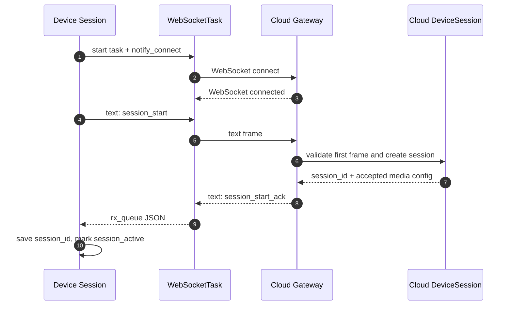

建连成功后，设备侧还没有正式上传用户语音。它只是拿到了本轮 AI session 的 `session_id` 和媒体配置。

异常时序也要记住：

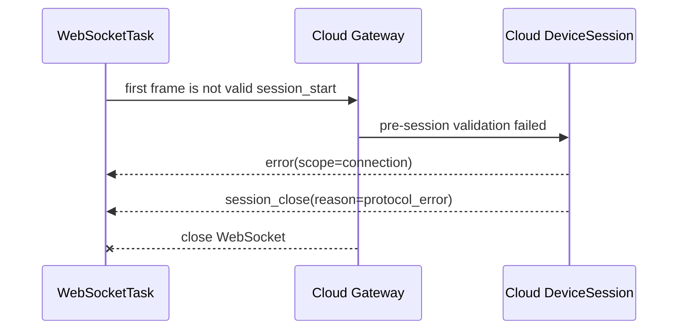

面试表达：

```text
session_start 是协议握手，不是唤醒。它声明设备能力并请求创建 AI session；session_start_ack 才表示云端接受本 session。
```

## 场景二：WakeNet 唤醒与冷启动问候

当前设备流程是：BOOT 长按只进入 wake prompt 并激活 WakeNet；真正创建 session 和发送 `wake_start` 发生在 WakeNet 命中之后。

`wake_start` 没有 ACK。它只是告诉云端：本地唤醒词已经触发。如果 `cold_start_warmup=true`，云端会尝试下发一轮空 ASR 文本的冷启动问候。

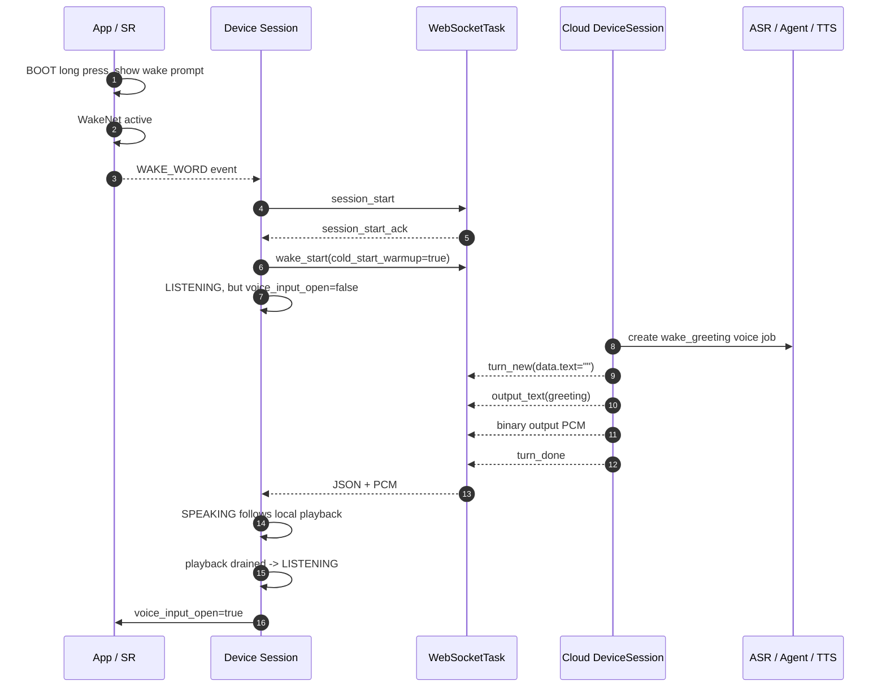

这里最容易混淆的是 `LISTENING`。设备在 `wake_start` 后会进入会话内基本状态，但冷启动问候播放完成前不会打开正式用户输入窗口。

面试表达：

```text
wake_start 不是 turn，也没有 ACK。冷启动问候是云端根据 wake_start 额外创建的 wake_greeting turn，turn_new 里 ASR 文本为空，所以 UI 不应该闪 THINKING。
```

## 场景三：正式一轮对话

正式对话从设备侧 Voice Activity 开始。SR 负责检测人声并在 Session 授权后发布音频；WebSocketTask 只要 connected，就会从上行 ringbuf 取 binary PCM 发给云端。

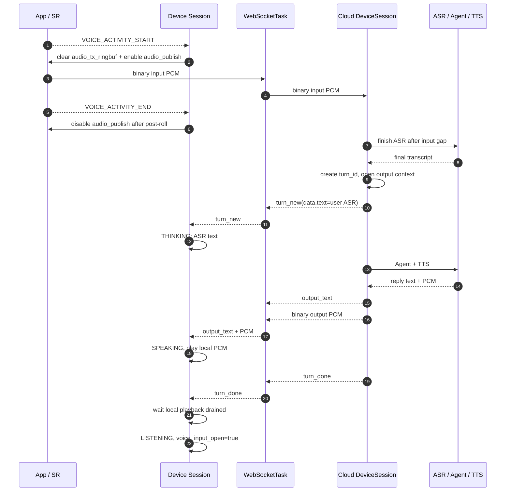

这里有两个重要边界：

1. 云端 `turn_done` 不等于设备马上回 `LISTENING`；设备要等本地 TTSPlayer 播放 drain。
2. `output_text` 只驱动 UI 文本，不负责标记哪段 binary PCM 属于哪句话。

面试表达：

```text
云端是按 turn 管理输出，设备是按本地播放状态同步 UI。turn_done 只说明云端不会再为这个 turn 下发输出；设备还要等本地 ringbuf 播完。
```

## 场景四：多轮对话

多轮对话不是重新 `session_start`。同一个 active session 内，每次有效用户语音都会生成新的 `turn_new`。

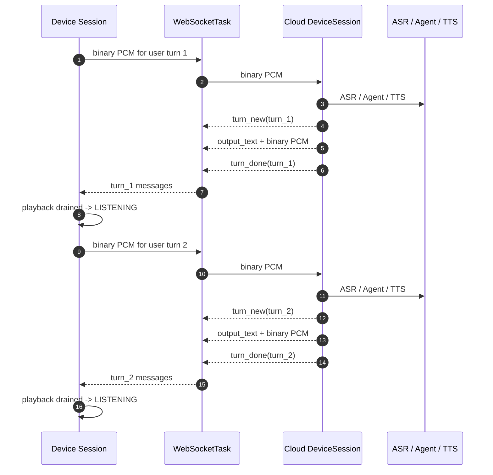

如果第二轮来得很快，新 `turn_new` 是强边界：

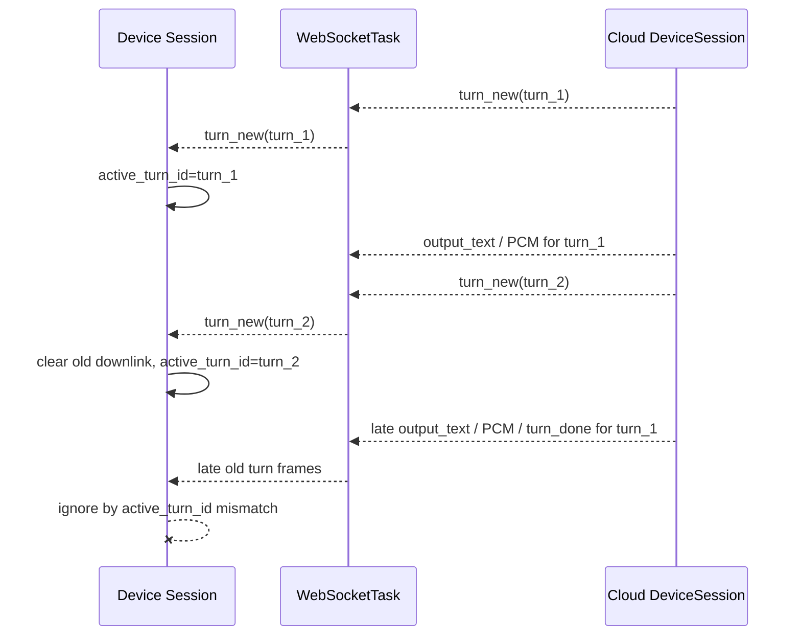

面试表达：

```text
session 是长生命周期，turn 是一轮用户输入和一轮输出。多轮对话复用同一个 session；新 turn_new 替换旧 output context。
```

## 场景五：KEY 单击对话打断

播放期语音打断容易受扬声器回声影响，所以当前主路径是 KEY 单击。KEY 打断是协议级 turn 终止，不是 `session_close`。

设备本地体验不等待云端 ACK：

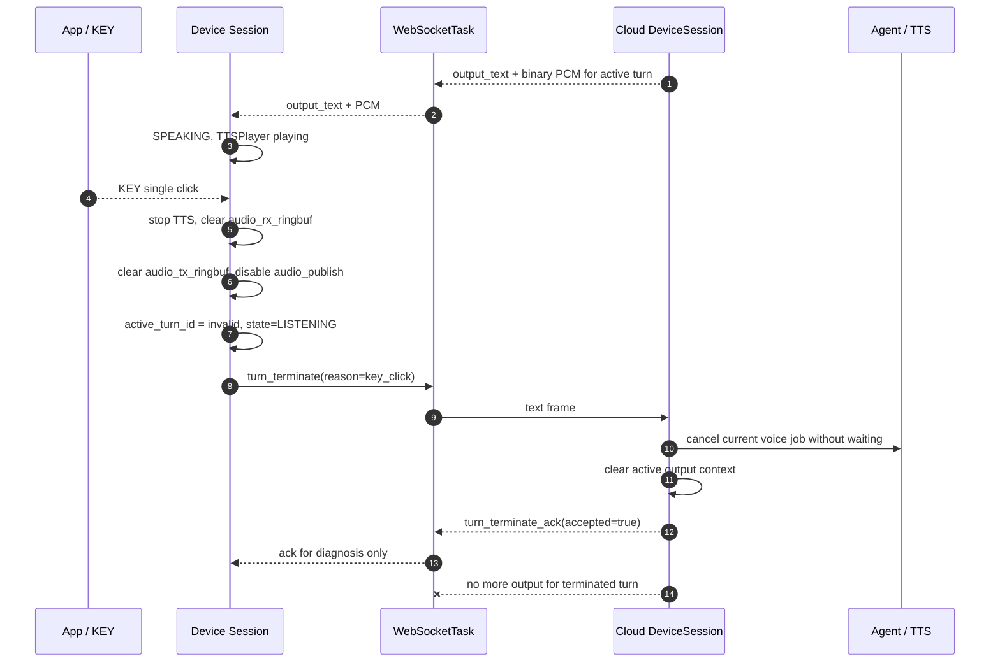

如果云端返回 `accepted=false`，设备也不会恢复旧输出：

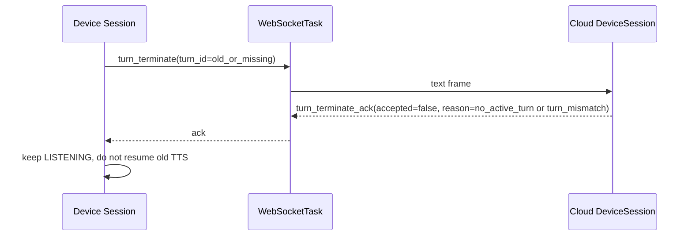

面试表达：

```text
turn_terminate 终止当前 turn，但 session 继续 active。它解决的是“停止当前回答并准备下一轮输入”，不是退出 AI 会话。
```

## 场景六：超时与关闭

关闭分两类：设备主动关闭、云端主动关闭。

设备主动关闭通常来自 BOOT 长按退出、用户退出或本地 server message timeout：

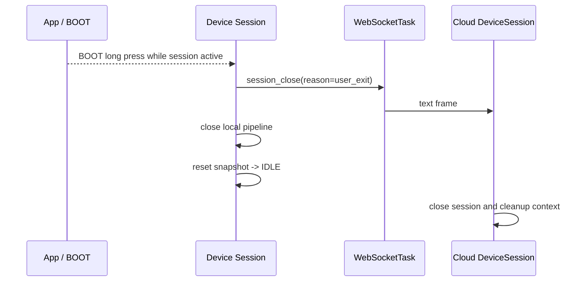

云端主动关闭最常见是 `input_audio_idle_timeout`：session active 后长时间没有成功进入有效 Agent/voice job。

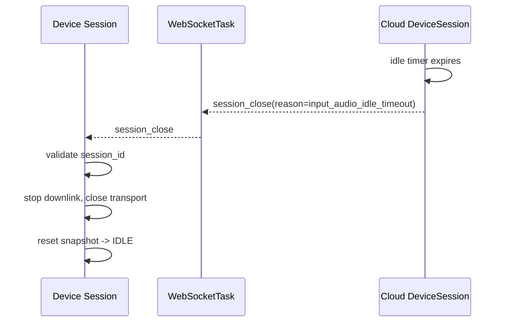

如果 WebSocket 本身断开或 transport error，当前设备策略也会关闭本地 Session：

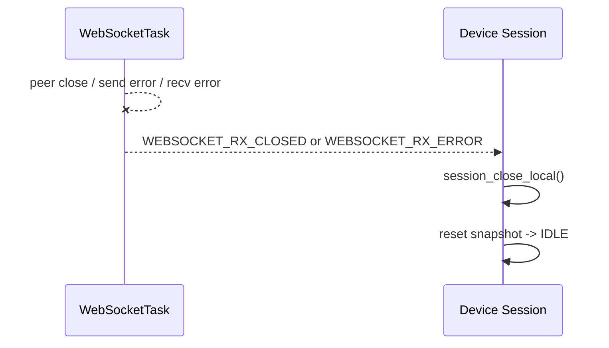

面试表达：

```text
WebSocket 断开不是自动重连恢复原 session。AI session/turn 是有状态协议，恢复策略必须由 Session/App 明确决定，不能藏在 WebSocketTask 里。
```

## 场景七：协议错误

协议错误的关键是区分 pre-session 和 post-session。

pre-session 还没有 `session_id`，所以云端可以发送不带 `session_id` 的 `session_close(protocol_error)`：

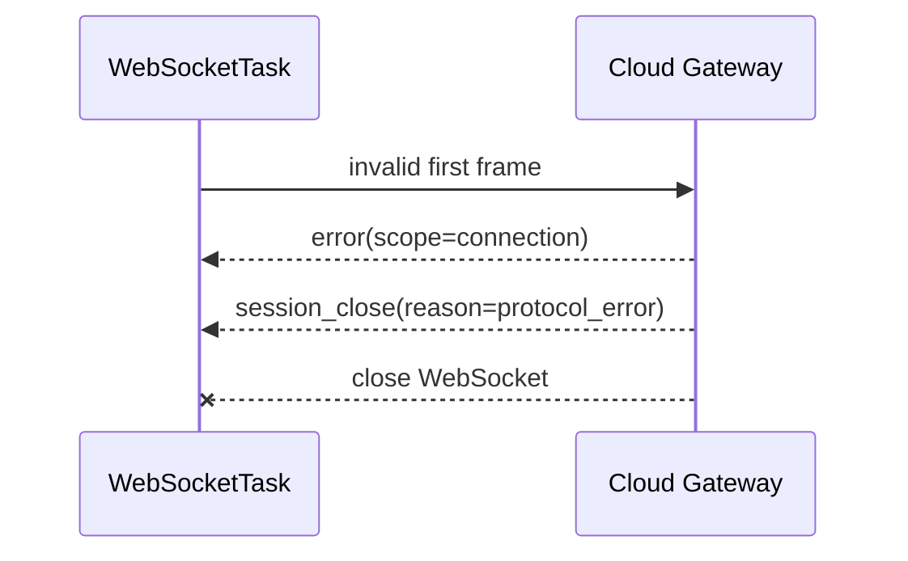

post-session 已经有 active `session_id`，所以错误和关闭都要带当前 session：

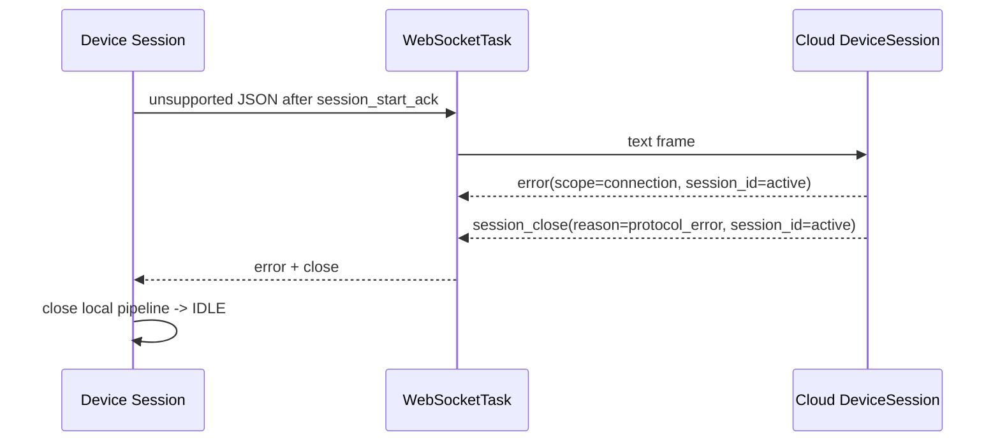

但 `session_id_mismatch` 是 session 作用域错误，不应该直接关闭：

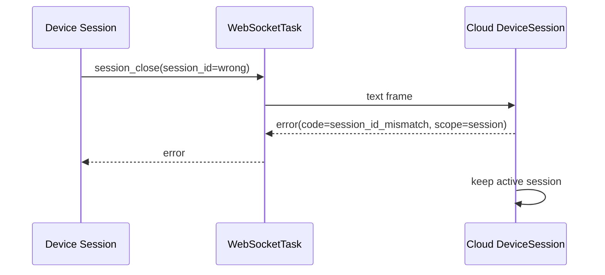

面试表达：

```text
不是所有 error 都关闭 session。connection 级协议错误会收口连接；session_id_mismatch 这种 session 级错误只返回 error，保持当前 session active。
```

## 消息速查

字段细节可以看设备仓库和云端仓库的正式协议文档。面试时优先记过程：

| 消息 | 方向 | 过程语义 |
| --- | --- | --- |
| `session_start` | Device -> Cloud | 请求创建 AI session，声明协议版本和媒体能力。 |
| `session_start_ack` | Cloud -> Device | 云端接受 session，分配 `session_id`。 |
| `wake_start` | Device -> Cloud | 本地 WakeNet 已命中；可触发冷启动问候。 |
| binary input PCM | Device -> Cloud | 设备在 Session 授权下上传用户语音。 |
| `turn_new` | Cloud -> Device | 新 turn 强边界，分配 `turn_id`，携带 ASR 文本或空 wake greeting 文本。 |
| `output_text` | Cloud -> Device | 可展示回复文本，不是音频边界。 |
| binary output PCM | Cloud -> Device | 当前 active output context 的可播放音频。 |
| `turn_done` | Cloud -> Device | 当前 turn 正常完成，session 不关闭。 |
| `turn_terminate` | Device -> Cloud | KEY 打断当前 turn，session 保持 active。 |
| `turn_terminate_ack` | Cloud -> Device | 云端确认或拒绝本次 turn terminate；设备不靠 ACK 才停播。 |
| `session_close` | 双向 | 结束整个 session。 |
| `error` | 双向 | 协议或业务错误；是否关闭取决于 scope 和场景。 |

## 面试讲法

如果面试官让你讲协议，不要从 JSON 字段背起，可以这样讲：

```text
这套协议把连接、会话和轮次分开。WebSocket 只是传输；session_start 创建会话；每次用户有效输入由云端创建一个 turn_new；output_text 和 binary PCM 下行给设备播放；turn_done 只结束这一轮，不结束会话。KEY 打断走 turn_terminate，终止当前 turn 但保留 session。超时或 BOOT 退出才走 session_close。
```

再补一句模块边界：

```text
设备侧 Protocol 只构建和解析 JSON；WebSocketTask 只搬运 text/binary frame；Session 负责什么时候开上行、什么时候清下行、怎么处理迟到旧 turn；云端 DeviceSession 负责 ASR endpoint、Agent/TTS、turn 生命周期和协议错误收口。
```

## 复习检查表

- 能否不看字段表，画出 `session_start` 握手？
- 能否说明 `wake_start` 为什么没有 ACK？
- 能否解释空文本 `turn_new` 为什么是 wake greeting，而不是用户 ASR？
- 能否说明 `output_text` 和 binary output PCM 为什么不是严格一一对应？
- 能否解释多轮对话为什么不重新 `session_start`？
- 能否说明 `turn_terminate` 和 `session_close` 的区别？
- 能否解释 WebSocket 断开后为什么当前设备策略是 Session 退出？
- 能否区分 `protocol_error`、`session_id_mismatch` 和 `input_audio_idle_timeout` 的收口方式？
