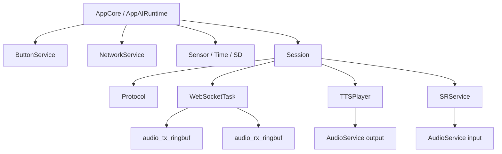

这组笔记用于重新阅读 Pixel Soul 设备侧项目。它不是源码文档的搬运，而是把每个 Service 模块整理成可复习、可面试表达的工程说明。

## 总体定位

`components/service` 是设备基础能力集合。它把网络、按键、音频、语音识别、会话协议、播放、传感器、时间、SD、电源等能力封装成 App 可组合的 Service。

Service 层维护内部状态和任务，但不直接渲染 UI，不决定页面切换，也不写产品文案。

分层边界可以这样理解：

> App 管产品业务和 UI 编排；Service 管设备能力和状态模型；BSP 管当前板子的引脚、总线和硬件事实；ESP-IDF / 第三方 driver 管具体外设操作。

```text
Application
  -> Service
      -> BSP
      -> ESP-IDF / third-party driver
  -> Display

BSP
  -> ESP-IDF driver
  -> Hardware
```

只有当某个芯片协议复杂、被多个 Service 复用、需要替换不同硬件实现，或者 Service 内部开始堆寄存器/总线细节时，才值得再抽出独立 Driver adapter。当前不强行补完整 Driver 层，否则会增加一层浅模块。

## 阅读顺序

建议按链路读，而不是按目录读：

1. [基础状态服务](./foundation-services/)：理解事件、snapshot、硬件缺失不阻塞。
2. [NetworkService](./network-service/)：理解网络状态和配网入口。
3. [AudioService](./audio-service/)：理解音频资源租约和 ringbuf。
4. [SRService](./sr-service/)：理解 WakeNet、Voice Activity、Audio Publish。
5. [Protocol + WebSocketTask](./protocol-websocket/)：理解 JSON 控制帧和 binary PCM 传输。
6. [TTSPlayer](./tts-player/)：理解下行 PCM 播放和本地停播。
7. [Session](./session-service/)：理解 AI Session owner 和 turn 状态机。
8. [PowerService](./power-service/)：理解电池状态服务 v1 实现。

如果要进一步理解网络音频链路的专业化深化，可以继续读独立专栏：[音频流可靠传输](../../audio-stream-reliability/)。

## 核心心智模型



面试时要先讲清楚 owner：

- `AppCore` 管产品语义：页面、按键、Footer、是否进入 AI。
- `Session` 管 AI 会话语义：session、turn、上下行授权、播放完成后的状态。
- `SRService` 管语音输入执行：WakeNet、Voice Activity、授权后发布 PCM。
- `WebSocketTask` 管 WebSocket IO：text frame 和 binary frame 搬运。
- `Protocol` 管 JSON 格式：构建、解析、校验。
- `AudioService` 管音频硬件资源租约：input/output token。

## 面试表达模板

回答模块问题时按这个顺序：

```text
1. 这个模块的 owner 是什么。
2. 它上游是谁，下游是谁。
3. 它不负责什么，边界在哪里。
4. 核心流程是什么。
5. 为什么不把这些逻辑放到 App 或底层 driver。
6. 失败时如何收口。
```

这个顺序比直接背 API 更稳，因为它先回答设计意图，再进入实现细节。

## 模块覆盖

| 笔记 | 覆盖模块 |
|---|---|
| 基础状态服务 | `ButtonService`、`SensorService`、`TimeService`、`SdService` |
| NetworkService | `NetworkService`、`network_storage`、`network_portal`、`network_dns` |
| AudioService | `AudioService`、`sr_ringbuf` |
| SRService | `SRService` |
| Session | `Session` |
| Protocol + WebSocketTask | `Protocol`、`WebSocketTask` |
| TTSPlayer | `TTSPlayer` |
| PowerService | `PowerService` |

## 复习检查表

- [ ] 能否一句话说清 App / Service / Driver / BSP 的边界，并说明当前 Driver 不是独立完整目录层？
- [ ] 能否说明为什么 UI 读 snapshot，而不是直接读硬件？
- [ ] 能否说明为什么 `Session` 是 AI 会话 owner？
- [ ] 能否画出上行 PCM 和下行 PCM 的路径？
- [ ] 能否解释 `turn_new` 为什么是强边界？
- [ ] 能否解释 KEY 打断为什么先本地停播，再发 `turn_terminate`？
- [ ] 能否把音频流可靠传输作为独立工程问题，而不是普通 WebSocket 发送问题？
