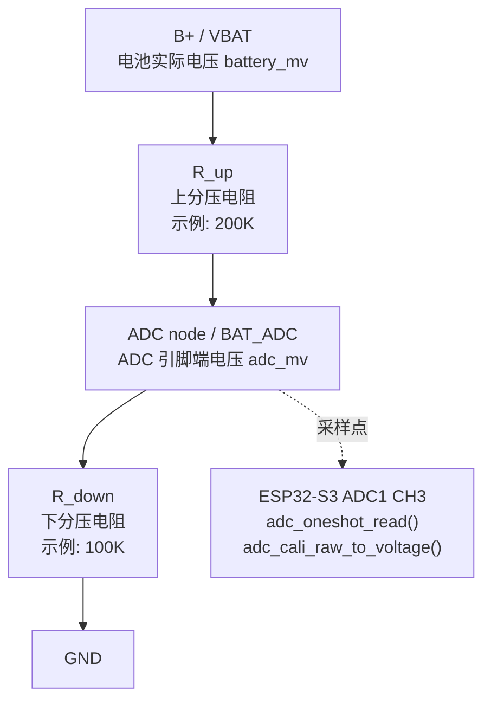

> 当前 PowerService 是设计草案/待实现：ESP32 service public include 目录中尚未存在对应头文件，也没有已落地的 PowerService 代码。本文只能作为后续实现和面试表达的设计笔记，不能当作已完成模块说明。

## 一句话定位

PowerService 计划把电池 ADC 采样和可选充电状态 GPIO 封装成“电源观测 Service”，给 AppModel/UI 提供稳定的电压、电量百分比和充电状态 snapshot。

更直白地说，它不是“电源管理大脑”，而是一个硬件事实采集器：

```text
ADC / CHG GPIO
  -> PowerService
  -> power_snapshot_t
  -> AppModel
  -> 右上角电池图标 / 充电图标
```

所以 PowerService 的职责是把底层硬件读数整理成上层好理解的数据。它不决定 UI 画什么，不决定低电关机，也不控制充电器。

## 基础原理

电池电压不能直接等同于 ADC 原始值。板卡通常会通过分压电阻把电池电压降到 ADC 可测范围，ADC 读到的是分压后的电压；Service 需要用校准后的 ADC mV 乘以分压比例，换算回电池实际电压。

这条链路可以拆成四个值：

| 名称 | 含义 | 举例 |
| --- | --- | --- |
| `raw` | ADC 原始采样值。 | 12-bit 时大致是 `0-4095`。 |
| `adc_mv` | ADC 校准后的输入端电压。 | 分压后的电压，例如 `1250mV`。 |
| `divider_ratio` | 分压还原比例。 | `200K + 100K` 分压时约为 `3.0`。 |
| `battery_mv` | 电池实际电压估算值。 | `1250 * 3 = 3750mV`。 |

也就是说，PowerService 不能直接拿 raw 值算电量，而应该先用 ESP-IDF ADC calibration 把 raw 转成 mV，再做分压还原。

当前草案以官方 ADC demo 为硬件基线：

```text
ADC_UNIT_1
ADC_CHANNEL_3
ADC_ATTEN_DB_12
ADC_BITWIDTH_12
adc_cali_create_scheme_curve_fitting()
adc_oneshot_read()
adc_cali_raw_to_voltage()
voltage = calibrated_adc_mv * 3
```

电量百分比 v1 计划使用线性映射：

```text
3000mV -> 0%
4120mV -> 100%
```

充电状态不靠“电压是否上升”推断，而是优先使用充电芯片 `CHG/STAT` 这类硬件状态信号。如果该信号没有接到 ESP32 GPIO，固件就读不到，只能保持 `charge_valid=false`，UI 不显示充电图标。

这里最容易混淆的是 `charging=false` 和 `charge_valid=false`：

```text
charge_valid=false:
  不知道是否正在充电，因为没有硬件依据。

charge_valid=true && charging=false:
  已经读取到 CHG/STAT，明确当前不在充电。
```

这个区别很重要。未知状态不能被 UI 或 App 直接当成“未充电”。

## 前置阅读

如果你要继续实现 PowerService，建议先读官方文档，再回来看项目草案。这样能把“外设 API 怎么用”和“项目里为什么这样封装”分开理解。

| 主题 | 官方链接 | 阅读目的 |
| --- | --- | --- |
| ADC Oneshot Driver | [ESP-IDF v5.5.3 ADC Oneshot Mode Driver](https://docs.espressif.com/projects/esp-idf/zh_CN/v5.5.3/esp32s3/api-reference/peripherals/adc_oneshot.html) | 看懂 `adc_oneshot_new_unit()`、`adc_oneshot_config_channel()`、`adc_oneshot_read()` 这条采样链路。 |
| ADC Calibration Driver | [ESP-IDF v5.5.3 ADC Calibration Driver](https://docs.espressif.com/projects/esp-idf/zh_CN/v5.5.3/esp32s3/api-reference/peripherals/adc_calibration.html) | 看懂 raw ADC 为什么要先校准成 mV，不能直接拿 raw 算电池电压。 |
| GPIO Driver | [ESP-IDF v5.5.3 GPIO Driver](https://docs.espressif.com/projects/esp-idf/zh_CN/v5.5.3/esp32s3/api-reference/peripherals/gpio.html) | 看懂可选 `CHG/STAT` 引脚如何配置为输入 GPIO 并读取电平。 |
| ADC Continuous Driver | [ESP-IDF v5.5.3 ADC Continuous Mode Driver](https://docs.espressif.com/projects/esp-idf/zh_CN/v5.5.3/esp32s3/api-reference/peripherals/adc_continuous.html) | 扩展阅读。PowerService v1 不用连续采样，但可以帮助区分 oneshot 和 continuous 的场景。 |

本文后面的设计默认使用 ADC oneshot + ADC calibration。原因很简单：电池电压变化慢，状态栏只需要周期刷新，不需要持续高速采样。

## 模块职责

PowerService 负责：

```text
1. 初始化电池 ADC 采样资源。
2. 初始化可选 CHG/STAT GPIO。
3. 周期读取 ADC raw。
4. 使用 ADC calibration 得到 ADC 输入端 mV。
5. 乘以分压比例，换算为电池实际电压。
6. 把电池电压估算为 0-100%。
7. 读取可选充电 GPIO，判断 charging。
8. 维护 power_snapshot_t。
9. snapshot 变化时通知 App。
```

PowerService 不负责：

```text
1. 不直接调用 LVGL。
2. 不决定状态栏显示哪个图标。
3. 不做低电量关机。
4. 不做休眠、省电、动态降频。
5. 不做充电电流、充满状态、电池健康度。
6. 不用电压趋势猜测充电状态。
```

这样划分后，PowerService 就是“观测模块”，如果以后要做低电关机或省电策略，可以单独设计 `PowerPolicy`，不要把策略塞进采样模块。

## 配置项草案

配置分两层理解：

```text
BSP:
  描述板子上电池 ADC 和 CHG GPIO 接在哪里。

PowerService:
  描述这个服务如何采样、换算、估算和通知。
```

推荐配置项：

| 配置项 | 建议默认值 | 注释 |
| --- | --- | --- |
| `SERVICE_POWER_BAT_ADC_GPIO` | `BSP_BAT_ADC_GPIO` | 电池 ADC 输入 GPIO。当前板卡基线来自官方 ADC demo 的 `BAT_ADC`。 |
| `SERVICE_POWER_BAT_ADC_UNIT` | `ADC_UNIT_1` | ADC unit。优先用 ADC1，避免 ADC2 与 Wi-Fi 等资源存在潜在冲突。 |
| `SERVICE_POWER_BAT_ADC_CHANNEL` | `ADC_CHANNEL_3` | ADC channel。官方 ADC demo 使用 Channel 3。 |
| `SERVICE_POWER_BAT_ADC_ATTEN` | `ADC_ATTEN_DB_12` | ADC 衰减。用于覆盖分压后的电池输入范围。 |
| `SERVICE_POWER_BAT_ADC_BITWIDTH` | `ADC_BITWIDTH_12` | ADC 位宽。12-bit 对齐官方 demo。 |
| `SERVICE_POWER_BAT_DIVIDER_RATIO` | `3.0f` | 分压还原比例。假设 `200K + 100K` 分压时，电池电压约为 ADC 端电压的 3 倍。 |
| `SERVICE_POWER_CHG_GPIO` | `GPIO_NUM_NC` | 充电状态 GPIO。未确认 CHG/STAT 接线前保持不可用。 |
| `SERVICE_POWER_CHG_ACTIVE_LEVEL` | `0` | 充电有效电平。常见 STAT 充电时拉低，但必须以原理图/实测为准。 |
| `SERVICE_POWER_SAMPLE_INTERVAL_MS` | `30000` | 周期采样间隔。电池是慢变量，30 秒足够状态栏使用。 |
| `SERVICE_POWER_EMPTY_MV` | `3000` | 百分比估算下限，低于它显示 0%。 |
| `SERVICE_POWER_FULL_MV` | `4120` | 百分比估算上限，高于它显示 100%。 |

如果写成代码注释，可以是这种风格：

```c
// 电池实际电压 = ADC 校准电压 * 分压比例。
// 例如 200K + 100K 分压时，ADC 端约为电池电压的 1/3。
#define SERVICE_POWER_BAT_DIVIDER_RATIO 3.0f

// 充电状态 GPIO。未确认 CHG/STAT 是否接入 ESP32 前保持 GPIO_NUM_NC。
#define SERVICE_POWER_CHG_GPIO GPIO_NUM_NC

// 电量百分比线性映射区间。只服务状态栏粗略显示，不代表精密电量计。
#define SERVICE_POWER_EMPTY_MV 3000
#define SERVICE_POWER_FULL_MV  4120
```

这些注释的价值是让维护者知道数字从哪里来，而不是把 `3.0f`、`30000`、`4120` 变成魔法数。

## 主流程

设计主流程应保持短而清楚：

```text
Init ADC/GPIO
  -> Sample Battery
  -> Read Charge GPIO
  -> Update Snapshot
  -> Notify App if changed
```

建议运行方式：

```text
Init
  -> 初始化 ADC oneshot 和 ADC calibration
  -> 如果配置了 CHG GPIO，则初始化 GPIO 输入
  -> 初始化 power_snapshot_t 默认值

Start
  -> 创建周期采样 task 或 timer

Sample Loop
  -> 每 SERVICE_POWER_SAMPLE_INTERVAL_MS 采样一次
  -> raw ADC 转 calibrated mV
  -> multiplied by divider ratio 得到 voltage_mv
  -> voltage_mv 映射到 percent
  -> 读取 charging 状态
  -> snapshot 有变化时通知 AppCore/AppModel
```

上层数据流：

```text
PowerService snapshot
  -> AppModel status model
  -> UI status bar
  -> battery icon / charge icon
```

最终模块实现后，核心函数应该长这样，而不是把主流程藏在一堆嵌套 helper 里：

```text
power_service_task()
  -> power_sample_once()
  -> delay interval

power_sample_once()
  -> read battery voltage
  -> read charge state
  -> update snapshot
  -> notify if changed
```

辅助函数只做具体动作：

```text
power_read_battery_mv()
  -> adc_oneshot_read()
  -> adc_cali_raw_to_voltage()
  -> multiply divider ratio

power_read_charge_state()
  -> if GPIO not configured, charge_valid=false
  -> else read GPIO and compare active level

power_update_snapshot()
  -> calculate percent
  -> compare old/new snapshot
  -> store new snapshot
```

这样读代码的人打开 `power_sample_once()` 就能看到业务主线：采样、换算、更新、通知。

## 关键方法：电池 ADC 采样

电池 ADC 采样这一步只负责得到“ADC 引脚上的校准电压”，不要在这里直接推导电池百分比。把这个动作单独收敛出来，后续读代码会很清楚：

```c
static esp_err_t power_read_adc_mv(uint16_t *out_adc_mv);
```

它依赖 PowerService 初始化阶段准备好的三个资源：

```text
adc_oneshot_unit_handle_t adc_unit
adc_cali_handle_t adc_cali
SERVICE_POWER_BAT_ADC_CHANNEL
```

返回值 `out_adc_mv` 表示 ADC 引脚端电压，单位是 mV。注意，这个值是分压后的电压，还不是电池实际电压。

流程可以按这 6 步理解：

```text
1. 确认 ADC 已初始化，例如 adc_ready=true。
2. 调用 adc_oneshot_read(adc_unit, channel, &raw)，得到 ADC raw。
3. raw 读取失败时返回错误，不更新 snapshot。
4. 调用 adc_cali_raw_to_voltage(adc_cali, raw, &adc_mv)，得到校准后的 ADC mV。
5. 校准失败时返回错误，不绕过校准直接用 raw 猜电压。
6. adc_mv 合法后写入 out_adc_mv，返回 ESP_OK。
```

伪代码：

```c
static esp_err_t power_read_adc_mv(uint16_t *out_adc_mv)
{
    if (!out_adc_mv || !s_power_ctx.adc_ready) {
        return ESP_ERR_INVALID_STATE;
    }

    int raw = 0;
    esp_err_t err = adc_oneshot_read(s_power_ctx.adc_unit,
                                     SERVICE_POWER_BAT_ADC_CHANNEL,
                                     &raw);
    if (err != ESP_OK) {
        return err;
    }

    int adc_mv = 0;
    err = adc_cali_raw_to_voltage(s_power_ctx.adc_cali, raw, &adc_mv);
    if (err != ESP_OK || adc_mv <= 0) {
        return err == ESP_OK ? ESP_ERR_INVALID_RESPONSE : err;
    }

    *out_adc_mv = (uint16_t)adc_mv;
    return ESP_OK;
}
```

为什么 v1 用 oneshot，而不是 continuous ADC：

```text
1. 电池电压是慢变量，不需要持续高速采样。
2. 状态栏只要粗略电量，不需要波形数据。
3. ESP32-S3-RLCD-4.2 的官方 ADC 示例也是 oneshot 读取。
4. oneshot 流程更短，更适合先验证硬件接线和换算基线。
```

如果实机看到电量跳动明显，可以在 v2 增加多次采样平均或中值滤波，但主流程仍然不要变成 UI 触发硬件读。UI/AppModel 只读 snapshot，采样由 PowerService 自己周期执行。

## 关键方法：ADC 电压换算为电池电压

`adc_cali_raw_to_voltage()` 得到的是 ADC 引脚端电压，不是电池原始电压。因为电池电压通常高于 ADC 安全输入范围，所以板子会先用分压电阻把电池电压降下来：

```text
VBAT
  -> R_up
  -> ADC node
  -> R_down
  -> GND
```

画成局部抽象图会更直观：



读图时只要抓住两个电压：

```text
battery_mv:
  B+ / VBAT 对 GND 的电压，也就是电池实际电压。

adc_mv:
  ADC node 对 GND 的电压，也就是 ESP32 ADC 实际测到的电压。
```

分压公式是：

```text
adc_mv = battery_mv * R_down / (R_up + R_down)
battery_mv = adc_mv * (R_up + R_down) / R_down
```

当前草案沿用 ESP32-S3-RLCD-4.2 官方 ADC 示例里的 `* 3` 作为硬件基线，可以理解为：

```text
R_up = 200K
R_down = 100K
divider_ratio = (200K + 100K) / 100K = 3.0
battery_mv = adc_mv * 3.0
```

建议把这一步写成独立方法：

```c
static uint16_t power_adc_mv_to_battery_mv(uint16_t adc_mv);
```

伪代码：

```c
static uint16_t power_adc_mv_to_battery_mv(uint16_t adc_mv)
{
    float battery_mv = adc_mv * SERVICE_POWER_BAT_DIVIDER_RATIO;

    if (battery_mv < 0) {
        return 0;
    }
    if (battery_mv > UINT16_MAX) {
        return UINT16_MAX;
    }
    return (uint16_t)(battery_mv + 0.5f);
}
```

这里最重要的是区分三个量：

```text
raw:
  ADC 原始码值，不直接代表真实电压。

adc_mv:
  ADC 引脚端校准电压，已经经过 ADC calibration，但仍是分压后的电压。

battery_mv:
  按硬件分压比例还原出来的电池实际电压估算值。
```

如果 ADC calibration 失败，不建议直接拿 raw 做线性换算。raw 到真实电压的关系受芯片、衰减、校准参数影响，绕过校准会让状态栏电量更飘。

## 关键方法：电池电压估算百分比

百分比是给 UI 看懂的显示估算，不是精密 SOC。v1 可以先用线性映射，方法单独收敛成：

```c
static uint8_t power_battery_mv_to_percent(uint16_t battery_mv);
```

公式：

```text
percent = (battery_mv - empty_mv) * 100 / (full_mv - empty_mv)
percent = clamp(percent, 0, 100)
```

默认区间先沿用官方 ADC 示例：

```text
empty_mv = 3000
full_mv  = 4120
```

伪代码：

```c
static uint8_t power_battery_mv_to_percent(uint16_t battery_mv)
{
    if (battery_mv <= SERVICE_POWER_EMPTY_MV) {
        return 0;
    }
    if (battery_mv >= SERVICE_POWER_FULL_MV) {
        return 100;
    }

    uint32_t span = SERVICE_POWER_FULL_MV - SERVICE_POWER_EMPTY_MV;
    uint32_t used = battery_mv - SERVICE_POWER_EMPTY_MV;
    return (uint8_t)((used * 100U + span / 2U) / span);
}
```

这一步要明确告诉自己：线性百分比只是状态栏估算。锂电池电压和剩余容量不是线性关系，而且还会受负载、电池内阻、温度和老化影响。没有 fuel gauge 或实机放电曲线前，v1 先追求“显示方向正确、便于校准”，不要假装它是精密电量计。

## Snapshot 设计

PowerService 对上层暴露的核心数据结构可以是：

```c
typedef struct {
    bool valid;
    uint16_t voltage_mv;
    uint8_t percent;
    bool charge_valid;
    bool charging;
} power_snapshot_t;
```

字段解释：

| 字段 | 说明 |
| --- | --- |
| `valid` | 电池 ADC 数据是否可靠。ADC 或校准失败时为 `false`。 |
| `voltage_mv` | 换算后的电池实际电压，单位 mV。 |
| `percent` | 粗略电量百分比，范围 `0-100`。 |
| `charge_valid` | 是否有硬件依据判断充电状态。 |
| `charging` | 是否正在充电。只有 `charge_valid=true` 时才有意义。 |

推荐默认无效值：

```text
valid=false:
  voltage_mv=0
  percent=0

charge_valid=false:
  charging=false
```

注意：`valid=false && percent=0` 不等于“电量 0%”，而是“当前没有可靠电量数据”。

## API 草案

如果进入代码实现，public API 可以很少：

```c
typedef void (*power_service_event_cb_t)(void *user_ctx);

esp_err_t power_service_init(const power_service_config_t *config);
esp_err_t power_service_start(void);
esp_err_t power_service_stop(void);
esp_err_t power_service_get_snapshot(power_snapshot_t *out_snapshot);
esp_err_t power_service_set_event_callback(power_service_event_cb_t cb, void *user_ctx);
```

为什么 `get_snapshot()` 不直接采样？

```text
1. UI 读取状态时不应该卡在 ADC 采样流程里。
2. 多个页面刷新不应该触发多次硬件读。
3. 周期采样和变化通知更容易控制刷新频率。
```

这也符合项目里其他 Service 的模式：Service 维护 snapshot，AppModel 读取 snapshot，UI 只渲染模型。

## 为什么这样设计

第一，PowerService 只做电源观测，不做电源策略。低电量关机、休眠、动态降频属于 PowerPolicy 或产品策略，不应塞进 v1。

第二，电量是慢变量，不需要高频采样。草案默认 30 秒采样一次，足够支撑状态栏显示，也避免 ADC 和 UI 频繁刷新。

第三，充电状态必须有明确硬件依据。用电压趋势推断充电响应慢、容易受负载波动影响，所以 v1 不采用。

第四，snapshot 对 UI 友好。UI 不应该知道 ADC 通道、分压比例、校准方法、充电 GPIO 有效电平，只应该读取 `battery_valid`、`battery_percent`、`charging` 这类模型字段。

第五，硬件缺失不应该拖垮主 App。即使 ADC 校准失败或 CHG GPIO 未接入，也应该让 UI、网络、AI 主链路继续运行，只是电池状态显示为 unknown。

第六，配置项保留校准空间。`EMPTY_MV/FULL_MV/DIVIDER_RATIO` 不是随便抽象，而是为了后续实机校准时不用改 UI 和上层数据流。

第七，充电 LED 和固件充电状态是两件事。板上 `CHG` LED 可以由 ETA6098 的 `STAT` 脚自己点亮，但如果 `STAT` 没有接到 ESP32 GPIO，固件仍然不知道 LED 是否亮，也就不能把它投影为 `charging=true`。

## 当前项目实现

当前状态：设计草案/待实现。

已确认的事实边界：

- 存在 `POWER_SERVICE_MODULE.md` 设计文档。
- service public include 中尚未存在 PowerService 对外头文件。
- 当前草案建议参考官方 ADC demo 的 ADC1 Channel 3。
- 板卡通过 Type-C 输入并由 ETA6098 充电芯片给电池充电。
- 板载 `CHG` LED 由 ETA6098 `STAT` 指示支路驱动；当前没有确认 `STAT` 再接到 ESP32 GPIO。
- 草案默认 `SERVICE_POWER_CHG_GPIO = GPIO_NUM_NC`，因此 `charge_valid=false`、`charging=false`，UI 不显示 `LV_SYMBOL_CHARGE`。
- v1 只计划覆盖状态栏电量和可选充电图标，不做完整 PMIC 管理。

草案 snapshot：

```c
typedef struct {
    bool valid;
    uint16_t voltage_mv;
    uint8_t percent;
    bool charge_valid;
    bool charging;
} power_snapshot_t;
```

草案配置分层：

```text
BSP config:
  - BSP_BAT_ADC_GPIO
  - BSP_BAT_ADC_UNIT
  - BSP_BAT_ADC_CHANNEL
  - BSP_CHG_STATUS_GPIO

Service config:
  - SERVICE_POWER_BAT_ADC_ATTEN
  - SERVICE_POWER_BAT_ADC_BITWIDTH
  - SERVICE_POWER_BAT_DIVIDER_RATIO
  - SERVICE_POWER_CHG_GPIO
  - SERVICE_POWER_CHG_ACTIVE_LEVEL
  - SERVICE_POWER_SAMPLE_INTERVAL_MS
  - SERVICE_POWER_EMPTY_MV
  - SERVICE_POWER_FULL_MV
```

未来落地后的文件形态大致会是：

```text
components/service/include/power_service.h
components/service/src/power/power_service.c
components/service/src/power/POWER_SERVICE_MODULE.md
```

可能的内部上下文：

```c
typedef struct {
    power_service_config_t config;
    power_snapshot_t snapshot;
    adc_oneshot_unit_handle_t adc_unit;
    adc_cali_handle_t adc_cali;
    TaskHandle_t task;
    SemaphoreHandle_t lock;
    power_service_event_cb_t cb;
    void *cb_user_ctx;
    bool adc_ready;
    bool charge_gpio_ready;
    bool running;
} power_service_ctx_t;
```

这不是为了增加状态，而是为了把资源句柄、snapshot、任务和 callback 放在同一个 owner 里。对外仍只暴露 snapshot，不让 App 操作 ADC 句柄。

## UI 联动设计

右上角状态栏建议最终保持三类图标：

```text
Wi-Fi icon | charge icon | battery icon
```

其中：

```text
NetworkService:
  提供 Wi-Fi 状态。

PowerService:
  提供 battery_valid / battery_percent / charge_valid / charging。

AppModel:
  把这些 service snapshot 投影为状态栏模型。

UI:
  只负责选 LVGL 图标。
```

电池图标映射可以是：

| 百分比 | 图标 |
| --- | --- |
| unknown | `LV_SYMBOL_BATTERY_EMPTY` 或空图标 |
| `0-19%` | `LV_SYMBOL_BATTERY_EMPTY` |
| `20-39%` | `LV_SYMBOL_BATTERY_1` |
| `40-59%` | `LV_SYMBOL_BATTERY_2` |
| `60-79%` | `LV_SYMBOL_BATTERY_3` |
| `80-100%` | `LV_SYMBOL_BATTERY_FULL` |

充电图标映射：

| 状态 | 图标 |
| --- | --- |
| `charge_valid=true && charging=true` | `LV_SYMBOL_CHARGE` |
| `charging=false` | 空字符串 |
| `charge_valid=false` | 空字符串 |

这样未充电时不会影响原有 Wi-Fi 和电池图标；正在充电时只额外显示 charge 图标。

## Type-C 充电与 CHG 指示灯

当前板卡的充电入口是 Type-C。Type-C 并不直接等于“ESP32 能知道正在充电”，中间还有充电芯片和状态指示支路。

真正的大电流充电路径可以这样理解：

```text
Type-C VBUS
  -> ETA6098 VIN
  -> ETA6098 开关充电电路
  -> L1 电感
  -> B+ / 电池
```

而板上的 `CHG` 指示灯是旁边的一条小电流显示支路：

```text
B+ / 电源侧
  -> 限流电阻
  -> CHG LED
  -> ETA6098 STAT
  -> 芯片内部下拉到 GND
```

`ETA6098 STAT` 的典型状态是：

```text
正在充电:
  STAT = low
  电流流过 限流电阻 -> CHG LED -> STAT -> GND
  LED 亮

充电完成 / 不在充电:
  STAT = high-Z
  LED 回路断开
  LED 灭
```

所以这里有一个很关键的结论：

```text
CHG LED 亮灭:
  由充电芯片自己控制，人眼可见。

PowerService charging:
  必须来自 ESP32 能读取到的 GPIO。

当前板卡事实:
  现有资料只确认 CHG LED 和充电电路。
  尚未确认 ETA6098 STAT 接到 ESP32 GPIO。
  因此固件默认不知道 CHG LED 是否亮。
```

如果未来要让 ESP32 读取充电状态，硬件上需要把 `STAT` 或等价状态节点接到一个 GPIO。这里要注意：

```text
1. STAT 是开漏/高阻输出，需要上拉。
2. 如果并联读取现有 CHG LED/STAT 节点，需要确认电平范围。
3. 要评估上拉来源和关机反灌电风险。
4. 软件上通常可以按低电平表示 charging，高电平表示 not charging 或 done。
5. 最终有效电平必须以原理图和实机测量为准。
```

这也是为什么 PowerService 草案里 `SERVICE_POWER_CHG_GPIO` 默认是 `GPIO_NUM_NC`：没有 GPIO 依据时，就不要把 `CHG` LED 的物理存在误写成固件可读状态。

## 失败收口

PowerService v1 推荐按“尽量不阻塞 App”处理：

```text
ADC 初始化失败：
  snapshot.valid=false，记录 warning，App 继续启动。

ADC 校准失败：
  不直接用 raw 猜电量，snapshot.valid=false。

CHG GPIO 未配置：
  charge_valid=false，不视为错误。

CHG GPIO 初始化失败：
  charge_valid=false，不影响电池采样。
```

这符合当前项目对 Sensor/SD/RTC 的处理方式：增强能力失败时降级显示，不拖垮主流程。

## 关键边界/踩坑

- 本文是设计草案/待实现，不能在复习或面试中说“当前 PowerService 已经落地”。
- 不要复用旧 ADC 文的结论替代项目事实；真正实现时要以当前板卡 demo、BSP 配置和实机测量为准。
- `CHG/STAT` GPIO 未确认前，默认 `charge_valid=false`，不要假装能判断充电状态。
- `CHG` LED 亮灭不等于固件可读 charging；当前没有确认 `STAT` 接到 ESP32 GPIO。
- Type-C 充电路径和 `CHG` LED 指示支路是两条不同路径，不要把 LED 支路理解成大电流充电路径。
- 电池百分比线性映射只是状态栏粗略估算，不是精密电量计。
- `SERVICE_POWER_BAT_DIVIDER_RATIO = 3.0f` 是按 `200K + 100K` 分压假设，需要原理图或实测确认。
- ADC 采样应使用校准后的 mV，不应直接拿 raw 值估算电池电压。
- PowerService 不应直接调用 UI，也不应决定低电量关机。
- `get_snapshot()` 应读取缓存，不应在 UI 调用链里直接触发硬件采样。
- `percent=0` 需要结合 `valid` 理解，不能单独代表低电。
- `charging=false` 需要结合 `charge_valid` 理解，不能单独代表未充电。

## 面试问答

**问：PowerService 现在实现了吗？**

答：还没有，当前是设计草案/待实现。已经有模块设计文档，但 service public include 中还没有 PowerService 对外头文件，所以不能把它描述成已落地代码。

**问：为什么电池电压要乘以分压比例？**

答：ADC 测的是经过分压电阻后的电压，不是电池原始电压。假设硬件是 `200K + 100K` 分压，ADC 端约为电池电压的三分之一，所以校准后的 ADC mV 要乘以 3 才接近电池实际电压。

**问：为什么不通过电压上升判断是否正在充电？**

答：电压趋势受负载、采样间隔、电池曲线影响，响应慢且容易误判。充电状态最好来自充电芯片的 `CHG/STAT` 引脚；如果没有硬件依据，就应该明确标记为 unknown，而不是猜。

**问：线性百分比有什么问题？**

答：锂电池电压和剩余容量不是线性关系，线性映射只能做状态栏粗略显示。v1 先用 `3000mV-4120mV` 对齐官方 demo，后续可以根据实机体验调阈值或换分段曲线。

**问：PowerService 和 PowerPolicy 怎么分？**

答：PowerService 只观测并输出 snapshot；PowerPolicy 才适合做低电量关机、休眠、降频等策略。这样电源数据采集和产品策略不会混在一起。

**问：为什么 `get_snapshot()` 不直接读取 ADC？**

答：因为 UI 可能频繁读取状态，如果每次都触发硬件采样，会让 UI 刷新和 ADC 时序耦合。更好的方式是 PowerService 周期采样并缓存 snapshot，AppModel 只读取缓存。

**问：为什么配置项看起来比较多？**

答：因为这里涉及硬件资源、ADC 参数、分压换算、采样周期和百分比校准。把这些写成有注释的配置项，比把数字藏在代码里更容易实机校准，也更方便迁移到另一块板子。

**问：如果 CHG/STAT 没接到 ESP32，充电图标怎么办？**

答：`charge_valid=false`，UI 不显示 charge 图标。不要通过电压上升去猜充电，否则负载变化和采样间隔很容易造成误判。

**问：板上有 CHG 指示灯，为什么 ESP32 还不知道 charging？**

答：因为 `CHG` LED 是 ETA6098 的 `STAT` 脚自己驱动的指示支路。它可以让人眼看到正在充电，但如果 `STAT` 没有额外接到 ESP32 GPIO，固件就读不到这个状态。PowerService 只能把 `charge_valid` 保持为 `false`。

**问：Type-C 充电路径和 CHG LED 支路有什么区别？**

答：Type-C VBUS 进入 ETA6098，再通过开关充电电路、电感到 B+ / 电池，这是实际充电路径。`CHG` LED 支路只是 B+ 侧分出的一条小电流显示回路，经过限流电阻、LED、`STAT` 到地，不负责给电池充电。

## 复习检查表

- [ ] 明确说出 PowerService 是设计草案/待实现。
- [ ] 能解释 ADC raw、校准 mV、分压换算、电池电压之间的关系。
- [ ] 能写出 `power_read_adc_mv()`、`power_adc_mv_to_battery_mv()`、`power_battery_mv_to_percent()` 三个方法的伪代码。
- [ ] 能写出 `3000mV-4120mV` 线性百分比的基本公式。
- [ ] 能说明 `charge_valid=false` 的含义。
- [ ] 能解释为什么不靠电压趋势推断充电。
- [ ] 能解释 Type-C 充电路径和 CHG LED 指示支路的区别。
- [ ] 能区分 PowerService 观测职责和 PowerPolicy 策略职责。
- [ ] 能列出实现前必须确认的 `CHG/STAT` GPIO、有效电平和分压比例。
- [ ] 能说明 `get_snapshot()` 为什么读取缓存而不是直接采样。
- [ ] 能画出 `PowerService snapshot -> AppModel -> UI status bar` 数据流。
