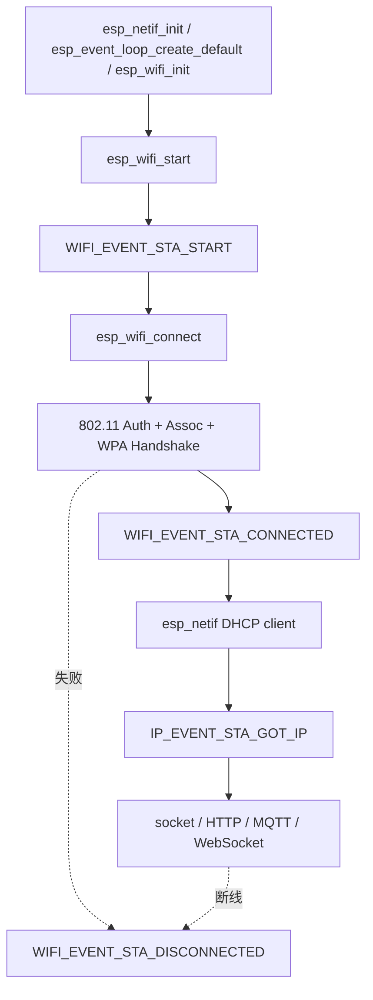

## 一句话结论

ESP32 Wi-Fi 连接不是一个 `esp_wifi_connect()` 函数完成的同步动作，而是一条分层链路：

```text
扫描 AP
  -> 802.11 认证
  -> 802.11 关联
  -> WPA2 4-Way Handshake
  -> DHCP 获取 IP
  -> TCP/UDP 应用通信
```

工程上最容易犯错的点是：

```text
WIFI_EVENT_STA_CONNECTED 只表示二层 Wi-Fi 链路建立；
IP_EVENT_STA_GOT_IP 才表示网络层具备通信条件。
```

## 1. Wi-Fi 建连完整生命周期

```mermaid
sequenceDiagram
    participant STA as ESP32 STA
    participant AP as Router / AP
    participant DHCP as DHCP Server

    rect rgb(35, 45, 65)
    note over STA,AP: Discovery
    AP-->>STA: Beacon
    STA->>AP: Probe Request
    AP-->>STA: Probe Response
    end

    rect rgb(45, 45, 65)
    note over STA,AP: 802.11 Authentication
    STA->>AP: Authentication Request
    AP-->>STA: Authentication Response
    end

    rect rgb(45, 55, 65)
    note over STA,AP: Association
    STA->>AP: Association Request
    AP-->>STA: Association Response + AID
    end

    rect rgb(55, 45, 45)
    note over STA,AP: WPA2 4-Way Handshake
    AP-->>STA: Message 1: ANonce
    STA->>AP: Message 2: SNonce + MIC
    AP-->>STA: Message 3: GTK + MIC
    STA->>AP: Message 4: ACK + MIC
    end

    rect rgb(45, 60, 45)
    note over STA,DHCP: Network Layer
    STA->>DHCP: DHCP Discover
    DHCP-->>STA: DHCP Offer
    STA->>DHCP: DHCP Request
    DHCP-->>STA: DHCP ACK
    end
```



这条链路里，每一层完成的事情不同。

| 阶段 | 主要帧/协议 | 完成后意味着什么 | 是否能上网 |
|---|---|---|---|
| 扫描 | Beacon / Probe | 发现 AP | 否 |
| 802.11 认证 | Authentication frame | AP 允许进入下一步 | 否 |
| 关联 | Association frame | AP 分配 AID，二层链路建立 | 否 |
| WPA2 握手 | EAPOL 4-Way Handshake | 生成会话密钥，数据可加密 | 否 |
| DHCP | UDP DHCP | 获取 IP / 网关 / DNS | 是，具备基础条件 |
| 应用通信 | TCP/UDP/HTTP/MQTT/WebSocket | 业务通道建立 | 取决于目标服务 |

## 2. 扫描 AP：只是“看见网络”

扫描阶段有两种方式：

```text
Passive Scan:
  AP 周期发送 Beacon
  STA 监听 Beacon

Active Scan:
  STA 发送 Probe Request
  AP 返回 Probe Response
```

这一步只回答：

```text
附近有哪些 SSID？
信号强度如何？
安全模式是什么？
信道是多少？
```

在 ESP-IDF 里对应：

```c
esp_wifi_scan_start();
WIFI_EVENT_SCAN_DONE;
esp_wifi_scan_get_ap_records();
```

## 3. 认证与关联：建立二层链路

802.11 Authentication 不是 WPA2 密码校验。现代 WPA2/WPA3 场景下，它更多是历史遗留的二层准入步骤，常见是 Open System Authentication。

关联阶段 AP 会给 STA 分配 AID，AP 开始正式识别这个 station。

```text
Authentication Request/Response
  -> Association Request/Response
  -> AP 分配 AID
  -> STA_CONNECTED
```

在 ESP32 事件里，通常你看到的是：

```text
WIFI_EVENT_STA_START
  -> esp_wifi_connect()
  -> WIFI_EVENT_STA_CONNECTED
```

注意：

```text
WIFI_EVENT_STA_CONNECTED 不等于 got IP。
```

它只说明 Wi-Fi 二层链路已经建立。

## 4. WPA2 4-Way Handshake：生成会话密钥

WPA2 四次握手的核心是让 STA 和 AP 在不直接传输密码的情况下，证明双方都拥有同一个 PMK，并派生出本次连接使用的 PTK。

输入：

```text
PMK: 由密码/PSK 派生
ANonce: AP 随机数
SNonce: STA 随机数
AP MAC
STA MAC
```

输出：

```text
PTK = KCK + KEK + TK
```

含义：

| 子密钥 | 作用 |
|---|---|
| KCK | 用于 EAPOL MIC，证明握手消息完整 |
| KEK | 用于加密 GTK 等密钥材料 |
| TK | 用于后续单播数据帧加密 |

四次握手之后，Wi-Fi 数据帧可以使用 AES-CCMP 加密。

但这仍然不代表“能访问互联网”，因为还没有 IP。

## 5. DHCP：真正进入网络层

DHCP 经典流程：

```text
Discover
  -> Offer
  -> Request
  -> ACK
```

拿到的信息通常包括：

```text
IP address
subnet mask
gateway
DNS server
lease time
```

ESP-IDF 里最关键的事件是：

```text
IP_EVENT_STA_GOT_IP
```

收到这个事件后，应用层才可以认为：

```text
设备具备 TCP/UDP 通信条件。
```

## 6. AES-CCMP 数据通信

WPA2 常见数据保护方式是 AES-CCMP。它主要做三件事：

```text
AES-CTR: 数据加密
CBC-MAC: 完整性校验 / MIC
PN: Packet Number，防重放
```

应用数据会被层层封装：

```text
Application Data
  -> TCP / UDP
  -> IP Packet
  -> 802.11 MAC Frame
  -> AES-CCMP protected frame
```

这部分通常由 Wi-Fi driver 和硬件自动处理，业务代码不用自己加密每个 Wi-Fi 帧。

## 7. ESP32 事件模型对照



对照表：

| Wi-Fi 协议阶段 | ESP32 API / Event | 上层应该怎么理解 |
|---|---|---|
| 初始化驱动 | `esp_wifi_init()` | Wi-Fi driver ready |
| 启动 STA | `esp_wifi_start()` / `WIFI_EVENT_STA_START` | 可以开始连接 |
| 发起连接 | `esp_wifi_connect()` | 进入 scan/auth/assoc/handshake |
| 二层连接成功 | `WIFI_EVENT_STA_CONNECTED` | 已连 AP，但未必有 IP |
| DHCP 成功 | `IP_EVENT_STA_GOT_IP` | 网络层 ready |
| 断开 | `WIFI_EVENT_STA_DISCONNECTED` | 链路失效，IP/业务要收口 |

## 8. 对 NetworkService 的设计启发

NetworkService 不应该只暴露一个 `online`。

更合理的 snapshot：

```c
typedef struct {
    bool sta_started;
    bool ap_connected;
    bool ip_ready;
    bool gateway_reachable;
    int rssi;
    int disconnect_reason;
} network_snapshot_t;
```

上层业务可以按层判断：

```text
BOOT 激活前:
  需要 ip_ready + gateway_reachable

WebSocket 连接:
  需要 ip_ready

Info 页面:
  应该区分 Wi-Fi / IP / Gateway / Session

Session:
  WebSocket 断开后必须退出或重建
```

## 9. 面试问答

### Q1：`WIFI_EVENT_STA_CONNECTED` 和 `IP_EVENT_STA_GOT_IP` 有什么区别？

`STA_CONNECTED` 是二层 Wi-Fi 连接成功，说明已经完成 Auth/Assoc/WPA 握手；`GOT_IP` 是 DHCP 成功，说明设备拿到 IP、网关和 DNS，才具备网络通信条件。

### Q2：为什么 Wi-Fi connected 后还不能立刻访问服务器？

因为还没完成 DHCP，可能没有 IP、网关或 DNS。即使拿到 IP，也还可能因为 DNS、路由、防火墙、TCP/TLS/WebSocket 握手失败而无法访问业务服务。

### Q3：WPA2 四次握手的目的是什么？

不是直接传密码，而是双方基于 PMK、Nonce 和 MAC 地址派生 PTK，并验证双方确实拥有同一个密钥材料，之后用 TK 做数据帧加密。

### Q4：AES-CCMP 是应用层加密吗？

不是。AES-CCMP 是 Wi-Fi 链路层的数据帧保护，通常由 Wi-Fi driver/硬件处理。应用层如果需要端到端安全，还要使用 TLS 等协议。

### Q5：项目里为什么要区分 `network ready` 和 `gateway online`？

`network ready` 只表示设备能联网；`gateway online` 表示目标 AI 服务端口可达。设备能上网不代表 AI 服务可用，所以 BOOT 激活前需要额外探测 gateway。

## 复习检查表

- 能否画出 scan -> auth -> assoc -> WPA2 -> DHCP 的顺序？
- 能否解释为什么 `STA_CONNECTED != GOT_IP`？
- 能否说清 WPA2 四次握手生成了什么？
- 能否解释 DHCP 为什么属于网络层上线？
- 能否把 ESP32 Wi-Fi event 映射到协议阶段？

