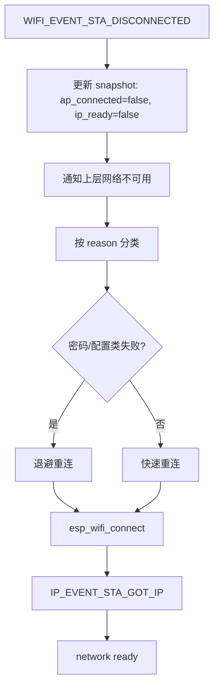

## 一句话结论

ESP32 Wi-Fi 稳定性设计不是简单地“断了就立刻重连”，而是要区分：

```text
为什么断？
断在哪一层？
当前业务是否需要实时在线？
重连是否应该退避？
是否需要清理上层 Session / WebSocket / Audio 状态？
```

## 1. 正常在线基线

```text
scan
  -> auth
  -> assoc
  -> WPA2 handshake
  -> DHCP
  -> IP_EVENT_STA_GOT_IP
  -> socket / WebSocket / MQTT
```

正常在线时，NetworkService 至少应该能给上层提供：

```text
ap_connected = true
ip_ready = true
rssi = current RSSI
last_disconnect_reason = 0
```

如果还有 gateway 探测，则继续分层：

```text
gateway_reachable = TCP probe success
```

## 2. 断线事件的本质

ESP32 断线核心事件：

```text
WIFI_EVENT_STA_DISCONNECTED
```

这个事件通常带有 reason code。reason code 很重要，因为它帮助你判断：

```text
密码错误？
找不到 AP？
认证超时？
AP 主动踢掉？
信号太弱？
Beacon 超时？
```

工程上不能只打印：

```text
wifi disconnected
```

至少要记录：

```text
reason code
retry count
rssi
uptime
当前业务状态
```

## 3. 常见 reason code 分类

不同 ESP-IDF 版本的枚举名称可能略有差异，具体以当前工程头文件为准。这里按工程排查角度分类。

| 分类 | 常见原因 | 工程含义 | 建议处理 |
|---|---|---|---|
| 找不到 AP | `NO_AP_FOUND` | SSID 不存在、信号太弱、2.4G/5G 选错 | 降低重试频率，提示网络不可用 |
| 认证失败 | `AUTH_FAIL` | 密码错误、认证方式不匹配 | 不要无限快速重试，提示配置错误 |
| 握手超时 | `4WAY_HANDSHAKE_TIMEOUT` | WPA2 握手失败、信号差、AP 异常 | 有限重试，记录 RSSI |
| 关联失败 | `ASSOC_FAIL / ASSOC_EXPIRE` | AP 拒绝加入或超时 | 重试并记录 AP 状态 |
| Beacon 超时 | `BEACON_TIMEOUT` | 已连接后 AP 长时间无响应 | 快速重连，常见弱信号问题 |
| AP 主动断开 | `AUTH_LEAVE / DISASSOC` | AP 踢掉、切换、负载限制 | 重连，必要时退避 |
| 内部/未知 | `UNSPECIFIED` | 驱动或环境异常 | 记录上下文，避免误判 |

## 4. 重连流程应该怎么设计

推荐流程：



上层收口也很关键：

```text
Wi-Fi 断线
  -> IP 不再可信
  -> WebSocket 必须断开或进入不可用
  -> Session 必须退出或等待重建
  -> 音频上行必须停止
  -> UI 显示网络不可用
```

如果不断开上层旧状态，就会出现：

```text
UI 还显示 Listening
Session 还以为 active
WebSocketTask 写失败
音频 ringbuf 积压
用户看到 AI ERROR
```

## 5. Wi-Fi 省电模式的工程含义

ESP32 常见策略可以粗略理解为四类：

| 模式 | 行为 | 延迟 | 功耗 | 适合 |
|---|---|---:|---:|---|
| `WIFI_PS_NONE` | Wi-Fi 基本常开 | 最低 | 最高 | 语音交互、低延迟音频 |
| `WIFI_PS_MIN_MODEM` | Modem sleep，按 DTIM 周期唤醒 | 中等 | 中等 | 普通联网、轻量音频 |
| Light Sleep + Wi-Fi | CPU 和 Wi-Fi 协同睡眠 | 更高 | 更低 | 非实时联网设备 |
| Deep Sleep | Wi-Fi 断开，下次重连 | 秒级 | 最低 | 低频上报、桌面时钟 |

### 5.1 `WIFI_PS_NONE`

特点：

```text
RF 常开
Beacon 基本都能及时处理
TCP/UDP 响应延迟最低
功耗最高
```

适合：

```text
ASR 上行
TTS 下行
WebSocket 音频流
播放期打断
低延迟控制
```

### 5.2 `WIFI_PS_MIN_MODEM`

特点：

```text
保持关联
按 DTIM 周期唤醒
延迟可能增加 100ms 级
功耗下降
```

适合：

```text
普通 IoT 在线
轻量状态同步
非极限低延迟场景
```

### 5.3 Light Sleep

特点：

```text
CPU idle 时进入 light sleep
Wi-Fi / timer / GPIO 等唤醒
延迟和调度复杂度更高
```

适合：

```text
低频联网
对实时性不敏感的显示设备
```

不适合直接用于强实时语音流。

### 5.4 Deep Sleep

特点：

```text
Wi-Fi stop
CPU deep sleep
唤醒后重新 scan/auth/assoc/WPA/DHCP
```

适合：

```text
电池设备
几分钟/几十分钟上报一次
桌面时钟定时同步
```

不适合：

```text
持续语音交互
实时音频流
需要秒内响应的 AI 助手
```

## 6. 三类业务的 Wi-Fi 策略

| 场景 | 推荐策略 | 原因 |
|---|---|---|
| 语音交互 | `WIFI_PS_NONE` 或谨慎使用 `MIN_MODEM` | ASR/TTS/打断对延迟敏感 |
| 音频流传输 | `WIFI_PS_NONE` 优先，`MIN_MODEM` 需实测 | 需要稳定吞吐和低 jitter |
| 桌面时钟 | Light Sleep / Deep Sleep | 低频更新，允许重连延迟 |

一句话：

```text
语音系统是 always connected 业务；
音频流是 continuous transport 业务；
桌面时钟是 periodic reconnect 业务。
```

## 7. 对 Pixel Soul / NetworkService 的启发

Pixel Soul 这类 AI 语音设备，Wi-Fi 策略应该跟业务状态联动：

```text
BOOT 激活前:
  保持 IP ready，允许 gateway probe

Wake prompt / Listening:
  网络必须 ready，避免唤醒后才重连

ASR 上行:
  优先低延迟，建议 PS_NONE

TTS 下行:
  保持连接稳定，避免播放断续

Idle:
  可以评估 MIN_MODEM，但不要影响下一次唤醒体验
```

NetworkService 不应该理解 ASR/TTS，但可以提供能力接口：

```c
network_service_set_latency_profile(NETWORK_LATENCY_LOW);
network_service_set_latency_profile(NETWORK_LATENCY_BALANCED);
```

业务层决定何时切换：

```text
Session active / audio streaming -> LOW_LATENCY
普通待机 -> BALANCED
长时间低频设备 -> POWER_SAVE
```

## 8. 面试问答

### Q1：Wi-Fi 断线后为什么不能只调用 `esp_wifi_connect()`？

因为断线会影响整个业务链路。除了重连 Wi-Fi，还要更新 network snapshot，清理 IP ready 状态，通知 WebSocket/Session 收口，避免上层继续使用失效连接。

### Q2：所有断线 reason 都应该快速重连吗？

不是。密码错误、找不到 AP 这类配置问题不应该无限快速重试；Beacon 超时、弱信号、AP 临时断开可以快速重连或带退避重连。

### Q3：为什么语音交互不适合 Deep Sleep？

Deep Sleep 会彻底断开 Wi-Fi，唤醒后要重新 scan/auth/assoc/WPA/DHCP，延迟通常是秒级。语音交互要求用户唤醒后马上说话和上传音频，因此更适合常驻连接。

### Q4：`WIFI_PS_NONE` 和 `MIN_MODEM` 怎么选？

低延迟和稳定吞吐优先时选 `WIFI_PS_NONE`；允许一定延迟、希望降低功耗时可以尝试 `MIN_MODEM`。音频流场景必须实测 jitter、吞吐、WebSocket 写耗时和播放连续性。

### Q5：NetworkService 重构的核心边界是什么？

NetworkService 负责 Wi-Fi/IP/gateway 可达性和重连策略；Session 负责业务会话；WebSocketTask 负责连接 IO；App 负责 UI 和用户事件。不能让 Wi-Fi 底层模块理解 AI 业务状态。

## 复习检查表

- 能否解释 `WIFI_EVENT_STA_DISCONNECTED` 后需要清理哪些上层状态？
- 能否按 reason code 区分配置失败和链路波动？
- 能否说明 `WIFI_PS_NONE`、`MIN_MODEM`、Light Sleep、Deep Sleep 的区别？
- 能否给语音交互、音频流、桌面时钟分别选择 Wi-Fi 策略？
- 能否说清 NetworkService 和 Session 的边界？

